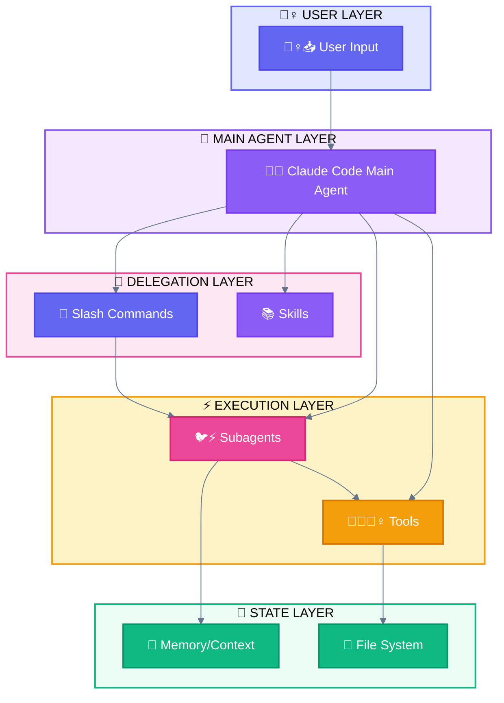
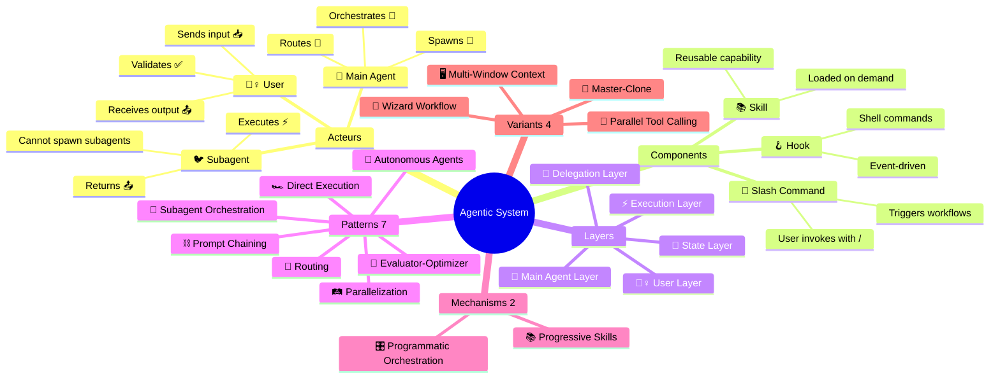

<div align="center">

[🏠 Home](README.md) • **00 Overview**

━━━━━━●━━━━━━━━━━━━━━━━━━━━━━━━━ `0/8`

[01 Terminology →](01-OFFICIAL-TERMINOLOGY.md)

</div>

---

# Claude Code Agentic Patterns - Documentation

> Complete reference for understanding and implementing agentic patterns with Claude Code CLI

## 📑 Table of Contents

| # | Section | Description |
|---|---------|-------------|
| 1 | [Quick Navigation](#quick-navigation) | Links to all documents |
| 2 | [Emoji Quick Reference](#emoji-quick-reference) | Visual legend |
| 3 | [Two Pattern Classifications](#two-pattern-classifications) | Research vs Implementation |
| 4 | [At a Glance](#at-a-glance-key-concepts) | Components & Layers |
| 5 | [How to Read](#how-to-read-this-documentation) | Reading paths |
| 6 | [Cross-Platform](#cross-platform-compatibility) | Compatibility matrix |

---

## Quick Navigation

| Document | Content |
|----------|---------|
| [01-TERMINOLOGY](01-OFFICIAL-TERMINOLOGY.md) | Claude Code components (Subagent, Command, Skill, Hook) |
| [02-ARCHITECTURE](02-LAYER-ARCHITECTURE.md) | 5-Layer system architecture |
| [03-AGENTIC-PATTERNS](03-AGENTIC-PATTERNS.md) | 7 unified patterns + 2 mechanisms |
| [04-USE-CASES](04-USE-CASES.md) | **Real-world validated use cases** |
| [05-PATTERN-SELECTION](05-PATTERN-SELECTION-GUIDE.md) | Decision tree for choosing patterns |
| [06-MAPPING-GLOSSARY](06-MAPPING-GLOSSARY.md) | Cross-reference and definitions |
| [07-STYLE-GUIDE](07-STYLE-GUIDE.md) | Colors, emojis, Mermaid standards |

---

## Emoji Quick Reference

```
┌─────────────────────────────────────────────────────────────────────────────┐
│                           EMOJI QUICK REFERENCE                             │
├─────────────────────────────────────────────────────────────────────────────┤
│                                                                             │
│  ACTEURS                             CLAUDE CODE PATTERNS                   │
│  ───────                             ────────────────────                   │
│  🙆‍♀️ User (neutral)                  🏎️ Direct Execution                    │
│  🙋‍♀️ User (input)                    🦑 Subagent Orchestration              │
│  💁‍♀️ User (output)                   🚂 Parallel Tool Calling               │
│  🐔 Main Agent                       🧬 Master-Clone                        │
│  🐦 Subagent                         🧙 Wizard Workflow                     │
│                                      🖥️ Multi-Window Context                │
│  COMPONENTS                          MECHANISMS                             │
│  ──────────                          ──────────                             │
│  🦴 Slash Command                    📚 Progressive Skills                  │
│  📚 Skill                            🎛️ Programmatic Orchestration          │
│  🪝 Hook                                                                    │
│  💾 State                            PATTERN VARIANTS                       │
│  ❓ AskUserQuestion                  ────────────────                       │
│                                      🧙 Wizard Workflow                     │
│  TOOLS                               🚂 Parallel Tool Calling               │
│  ─────                               🧬 Master-Clone                        │
│  🔧 Built-in                         🖥️ Multi-Window Context                │
│  🔌 External (MCP)                                                          │
│                                      STATUS                                 │
│  💁‍♀️ User Interaction                ──────                                 │
│                                      ✅ Success    ❌ Error                 │
│  PHASES                              ⚠️ Warning    🔄 Progress              │
│  ──────                              ⏳ Pending    ⏭️ Skip                  │
│  🏗️ Phase 1 (Foundation)                                                   │
│  🔗 Phase 2 (Formatting)                                                    │
│  📝 Phase 3 (Content)                                                       │
│  🔮 Phase 4 (Synthesis)                                                     │
│                                                                             │
└─────────────────────────────────────────────────────────────────────────────┘
```

---

## Agentic Patterns Overview

```
┌─────────────────────────────────────────────────────────────────────────────┐
│                         UNIFIED AGENTIC PATTERNS                            │
├─────────────────────────────────────────────────────────────────────────────┤
│                                                                             │
│  PATTERNS (7)                    MECHANISMS (2)                             │
│  ─────────────                   ──────────────                             │
│  1. 🏎️ Direct Execution         📚 Progressive Skills                      │
│  2. ⛓️ Prompt Chaining          🎛️ Programmatic Orchestration              │
│  3. 🚦 Routing                                                              │
│  4. 🛤️ Parallelization          VARIANTS (4)                               │
│  5. 🦑 Subagent Orchestration   ─────────────                               │
│  6. 🩻 Evaluator-Optimizer      🧙 Wizard Workflow (→ ⛓️)                   │
│  7. 🐉 Autonomous Agents        🚂 Parallel Tool Calling (→ 🛤️)            │
│                                  🧬 Master-Clone (→ 🛤️)                     │
│                                  🖥️ Multi-Window Context (→ 🐉)             │
│                                                                             │
├─────────────────────────────────────────────────────────────────────────────┤
│                         COMPONENTS (4)                                      │
│  ─────────────────────────────────────────────────────────────────────────  │
│   🐦 Subagent  │  🦴 Slash Command  │  📚 Skill  │  🪝 Hook                 │
└─────────────────────────────────────────────────────────────────────────────┘
```

---

## At a Glance: Key Concepts

### Components (What you build)

| Component | Emoji | Definition | File Location |
|-----------|-------|------------|---------------|
| **Subagent** | 🐦 | Specialized agent spawned via `Task` tool | `.claude/agents/*.md` |
| **Slash Command** | 🦴 | User-invokable command starting with `/` | `.claude/commands/*.md` |
| **Skill** | 📚 | Reusable capability the agent possesses | `.claude/skills/*/SKILL.md` |
| **Hook** | 🪝 | Shell command triggered by events | `.claude/settings.json` |

### Layers (How they interact)



### Critical Rule

> **🐦 Subagents cannot spawn other subagents.**
>
> All delegation must go through the 🐔 Main Agent.

---

## How to Read This Documentation

### If you're new to agentic patterns:
1. Start with [01-OFFICIAL-TERMINOLOGY](01-OFFICIAL-TERMINOLOGY.md)
2. Then [02-LAYER-ARCHITECTURE](02-LAYER-ARCHITECTURE.md)
3. Finally explore patterns as needed

### If you're choosing a pattern:
1. Check [04-USE-CASES](04-USE-CASES.md) for real-world examples
2. Use [05-PATTERN-SELECTION-GUIDE](05-PATTERN-SELECTION-GUIDE.md) for decision trees

### If you're implementing:
1. Check [03-AGENTIC-PATTERNS](03-AGENTIC-PATTERNS.md) for implementation details
2. Use [06-MAPPING-GLOSSARY](06-MAPPING-GLOSSARY.md) for term lookups

---

## Relationship Map



---

## Cross-Platform Compatibility

These patterns originate from Claude/Anthropic but many apply across AI frameworks:

| Pattern | Claude | GPT Agents | Gemini ADK | LangGraph |
|:--------|:------:|:----------:|:----------:|:---------:|
| 🦑 Subagent Orchestration | ✅ | ✅ Handoffs | ✅ Multi-agent | ✅ Subgraphs |
| 📚 Progressive Skills | ✅ | ❌ | ❌ | ❌ |
| 🚂 Parallel Tool Calling | ✅ | ✅ | ✅ ParallelAgent | ✅ Fan-out |
| 🧬 Master-Clone | ✅ | ✅ Dynamic | ✅ Custom | ✅ Send API |
| 🖥️ Multi-Window Context | ✅ | ⚠️ Sessions | ⚠️ ctx.state | ✅ Checkpointing |
| 🎛️ Programmatic Orchestration | ✅ | ✅ | ✅ Workflows | ✅ StateGraph |
| 🧙 Wizard Workflows | ✅ | ⚠️ | ✅ Tool Confirm | ✅ interrupt() |

**Legend:** ✅ Native | ⚠️ Partial | ❌ Not supported

> **Note**: 📚 Progressive Skills uses Claude Code's unique `.md`-based skill system. Other frameworks have "tools" but not this pattern.

---

## Version & Sources

| Source | Version/Date | URL |
|--------|--------------|-----|
| Claude Code Docs | 2025 | https://docs.anthropic.com/en/docs/claude-code |
| Building Effective Agents | Dec 2024 | Anthropic Research Paper |
| Anthropic Cookbook | 2025 | https://github.com/anthropics/anthropic-cookbook |

---

<div align="center">

**━━━━━━━━━━━━━━━━━━━━━━━━━━━━━━━━━━━━━━━━━━━━━━━━**

[🏠 Home](README.md) • [01 Terminology →](01-OFFICIAL-TERMINOLOGY.md)

*Last updated: 2025-11-27*

</div>
