```mermaid
%%{init: {'theme': 'base', 'themeVariables': {'lineColor': '#64748b'}}}%%
flowchart LR
    classDef user fill:#6366f1,stroke:#4f46e5,stroke-width:2px,color:#ffffff
    classDef main fill:#8b5cf6,stroke:#7c3aed,stroke-width:2px,color:#ffffff

    U["🙋‍♀️📥 User: /generate fr-FR"]:::user --> CMD["🦴 Slash Command"]:::user
    CMD --> MA["🐔💭 Main Agent"]:::main
    MA --> W["Workflow Execution"]
    W --> R["💁‍♀️📤 Result to User"]
```

```mermaid
%%{init: {'theme': 'base', 'themeVariables': {'lineColor': '#64748b'}}}%%
flowchart TB
    classDef user fill:#6366f1,stroke:#4f46e5,stroke-width:2px,color:#ffffff
    classDef main fill:#8b5cf6,stroke:#7c3aed,stroke-width:2px,color:#ffffff
    classDef skill fill:#8b5cf6,stroke:#7c3aed,stroke-width:2px,color:#ffffff
    classDef decision fill:#f59e0b,stroke:#d97706,stroke-width:2px,color:#ffffff

    REQ["🙋‍♀️📥 User Request"]:::user --> CHECK{"📚 Skill Applicable?"}:::decision
    CHECK -->|Yes| LOAD["📚 Load Skill"]:::skill
    CHECK -->|No| DIRECT["🐔⚡ Direct Execution"]:::main
    LOAD --> APPLY["🐔📚 Apply Methodology"]:::main
    APPLY --> EXEC["🐔⚡ Execute with Skill"]:::main
    EXEC --> RESULT["💁‍♀️📤 Enhanced Result"]
    DIRECT --> RESULT
```

```mermaid
%%{init: {'theme': 'base', 'themeVariables': {'lineColor': '#64748b'}}}%%
sequenceDiagram
    participant U as 🙋‍♀️ User
    participant H1 as 🪝 Pre-Hook
    participant A as 🐔 Main Agent
    participant T as 🔧 Tool
    participant H2 as 🪝 Post-Hook

    U->>H1: 🙋‍♀️📥 Prompt received
    H1->>A: Context injected
    A->>T: 🐔🔧 Execute tool
    T->>H2: Tool completed
    H2->>U: 💁‍♀️📤 Final response
```

<div align="center">

[🏠 Home](README.md) • [📖 Overview](00-OVERVIEW.md) • **01 Terminology**

━━━━━━━●━━━━━━━━━━━━━━━━━━━━━━━ `1/8`

[← 00 Overview](00-OVERVIEW.md) • [02 Architecture →](02-LAYER-ARCHITECTURE.md)

</div>

---

# Official Claude Code Terminology

> Definitive reference for Claude Code component terminology

## 📑 Table of Contents

| # | Section | Description |
|---|---------|-------------|
| 1 | [The Four Core Components](#the-four-core-components) | Overview diagram |
| 2 | [🐦 Subagent](#1--subagent) | Autonomous task execution |
| 3 | [🦴 Slash Command](#2--slash-command) | User-invokable workflows |
| 4 | [📚 Skill](#3--skill) | Reusable capabilities |
| 5 | [🪝 Hook](#4--hook) | Event-driven automation |
| 6 | [Comparison Table](#comparison-table) | Side-by-side comparison |
| 7 | [Naming Conventions](#naming-conventions) | Official terms |

---

## The Four Core Components

```
┌─────────────────────────────────────────────────────────────────────────────┐
│                       CLAUDE CODE COMPONENTS                                │
├─────────────────────────────────────────────────────────────────────────────┤
│                                                                             │
│   ┌──────────────┐  ┌──────────────┐  ┌──────────────┐  ┌──────────────┐   │
│   │ 🐦 SUBAGENT  │  │🦴 SLASH CMD  │  │  📚 SKILL    │  │   🪝 HOOK    │   │
│   ├──────────────┤  ├──────────────┤  ├──────────────┤  ├──────────────┤   │
│   │ Task tool    │  │ /command     │  │ Capability   │  │ Event-driven │   │
│   │ 🪺 spawns    │  │ invokes      │  │ loaded       │  │ shell cmd    │   │
│   │              │  │              │  │              │  │              │   │
│   │ agents/*.md  │  │ commands/*.md│  │ skills/*/    │  │ settings.json│   │
│   └──────────────┘  └──────────────┘  └──────────────┘  └──────────────┘   │
│                                                                             │
│         ↓                  ↓                 ↓                 ↓            │
│    Autonomous         User-invoked      Reusable           Automated       │
│    Execution          Workflows         Patterns           Triggers        │
│                                                                             │
└─────────────────────────────────────────────────────────────────────────────┘
```

---

## 1. 🐦 Subagent

### Definition

A **Subagent** is an autonomous agent spawned by the 🐔 Main Agent via the `Task` tool (🪺 spawn action) to handle specific, isolated tasks.

### Key Characteristics

| Property | Value |
|----------|-------|
| **Invocation** | `Task` tool with `subagent_type` parameter (🪺 spawn) |
| **Location** | `.claude/agents/*.md` |
| **Autonomy** | Full - executes independently |
| **Spawning** | ❌ Cannot spawn other subagents |
| **Context** | Isolated from main conversation |
| **Permissions** | Controlled via `permissionMode` frontmatter |

### File Structure

```markdown
# .claude/agents/code-reviewer.md

---
name: code-reviewer
description: Reviews code for quality, security, and best practices
tools: Read, Write, Grep, Glob
model: sonnet
permissionMode: acceptEdits
skills: test-driven-development, code-review
---

You are a code review specialist. Your task is to...
```

> **Note**: `tools` and `skills` are comma-separated strings, not YAML lists.

### Frontmatter Reference

| Field | Required | Description |
|-------|----------|-------------|
| `name` | Yes | Unique identifier (lowercase, hyphens) |
| `description` | Yes | Natural language description for discovery |
| `tools` | No | Comma-separated tool list. Omit to inherit all tools |
| `model` | No | `sonnet`, `opus`, `haiku`, or `inherit` (default: configured subagent model) |
| `permissionMode` | No | Controls permission handling (see below) |
| `skills` | No | Comma-separated skill names to auto-load |

### Permission Modes

Control how 🐦 Subagents request permissions for tool usage:

| Mode | Behavior | Use Case |
|------|----------|----------|
| `default` | Asks permission for each tool | Read-only, validation |
| `acceptEdits` | Auto-approves Write/Edit | Generation after 🧙 user confirmation |
| `bypassPermissions` | All tools auto-approved | Trusted autonomous workflows |
| `plan` | Read-only planning mode | Research without modifications |
| `ignore` | Skip permission prompts entirely | Batch processing |

> **Best Practice**: Use `acceptEdits` after 🧙 Wizard confirmation to enable autonomous generation without repeated permission prompts.

### Usage Example

```python
# 🐔 Main Agent 🪺 spawns 🐦 subagent via Task tool
Task(
    subagent_type="code-reviewer",
    prompt="Review the authentication module for security issues"
)
```

### Mermaid Representation



```mermaid
%%{init: {'theme': 'base', 'themeVariables': {'lineColor': '#64748b'}}}%%
sequenceDiagram
    participant U as 🙋‍♀️ User
    participant MA as 🐔 Main Agent
    participant SA as 🐦 Subagent
    participant T as 🔧 Tools

    U->>MA: "Review my code"
    MA->>SA: 🪺 Task(subagent_type="code-reviewer")
    SA->>T: Read, Grep, Glob
    T-->>SA: Results
    SA-->>MA: 🐦📤 Review Report
    MA-->>U: 💁‍♀️📤 "Here's the review..."
```

### Built-in Subagents

Claude Code includes built-in subagents available out of the box:

| Subagent | Model | Tools | Purpose |
|----------|-------|-------|---------|
| **General-purpose** | Sonnet | All tools | Complex multi-step tasks requiring exploration and modification |
| **Plan** | Sonnet | Read, Glob, Grep, Bash | Research during plan mode (read-only exploration) |
| **Explore** | Haiku | Glob, Grep, Read, Bash (read-only) | Fast, lightweight codebase searching |

**Explore Thoroughness Levels:**
- `quick` - Basic searches, fastest results
- `medium` - Moderate exploration, balanced speed/depth
- `very thorough` - Comprehensive analysis across multiple locations

### Resumable Subagents

Subagents can be resumed to continue previous conversations:

```python
# Initial invocation returns agentId
Task(subagent_type="code-analyzer", prompt="Review auth module")
# Returns: agentId = "abc123"

# Resume with previous context
Task(
    subagent_type="code-analyzer",
    prompt="Now analyze authorization logic",
    resume="abc123"  # Continue from previous execution
)
```

> **Use Cases**: Long-running research, iterative refinement, multi-step workflows requiring context persistence.

---

## 2. 🦴 Slash Command

### Definition

A **Slash Command** is a user-invokable workflow that starts with `/` and triggers predefined prompt sequences.

### Key Characteristics

| Property | Value |
|----------|-------|
| **Invocation** | 🙋‍♀️ User types `/command-name` |
| **Location** | `.claude/commands/*.md` |
| **Variables** | `$ARGUMENTS` for user input |
| **Execution** | Synchronous, within main conversation |

### File Structure

```markdown
# .claude/commands/generate.md

---
description: Generate localization files for specified locales
argument-hint: [locale]
---

Generate localization files for: $ARGUMENTS

1. First, identify if this is a single locale or language cluster
2. Check LOCALES-200.csv for valid locales
3. ...
```

> **Note**: The command name comes from the filename (`generate.md` → `/generate`).

### Frontmatter Reference

| Field | Required | Description |
|-------|----------|-------------|
| `description` | Recommended | Brief description (shown in `/help` and used by SlashCommand tool) |
| `argument-hint` | No | Expected arguments hint (e.g., `[locale]`, `[pr-number] [priority]`) |
| `allowed-tools` | No | Tools the command can use without asking permission |
| `model` | No | Specific model to use (e.g., `claude-3-5-haiku-20241022`) |
| `disable-model-invocation` | No | Set `true` to prevent `SlashCommand` tool from calling this command programmatically |

> **SlashCommand Tool**: Claude can invoke slash commands programmatically via the `SlashCommand` tool. Commands without `description` or with `disable-model-invocation: true` are excluded.

### Usage Examples

```bash
# 🙋‍♀️ User invokes
/generate fr-FR              # Single locale
/generate fr                 # Language cluster
/generate fr es de           # Multiple clusters
```

### Mermaid Representation



---

## 3. 📚 Skill

### Definition

A **Skill** is a reusable capability that provides the agent with specialized knowledge or methodology for specific task types.

### Key Characteristics

| Property | Value |
|----------|-------|
| **Invocation** | Skill tool or automatic based on context |
| **Location** | `.claude/skills/*/SKILL.md` |
| **Loading** | On-demand when relevant |
| **Scope** | Enhances 🐔 main agent capabilities |

### File Structure

```bash
# Skills are directories containing SKILL.md
.claude/skills/test-driven-development/
└── SKILL.md
```

```markdown
# .claude/skills/test-driven-development/SKILL.md

---
description: Use when implementing features - write tests first, then code
---

# Test-Driven Development Skill

## When to Use
- Implementing new features
- Fixing bugs

## Methodology
1. RED: Write a failing test
2. GREEN: Write minimal code to pass
3. REFACTOR: Clean up while tests pass

...
```

> **Note**: The skill name comes from the directory name (`test-driven-development/`).
> Frontmatter supports: `name` (optional, max 64 chars), `description` (required, max 1024 chars), `allowed-tools` (optional, restricts tool access).
> Skills are loaded automatically when context matches the `description`.

### Usage Example

```
🙋‍♀️📥 User: "Add a validation function"

🐔💭 Agent: "I'm using the 📚 test-driven-development skill..."
[Loads skill, follows TDD methodology]
```

### Mermaid Representation



---

## 4. 🪝 Hook

### Definition

A **Hook** is a shell command that executes automatically in response to specific Claude Code events.

### Key Characteristics

| Property | Value |
|----------|-------|
| **Invocation** | Automatic on event trigger |
| **Location** | `.claude/settings.json` |
| **Types** | `command` (shell) or `prompt` (LLM-based) |
| **Execution** | Shell command |

### Configuration

```json
// .claude/settings.json
{
  "hooks": {
    "PreToolUse": [
      {
        "matcher": "Write",
        "hooks": [
          {
            "type": "command",
            "command": "echo 'Writing file...'"
          }
        ]
      }
    ],
    "PostToolUse": [
      {
        "matcher": "Bash",
        "hooks": [
          {
            "type": "command",
            "command": "npm run lint --fix"
          }
        ]
      }
    ],
    "SessionStart": [
      {
        "hooks": [
          {
            "type": "command",
            "command": "git status --short"
          }
        ]
      }
    ]
  }
}
```

### Hook Events

| Event | Trigger | Use Case |
|-------|---------|----------|
| `PreToolUse` | Before tool execution | Validation, blocking, logging |
| `PostToolUse` | After tool completion | Cleanup, formatting |
| `PermissionRequest` | When permission dialogs appear | Auto-allow/deny |
| `UserPromptSubmit` | Before processing user input | Pre-processing |
| `SessionStart` | When session starts/resumes | Environment setup |
| `SessionEnd` | When session ends | Cleanup |
| `Stop` | When Claude finishes responding | Post-response actions |
| `SubagentStop` | When subagent task completes | Subagent cleanup |
| `PreCompact` | Before compact operation | Lifecycle management |
| `Notification` | When notifications sent | Custom notification control |

### Mermaid Representation



---

## Component Relationships

```mermaid
%%{init: {'theme': 'base', 'themeVariables': {'lineColor': '#64748b'}}}%%
flowchart TB
    classDef user fill:#6366f1,stroke:#4f46e5,stroke-width:2px,color:#ffffff
    classDef main fill:#8b5cf6,stroke:#7c3aed,stroke-width:2px,color:#ffffff
    classDef subagent fill:#ec4899,stroke:#db2777,stroke-width:2px,color:#ffffff
    classDef skill fill:#8b5cf6,stroke:#7c3aed,stroke-width:2px,color:#ffffff
    classDef builtinTool fill:#64748b,stroke:#475569,stroke-width:2px,color:#ffffff
    classDef mcpTool fill:#f59e0b,stroke:#d97706,stroke-width:2px,color:#ffffff

    subgraph UserInput["🙋‍♀️ USER INPUT"]
        SLASH["🦴 /command args"]:::user
        PROMPT["🙋‍♀️📥 Natural language"]:::user
    end

    subgraph MainAgent["🐔 MAIN AGENT"]
        MA["🐔💭 Claude Code"]:::main
    end

    subgraph Components["COMPONENTS"]
        CMD["🦴 Slash Commands"]:::user
        SKL["📚 Skills"]:::skill
        SA["🐦 Subagents"]:::subagent
        HOOK["🪝 Hooks"]:::skill
    end

    subgraph Tools["🔧 TOOLS"]
        TASK["🪺 Task (spawn)"]:::subagent
        READ["🔧 Read"]:::builtinTool
        WRITE["🔧 Write"]:::builtinTool
        BASH["🔧 Bash"]:::builtinTool
    end

    SLASH --> CMD
    CMD --> MA
    PROMPT --> MA
    MA --> SKL
    MA --> TASK
    TASK --> SA
    SA --> READ
    SA --> WRITE
    SA --> BASH
    HOOK -.->|events| MA
    HOOK -.->|events| Tools
```



---

## Comparison Table

| Aspect | 🐦 Subagent | 🦴 Slash Command | 📚 Skill | 🪝 Hook |
|--------|----------|---------------|-------|------|
| **Invoked by** | Task tool (🪺) | 🙋‍♀️ User (`/`) | Context/Skill tool | Events |
| **Autonomy** | High | Low | Medium | Automatic |
| **Context** | Isolated | Main conversation | Main conversation | System |
| **Can spawn subagents** | ❌ No | Via 🐔 main agent | Via 🐔 main agent | ❌ No |
| **Typical use** | Complex tasks | Workflows | Methodologies | Automation |
| **File location** | `agents/*.md` | `commands/*.md` | `skills/*/SKILL.md` | `settings.json` |

---

## Naming Conventions

### Official Terms (Use These)

| Correct | Avoid |
|---------|-------|
| 🐦 Subagent | Sub-agent, sub agent, child agent |
| 🦴 Slash Command | Command, slash-command |
| 📚 Skill | Capability, ability |
| 🪝 Hook | Trigger, event handler |
| 🐔 Main Agent | Parent agent, orchestrator |
| Task (🪺 spawn) | Task tool, delegate |
| 🙋‍♀️ User (input) | 👤 User |
| 💁‍♀️ User (output) | 👤 User |
| 🔧 Built-in | Native Tool, 🛠️ Tool |

### In Documentation

```markdown
# Good
The 🐔 Main Agent 🪺 spawns a 🐦 Subagent via the Task tool.
🙋‍♀️ Users invoke /generate to trigger the workflow.

# Avoid
The parent spawns a child agent.
Users run the generate command.
```

---

## Additional Terms

### Task Tool (🪺 Spawn)

The `Task` tool is the mechanism for 🪺 spawning 🐦 Subagents:

```python
Task(
    subagent_type="agent-name",    # Maps to agents/*.md
    prompt="Task description",
    model="sonnet"                 # Optional: sonnet, opus, haiku
)
```

### ❓ AskUserQuestion Tool

The `AskUserQuestion` tool enables human-in-the-loop interactions:

```python
AskUserQuestion(
    questions=[
        {
            "header": "Approach",
            "question": "Which approach do you prefer?",
            "options": [
                {"label": "Option A", "description": "Fast but risky"},
                {"label": "Option B", "description": "Slow but safe"}
            ],
            "multiSelect": False
        }
    ]
)
```

This is the key component for 🧙 **Wizard Workflows** pattern.

---

<div align="center">

**━━━━━━━━━━━━━━━━━━━━━━━━━━━━━━━━━━━━━━━━━━━━━━━━**

[← 00 Overview](00-OVERVIEW.md) • [🏠 Home](README.md) • [02 Architecture →](02-LAYER-ARCHITECTURE.md)

</div>
