<div align="center">

[🏠 Home](README.md) • [📖 Overview](00-OVERVIEW.md) • **03 Agentic Patterns**

━━━━━━━━━●━━━━━━━━━━━━━━━━━━━━━ `3/8`

[← 02 Architecture](02-LAYER-ARCHITECTURE.md) • [04 Use Cases →](04-USE-CASES.md)

</div>

---

# Agentic Patterns

> 7 patterns for building Claude Code agentic systems + 2 implementation mechanisms

## 📑 Table of Contents

| # | Pattern | Description |
|---|---------|-------------|
| 1 | [🏎️ Direct Execution](#pattern-1-️-direct-execution) | Baseline (no orchestration) |
| 2 | [⛓️ Prompt Chaining](#pattern-2-️-prompt-chaining) | Sequential steps |
| 3 | [🚦 Routing](#pattern-3--routing) | Classification & dispatch |
| 4 | [🛤️ Parallelization](#pattern-4-️-parallelization) | Concurrent execution |
| 5 | [🦑 Subagent Orchestration](#pattern-5--subagent-orchestration) | Manager + specialists |
| 6 | [🩻 Evaluator-Optimizer](#pattern-6--evaluator-optimizer) | Iterative refinement |
| 7 | [🐉 Autonomous Agents](#pattern-7--autonomous-agents) | Self-directed execution |
| ⚙️ | [Mechanisms](#mechanisms) | Progressive Skills, Programmatic Orchestration |
| ⚔️ | [Pattern Comparisons](#pattern-comparisons) | Side-by-side VS diagrams |
| 📋 | [Best Practices](#best-practices) | Operational guidelines |

---

## Terminology

```
┌─────────────────────────────────────────────────────────────────────────────┐
│                         UNIFIED TERMINOLOGY                                  │
├─────────────────────────────────────────────────────────────────────────────┤
│                                                                             │
│  🐔 Main Agent    → Claude Code orchestrator (the hen that coordinates)    │
│  🐦 Subagent      → Delegated worker spawned via Task (the bird)           │
│  🪺 Spawn (Task)  → Action to create 🐦 subagents (via Task built-in tool) │
│  📚 Skill         → Loaded knowledge that enhances 🐔 capabilities          │
│                                                                             │
│  HIERARCHY: 🙋‍♀️📥 User → 🐔 Main Agent → 🐦 Subagent → 💁‍♀️📤 User              │
│                                                                             │
│  RULE: 🐦 Subagents CANNOT spawn other 🐦 subagents (flat hierarchy)        │
│                                                                             │
└─────────────────────────────────────────────────────────────────────────────┘
```

---

## Decision Tree

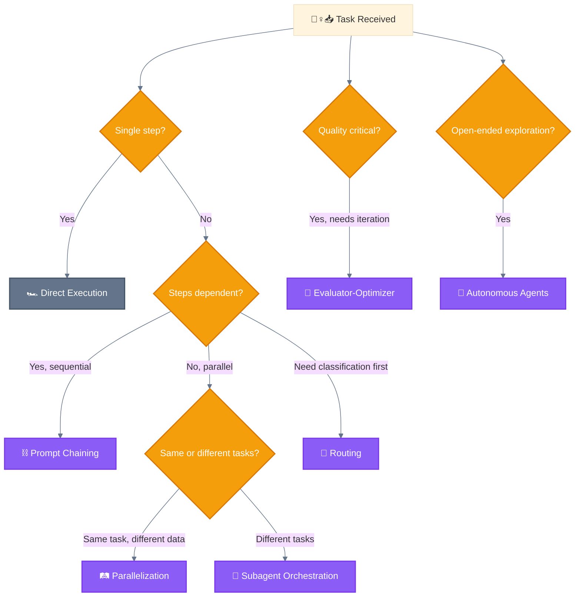

---

## Pattern 1: 🏎️ Direct Execution

### Definition

🐔 Main Agent handles the request directly without spawning 🐦 subagents or complex orchestration.

### Diagram

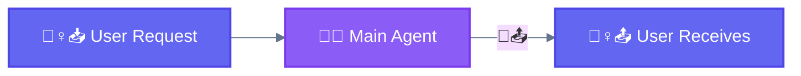

### When to Use

- Simple, single-step tasks
- No need for specialization
- Quick operations (file read, simple edit, search)

### When NOT to Use

- Complex multi-step workflows
- Tasks requiring multiple specializations
- Large-scale operations

### Example

```
User: "What's in the config.json file?"

🐔 Main Agent:
  - Uses Read tool to read config.json
  - Returns content to user

No 🐦 subagents needed.
```

---

## Pattern 2: ⛓️ Prompt Chaining

### Definition

Breaking a task into sequential steps where each step's output becomes the next step's input.

### Diagram

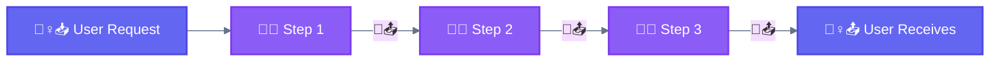

### Use Cases

| Use Case | Example |
|----------|---------|
| Document processing | Extract → Analyze → Summarize |
| Code generation | Plan → Implement → Review |
| Data transformation | Parse → Transform → Validate |

### Example Flow

```
Step 1: "Extract all function names from this code"
        → [list of functions]

Step 2: "For each function, identify parameters and return types"
        → [function signatures]

Step 3: "Generate documentation for each function"
        → [documented code]
```

### When to Use

- Tasks have clear sequential dependencies
- Each step's quality affects the next
- Need checkpoints between steps

### When NOT to Use

- Steps can be done independently (use 🛤️ Parallelization)
- Simple single-step tasks (use 🏎️ Direct Execution)

### Variant: 🧙 Wizard Workflows

Multi-step processes with explicit 🙆‍♀️ user confirmation at each phase using ❓ `AskUserQuestion`.

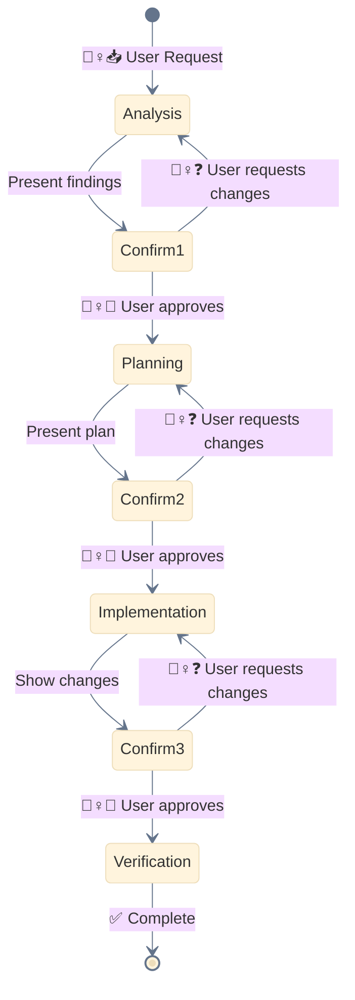

**Use 🧙 Wizard for:**
- Destructive operations (migrations, deletions)
- Complex refactoring
- Multi-stakeholder decisions

---

## Pattern 3: 🚦 Routing

### Definition

Directing inputs to specialized handlers based on classification or intent.

### Diagram

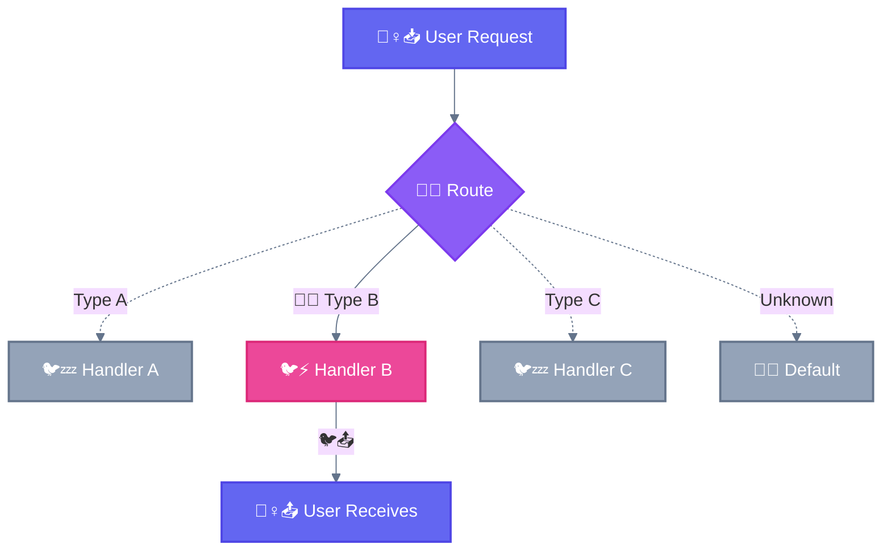

### Key Insight

```
┌─────────────────────────────────────────────────────────────────────────────┐
│  🚦 ROUTING: Choose ONE branch                                              │
├─────────────────────────────────────────────────────────────────────────────┤
│                                                                             │
│  Logic: if/else, switch/case                                               │
│  Question: "Where should I send this?"                                      │
│  Result: Single output from chosen handler                                  │
│                                                                             │
│  Analogy: Train switch → One train takes ONE track                         │
│                                                                             │
└─────────────────────────────────────────────────────────────────────────────┘
```

### Use Cases

| Use Case | Example |
|----------|---------|
| Customer support | Bug → Tech Team, Billing → Finance |
| Code tasks | Bug fix → Debugger, New feature → Builder |
| Content | Question → Q&A, Task → Executor |

### When to Use

- Inputs have distinct types requiring different handling
- Specialized expertise improves quality
- Clear classification criteria exist

### When NOT to Use

- All inputs require same processing
- Classification is unreliable

---

## Pattern 4: 🛤️ Parallelization

### Definition

Executing independent tasks simultaneously and merging results.

### Core Concept

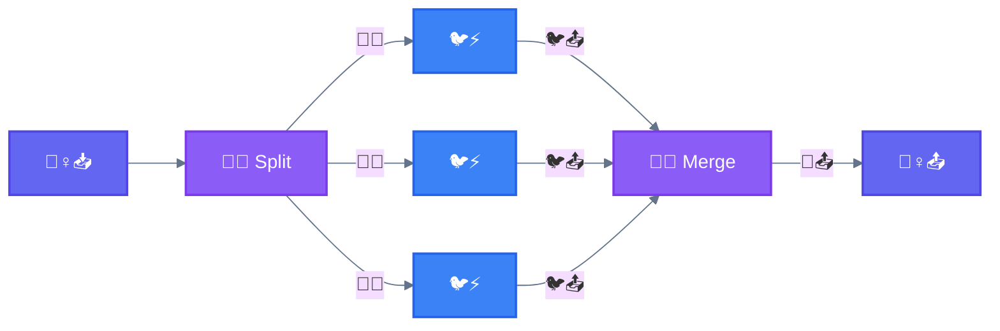

### Key Insight

```
┌─────────────────────────────────────────────────────────────────────────────┐
│  ⚠️  IMPORTANT: Parallelization vs Subagent Orchestration                    │
├─────────────────────────────────────────────────────────────────────────────┤
│                                                                             │
│  In Parallelization, all spawned subagents are IDENTICAL.                   │
│  Same prompt, same capabilities. They are INTERCHANGEABLE.                  │
│                                                                             │
│  🛤️ Parallelization:        🐦⚡ = 🐦⚡ = 🐦⚡   (clones)                      │
│  🦑 Subagent Orchestration:  🐦🔒 ≠ 🐦⚡ ≠ 🐦🎨   (specialists)                │
│                                                                             │
└─────────────────────────────────────────────────────────────────────────────┘
```

### 2 Types of Parallelization

#### Type 1: 🛤️ Sectioning (Split DATA)

Split large data into chunks, process each chunk the same way, combine all results.

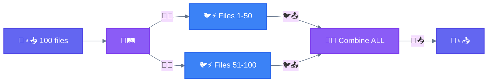

#### Type 2: 🗳️ Voting (Same TASK, pick BEST)

Run the same task multiple times, compare results, pick the best one.

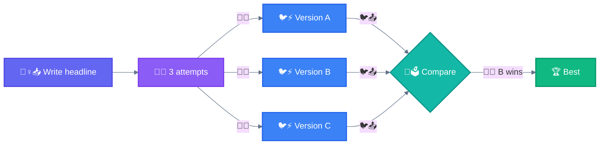

### Summary

| Type | Workers | Input | Output |
|------|---------|-------|--------|
| **🛤️ Sectioning** | IDENTICAL | Different DATA chunks | Combine ALL |
| **🗳️ Voting** | IDENTICAL | Same DATA | Pick ONE best |

### Variant: 🚂 Parallel Tool Calling

Execute multiple independent 🔧 tool calls in a single message for efficiency.

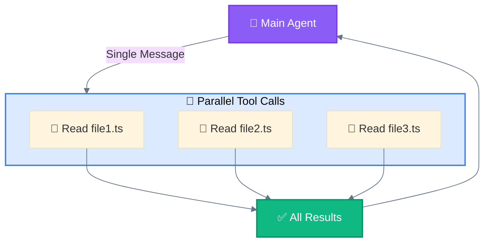

**Implementation:**
```python
# Single message with multiple parallel 🔧 tool calls
[
    Read(file_path="/src/auth.ts"),
    Read(file_path="/src/user.ts"),
    Read(file_path="/src/session.ts"),
    Grep(pattern="password", path="/src")
]
# All execute concurrently, results returned together
```

### Variant: 🧬 Master-Clone

Spawn multiple isolated 🐦 instances handling independent domains with no shared state.

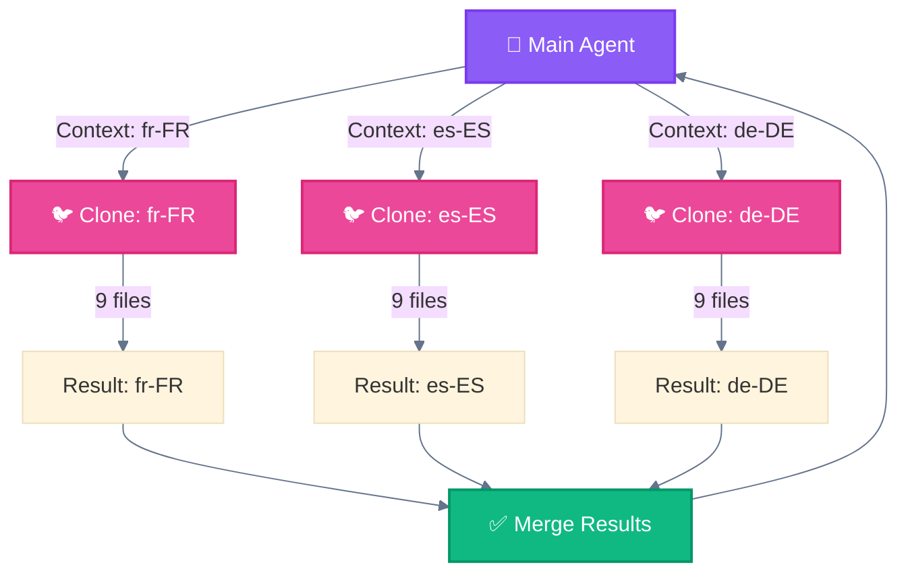

**Key Characteristic:** Each 🐦 clone operates in complete isolation (no shared memory, no inter-clone communication).

### When to Use

- Tasks have no dependencies on each other
- Speed is important
- Resources allow concurrent execution

### When NOT to Use

- Tasks depend on each other's output
- Sequential order matters

---

## Pattern 5: 🦑 Subagent Orchestration

### Definition

🐔 Main Agent 🪺 spawns specialized 🐦 subagents via the `Task` tool to handle complex, domain-specific tasks.

### Diagram

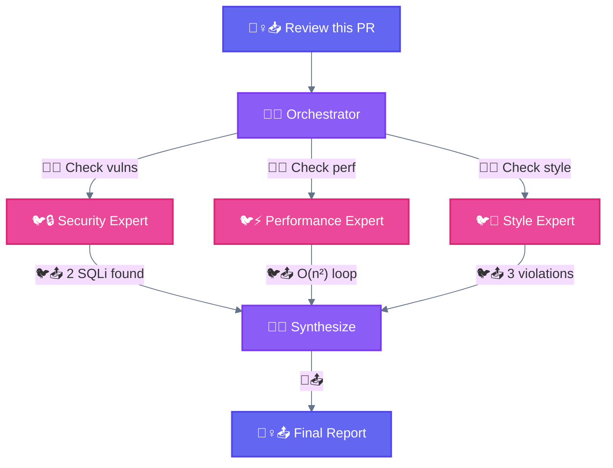

### Key Insight

```
┌─────────────────────────────────────────────────────────────────────────────┐
│  🦑 SUBAGENT ORCHESTRATION: Different specialists                           │
├─────────────────────────────────────────────────────────────────────────────┤
│                                                                             │
│  Each 🐦 subagent has a DIFFERENT expertise and does a DIFFERENT task.     │
│                                                                             │
│  Analogy: Hospital team → Different experts collaborate                     │
│           (Chef + Pastry + Sommelier, not 3 cooks making same recipe)      │
│                                                                             │
│  Compare to 🛤️ Parallelization:                                            │
│  - Parallelization: Same worker + Different data (assembly line)           │
│  - Orchestration: Different workers + Same data (expert team)              │
│                                                                             │
└─────────────────────────────────────────────────────────────────────────────┘
```

### Main Agent Responsibilities

| Responsibility | Description |
|----------------|-------------|
| **Decomposition** | Break complex task into subtasks |
| **Assignment** | Route subtasks to appropriate 🐦 subagents |
| **Monitoring** | Track 🐦 subagent progress |
| **Synthesis** | Combine results into coherent output |

### 🐦 Subagent Definition

```markdown
# .claude/agents/code-reviewer.md

---
name: code-reviewer
description: Reviews code for quality, security, and best practices
tools: Read, Grep, Glob
---

You are a senior code reviewer specializing in security and quality.

## Your Task
Review the provided code and report:
1. Security vulnerabilities
2. Performance issues
3. Code quality concerns
4. Suggested improvements

## Output Format
- ❌ CRITICAL: Issues requiring immediate attention
- ⚠️ WARNING: Should be addressed
- ℹ️ INFO: Suggestions for improvement
```

### Critical Rules

| Rule | Explanation |
|------|-------------|
| **No nested subagents** | 🐦 Subagents cannot spawn other 🐦 subagents |
| **Isolated context** | Each 🐦 subagent starts fresh, no shared memory |
| **Report to orchestrator** | Results flow back to 🐔 Main Agent only |

### When to Use

- Complex tasks require multiple specializations
- Workers can operate independently
- Need centralized coordination

### When NOT to Use

- Simple tasks not worth decomposition overhead
- Workers need heavy inter-communication

---

## Pattern 6: 🩻 Evaluator-Optimizer

### Definition

Generate candidates, evaluate them, and iteratively improve until quality threshold is met.

### Diagram

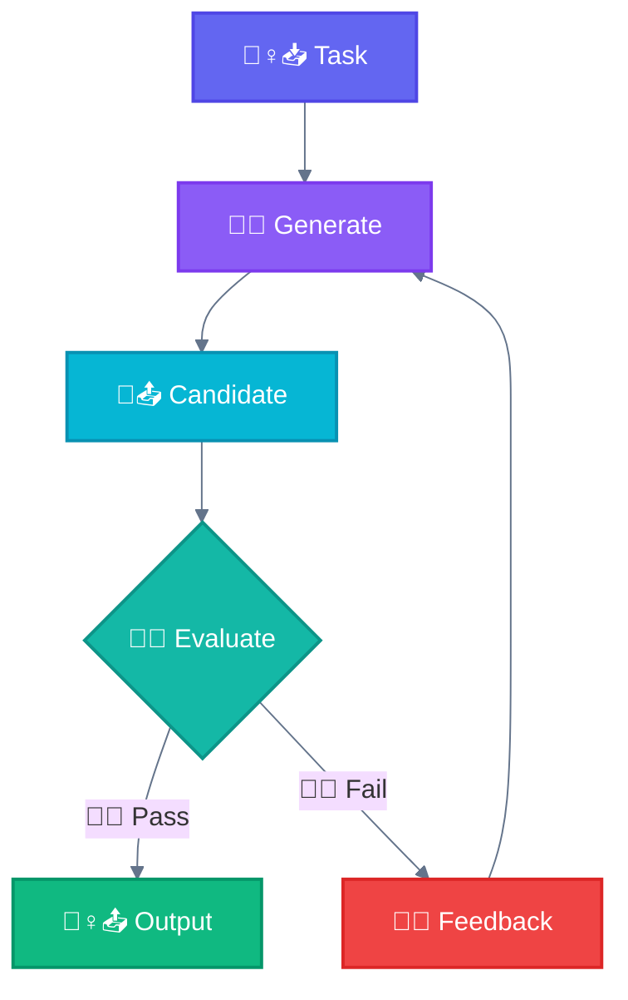

### Detailed Flow

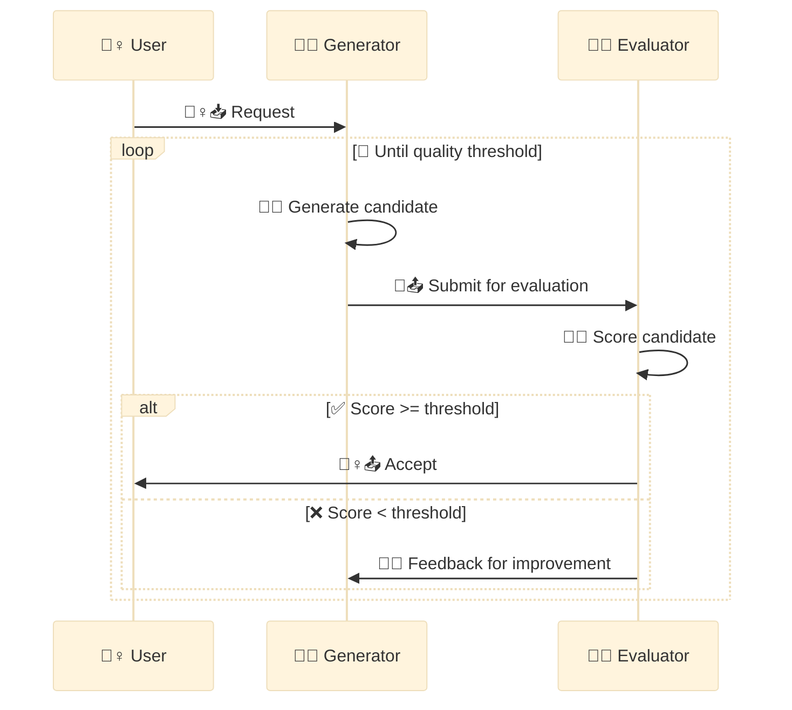

### Evaluation Criteria Examples

| Domain | Criteria |
|--------|----------|
| **Code** | Tests pass, linting clean, no security issues |
| **Text** | Clarity score, factual accuracy, tone match |
| **Design** | Usability score, accessibility, consistency |

### Example: Code Generation

```
Generator: Write function to parse CSV

Attempt 1: Basic implementation
Evaluator: "Missing error handling for malformed input"

Attempt 2: Added try/catch
Evaluator: "Not handling empty files"

Attempt 3: Complete implementation
Evaluator: "Pass - all criteria met"
```

### When to Use

- Quality is critical
- Clear evaluation criteria exist
- Iteration improves results

### When NOT to Use

- First attempt is usually good enough
- No clear quality metrics
- Time constraints prevent iteration

---

## Pattern 7: 🐉 Autonomous Agents

### Definition

Long-running agents that independently plan, execute, and adapt based on environment feedback.

### Diagram

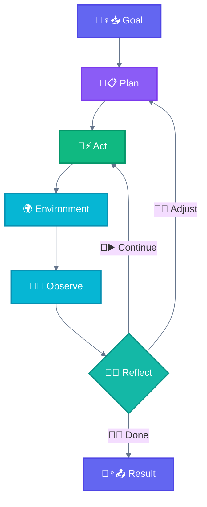

### Agent Loop

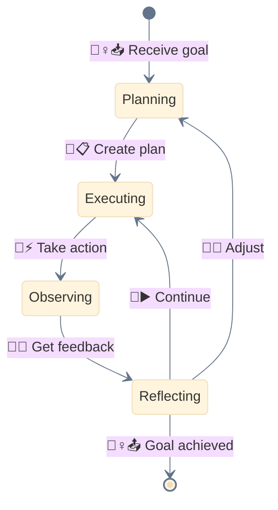

### Characteristics

| Characteristic | Description |
|----------------|-------------|
| **Goal-directed** | Works toward specified objective |
| **Adaptive** | Adjusts based on feedback |
| **Self-directed** | Decides next actions independently |
| **Persistent** | Continues until goal achieved or failure |

### Example: Bug Investigation

```
Goal: "Fix the login timeout bug"

Agent:
1. PLAN: Need to find where timeout is set
2. ACT: Search codebase for "timeout" in auth
3. OBSERVE: Found 3 locations
4. REFLECT: Most likely in session config
5. ACT: Read session config file
6. OBSERVE: Default timeout is 30 minutes
7. REFLECT: User reported issue after 5 minutes
8. ACT: Check if there's an override
9. ...continues until resolved...
```

### Risk Management

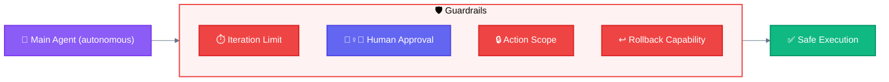

### Variant: 🖥️ Multi-Window Context

Implement checkpointing to save 💾 state and resume from interruptions in long-running workflows.

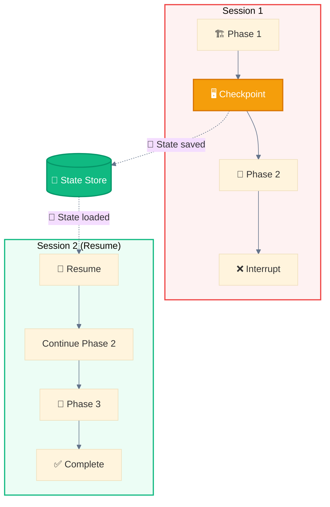

**Use 🖥️ Multi-Window for:**
- Large-scale generation (1000+ files)
- Long research tasks
- Multi-day workflows
- Error recovery

### When to Use

- Open-ended exploration tasks
- Environment feedback is rich
- Human oversight is available

### When NOT to Use

- Predictable tasks with known steps
- No rollback capability
- Tight time constraints

---

## Mechanisms

These are **implementation mechanisms** in Claude Code, not agentic patterns themselves.

### 📚 Progressive Skills

Load 📚 skills on-demand to enhance 🐔 agent capabilities for specific task types.

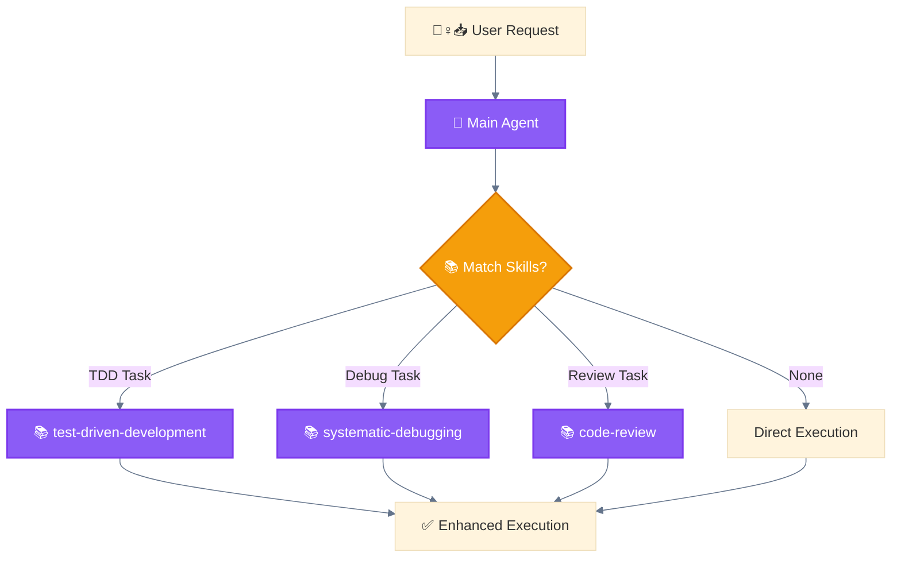

**Purpose:** Route execution through specialized methodologies.

**📚 Skill Definition:**
```markdown
# .claude/skills/test-driven-development/SKILL.md

---
description: Use when implementing features - write tests first
---

# 📚 Test-Driven Development

## When to Use
- New feature implementation
- Bug fixes (write test that catches bug first)

## Methodology
1. 🏗️ RED: Write failing test
2. 🔗 GREEN: Minimal code to pass
3. 📝 REFACTOR: Clean while green
```

### 🎛️ Programmatic Orchestration

External code controls 🐔 agent invocation and workflow logic rather than pure prompt-based control.

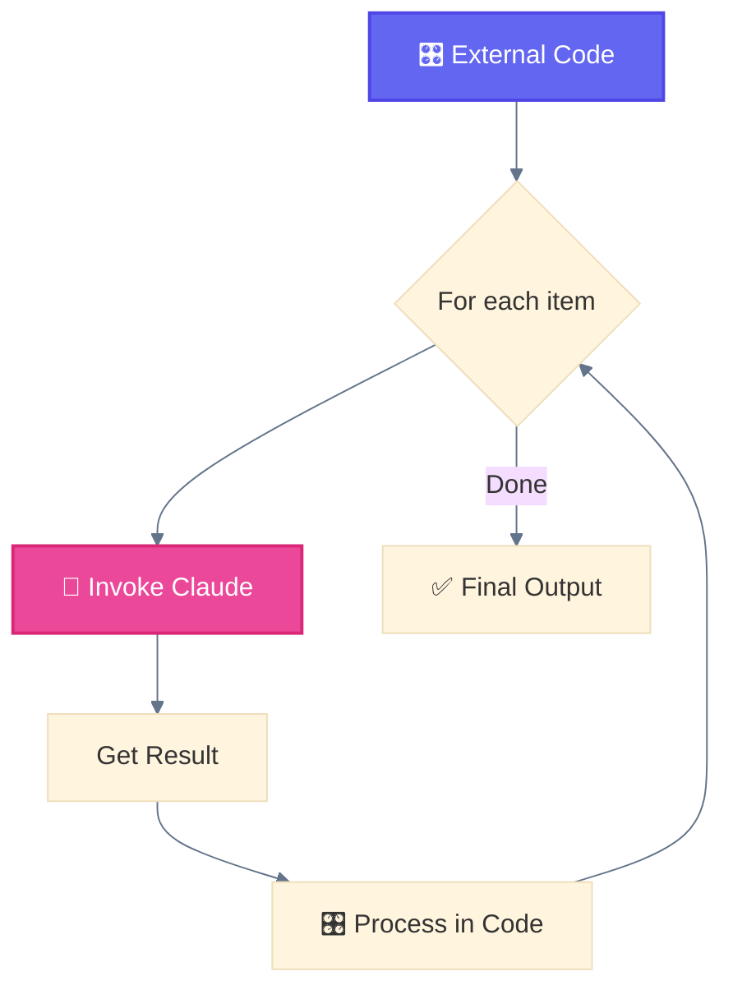

**Purpose:** ⛓️ Prompt Chaining with external control (CI/CD, batch processing, API automation).

**Implementation:**
```python
# 🎛️ External Python script orchestrating Claude
import anthropic

client = anthropic.Anthropic()

locales = ["fr-FR", "es-ES", "de-DE"]
results = []

for locale in locales:
    response = client.messages.create(
        model="claude-sonnet-4-20250514",
        messages=[{"role": "user", "content": f"Generate for {locale}"}]
    )
    results.append({"locale": locale, "content": response.content})
    save_progress(results)  # 🎛️ Code-controlled checkpointing
```

---

## Pattern Comparisons

### 🚦 Routing vs 🛤️ Parallelization

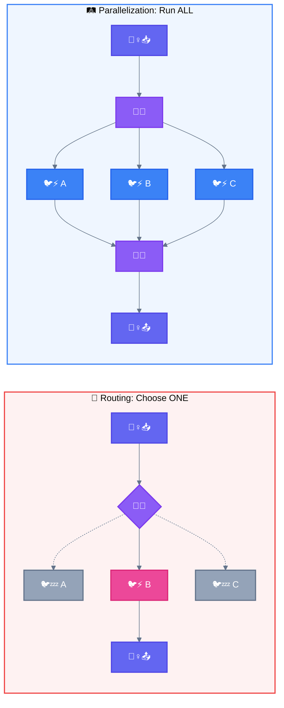

| Aspect | 🚦 Routing | 🛤️ Parallelization |
|--------|-----------|-------------------|
| **Action** | Choose **ONE** branch | Execute **ALL** branches |
| **Logic** | `if/else`, `switch/case` | `fork/join`, `Promise.all` |
| **Question** | "Where should I send this?" | "How can I do all this at once?" |
| **Result** | Single output from chosen handler | Multiple outputs merged |

### 🛤️ Parallelization vs 🦑 Subagent Orchestration

```mermaid
%%{init: {'theme': 'base', 'themeVariables': {'lineColor': '#64748b'}}}%%
flowchart LR
    classDef user fill:#6366f1,stroke:#4f46e5,stroke-width:2px,color:#ffffff
    classDef main fill:#8b5cf6,stroke:#7c3aed,stroke-width:2px,color:#ffffff
    classDef subagent fill:#ec4899,stroke:#db2777,stroke-width:2px,color:#ffffff
    classDef parallel fill:#3b82f6,stroke:#2563eb,stroke-width:2px,color:#ffffff

    subgraph PARALLEL["🛤️ Parallelization: SAME Task"]
        P_IN["🙋‍♀️📥"]:::user --> P_SPLIT["🐔🔀"]:::main
        P_SPLIT --> P_A["🐦⚡ Chunk 1"]:::parallel
        P_SPLIT --> P_B["🐦⚡ Chunk 2"]:::parallel
        P_SPLIT --> P_C["🐦⚡ Chunk 3"]:::parallel
        P_A --> P_MERGE["🐔🌀"]:::main
        P_B --> P_MERGE
        P_C --> P_MERGE
        P_MERGE --> P_OUT["💁‍♀️📤"]:::user
    end

    subgraph ORCH["🦑 Orchestration: DIFFERENT Tasks"]
        O_IN["🙋‍♀️📥"]:::user --> O_MAIN["🐔🪺"]:::main
        O_MAIN --> O_A["🐦🔒 Security"]:::subagent
        O_MAIN --> O_B["🐦⚡ Perf"]:::subagent
        O_MAIN --> O_C["🐦🎨 Style"]:::subagent
        O_A --> O_SYNTH["🐔🌀"]:::main
        O_B --> O_SYNTH
        O_C --> O_SYNTH
        O_SYNTH --> O_OUT["💁‍♀️📤"]:::user
    end

    style PARALLEL fill:#eff6ff,stroke:#3b82f6,stroke-width:2px
    style ORCH fill:#fdf4ff,stroke:#ec4899,stroke-width:2px
```

| Aspect | 🛤️ Parallelization | 🦑 Subagent Orchestration |
|--------|-------------------|------------------------|
| **Workers** | **Interchangeable** (same skill) | **Specialized** (different skills) |
| **Task type** | **Identical** task on different data | **Different** tasks on same data |
| **Decision** | **Static** (predefined split) | **Dynamic** (orchestrator decides) |
| **Example** | 3 cooks make same recipe | Chef + Pastry + Sommelier |

---

## Pattern Summary

```
┌──────────────────────────┬─────────────┬─────────────┬──────────────┬───────────┐
│ Pattern                  │ Complexity  │ Parallelism │ Human-Loop   │ Iteration │
├──────────────────────────┼─────────────┼─────────────┼──────────────┼───────────┤
│ 🏎️ Direct Execution      │ None        │ None        │ None         │ None      │
│ ⛓️ Prompt Chaining        │ Low         │ None        │ Optional     │ Linear    │
│ 🚦 Routing                │ Low         │ None        │ None         │ None      │
│ 🛤️ Parallelization        │ Medium      │ High        │ Optional     │ None      │
│ 🦑 Subagent Orchestration │ High        │ High        │ Optional     │ As needed │
│ 🩻 Evaluator-Optimizer    │ Medium      │ Optional    │ Optional     │ Loop      │
│ 🐉 Autonomous Agent       │ Very High   │ Variable    │ Recommended  │ Adaptive  │
└──────────────────────────┴─────────────┴─────────────┴──────────────┴───────────┘
```

---

## Best Practices

### Permission Modes

Control how 🐦 Subagents request permissions for tool usage.

| Mode | Behavior | Use Case |
|------|----------|----------|
| `default` | Asks permission for each tool call | Read-only operations, validation |
| `acceptEdits` | Auto-approves Write/Edit operations | Generation after 🧙 user confirmation |
| `bypassPermissions` | All tools auto-approved | Trusted autonomous workflows |

**Best Practice:** Use 🧙 Wizard confirmation before spawning subagents with elevated permissions.

### Parallelization Limits

| Type | Recommended Max | Risk if Exceeded |
|------|-----------------|------------------|
| 🐦 Concurrent Subagents | **10-15** | Context overflow, memory pressure |
| 🔌 MCP calls per subagent | **5** | Rate limit errors |
| 🪺 Task calls per message | **10** | API limits, timeouts |

**Batching Strategy:**
```
# Instead of 39 parallel subagents:
Wave 1: 10 🐦 subagents
Wave 2: 10 🐦 subagents
Wave 3: 10 🐦 subagents
Wave 4:  9 🐦 subagents
```

### Context Management

Use `/compact` between major phases to prevent overflow:

```mermaid
%%{init: {'theme': 'base', 'themeVariables': {'lineColor': '#64748b'}}}%%
flowchart LR
    classDef wave fill:#3b82f6,stroke:#2563eb,stroke-width:2px,color:#ffffff
    classDef compact fill:#8b5cf6,stroke:#7c3aed,stroke-width:2px,color:#ffffff
    classDef checkpoint fill:#10b981,stroke:#059669,stroke-width:2px,color:#ffffff

    W1["🚂 Wave 1"]:::wave
    CP1["🖥️ Checkpoint"]:::checkpoint
    C1["/compact"]:::compact

    W2["🚂 Wave 2"]:::wave
    CP2["🖥️ Checkpoint"]:::checkpoint
    C2["/compact"]:::compact

    W3["🚂 Wave 3"]:::wave
    DONE["✅ Complete"]:::checkpoint

    W1 --> CP1 --> C1 --> W2 --> CP2 --> C2 --> W3 --> DONE
```

**Pattern:** Checkpoint → Compact → Resume

---

## Combining Patterns

These patterns are building blocks that combine:

```mermaid
%%{init: {'theme': 'base', 'themeVariables': {'lineColor': '#64748b'}}}%%
flowchart TB
    classDef user fill:#6366f1,stroke:#4f46e5,stroke-width:2px,color:#ffffff
    classDef wizard fill:#14b8a6,stroke:#0d9488,stroke-width:2px,color:#ffffff
    classDef main fill:#8b5cf6,stroke:#7c3aed,stroke-width:2px,color:#ffffff
    classDef parallel fill:#3b82f6,stroke:#2563eb,stroke-width:2px,color:#ffffff

    subgraph Combined["🔗 Complex System"]
        R["🐔🚦 Routing"]:::wizard --> OW["🐔🎭 Orchestrator"]:::main
        OW -->|"🐔🪺"| P["🐦⚡ Parallel Workers"]:::parallel
        P -->|"🐦📤"| EO["🐔🩻 Evaluator"]:::wizard
    end

    INPUT["🙋‍♀️📥 Input"]:::user --> R
    EO -->|"🐔📤"| OUTPUT["💁‍♀️📤 Output"]:::user

    style Combined fill:#f8fafc,stroke:#e2e8f0,stroke-width:2px
```

### Example: Code Review Pipeline

1. **🚦 Routing**: Classify code change type
2. **🦑 Subagent Orchestration**: Assign to security, perf, style workers
3. **🛤️ Parallelization**: Workers run concurrently
4. **🩻 Evaluator-Optimizer**: Iterate on feedback if issues found

---

<div align="center">

**━━━━━━━━━━━━━━━━━━━━━━━━━━━━━━━━━━━━━━━━━━━━━━━━**

[← 02 Architecture](02-LAYER-ARCHITECTURE.md) • [🏠 Home](README.md) • [04 Use Cases →](04-USE-CASES.md)

</div>
