<div align="center">

[🏠 Home](README.md) • [📖 Overview](00-OVERVIEW.md) • **03 Research Patterns**

━━━━━━━━━●━━━━━━━━━━━━━━━━━━━━━ `3/8`

[← 02 Architecture](02-LAYER-ARCHITECTURE.md) • [04 Implementation →](04-CLAUDE-CODE-PATTERNS.md)

</div>

---

# Anthropic Research Patterns

> 6 foundational patterns from Anthropic's "Building Effective Agents" paper

## 📑 Table of Contents

| # | Pattern | Description |
|---|---------|-------------|
| 1 | [⛓️ Prompt Chaining](#pattern-1-️-prompt-chaining) | Sequential steps |
| 2 | [🚦 Routing](#pattern-2--routing) | Classification & dispatch |
| 3 | [🛤️ Parallelization](#pattern-3-️-parallelization) | Concurrent execution |
| 4 | [🎭 Orchestrator-Workers](#pattern-4--orchestrator-workers) | Manager + specialists |
| 5 | [👨‍🔧 Evaluator-Optimizer](#pattern-5-️-evaluator-optimizer) | Iterative refinement |
| 6 | [🐔 Autonomous Agents](#pattern-6--autonomous-agents) | Self-directed execution |

---

## Source

These patterns come from **Anthropic's research paper "Building Effective Agents"** (December 2024), which establishes the theoretical foundation for agentic AI systems.

```
┌─────────────────────────────────────────────────────────────────────────────┐
│                    6 ANTHROPIC RESEARCH PATTERNS                            │
├─────────────────────────────────────────────────────────────────────────────┤
│                                                                             │
│   1. ⛓️ Prompt Chaining       4. 🎭 Orchestrator-Workers                    │
│   2. 🚦 Routing               5. 👨‍🔧 Evaluator-Optimizer                     │
│   3. 🛤️ Parallelization       6. 🐔 Autonomous Agents                       │
│                                                                             │
│   Source: "Building Effective Agents" - Anthropic Research, Dec 2024        │
│                                                                             │
└─────────────────────────────────────────────────────────────────────────────┘
```

---

## Pattern 1: ⛓️ Prompt Chaining

### Definition

Breaking a task into sequential steps where each step's output becomes the next step's input.

### Diagram


### Use Cases

| Use Case | Example |
|----------|---------|
| Document processing | Extract → Analyze → Summarize |
| Code generation | Plan → Implement → Review |
| Data transformation | Parse → Transform → Validate |

### Example Flow

```
Step 1: "Extract all function names from this code"
        → [list of functions]

Step 2: "For each function, identify parameters and return types"
        → [function signatures]

Step 3: "Generate documentation for each function"
        → [documented code]
```

### When to Use

- Tasks have clear sequential dependencies
- Each step's quality affects the next
- Need checkpoints between steps

### When NOT to Use

- Steps can be done independently (use Parallelization)
- Simple single-step tasks

---

## Pattern 2: 🚦 Routing

### Definition

Directing inputs to specialized handlers based on classification or intent.

### Diagram


### Use Cases

| Use Case | Example |
|----------|---------|
| Customer support | Bug → Tech Team, Billing → Finance |
| Code tasks | Bug fix → Debugger, New feature → Builder |
| Content | Question → Q&A, Task → Executor |

### Example Implementation

```python
# Router determines handler
def route(input):
    classification = classify(input)

    if classification == "security":
        return security_handler(input)
    elif classification == "performance":
        return performance_handler(input)
    elif classification == "feature":
        return feature_handler(input)
    else:
        return general_handler(input)
```

### When to Use

- Inputs have distinct types requiring different handling
- Specialized expertise improves quality
- Clear classification criteria exist

### When NOT to Use

- All inputs require same processing
- Classification is unreliable

---

## Pattern 3: 🛤️ Parallelization

### Definition

Executing independent tasks simultaneously and merging results.

### Diagram


### Types of Parallelization


### Use Cases

| Type | Use Case | Example |
|------|----------|---------|
| **Sectioning** | Large documents | Review chapters in parallel |
| **Voting** | Critical decisions | Multiple reviews, consensus |
| **Independent** | Unrelated tasks | Generate + Test + Document |

### When to Use

- Tasks have no dependencies on each other
- Speed is important
- Resources allow concurrent execution

### When NOT to Use

- Tasks depend on each other's output
- Sequential order matters
- Resource constraints

---

## Pattern 4: 🎭 Orchestrator-Workers

### Definition

A central orchestrator delegates tasks to specialized workers and synthesizes results.

### Diagram


### Orchestrator Responsibilities

| Responsibility | Description |
|----------------|-------------|
| **Decomposition** | Break complex task into subtasks |
| **Assignment** | Route subtasks to appropriate workers |
| **Monitoring** | Track worker progress |
| **Synthesis** | Combine results into coherent output |

### Worker Characteristics


### Example: Code Review System

```
Orchestrator: "Review this PR for security, performance, and style"

    → Security Worker: "Check for SQL injection, XSS, auth issues"
      ← "Found 2 potential SQL injection points"

    → Performance Worker: "Analyze time complexity, memory usage"
      ← "O(n²) loop could be O(n)"

    → Style Worker: "Check naming, formatting, patterns"
      ← "3 naming convention violations"

Orchestrator: Synthesizes into comprehensive review
```

### When to Use

- Complex tasks require multiple specializations
- Workers can operate independently
- Need centralized coordination

### When NOT to Use

- Simple tasks not worth decomposition overhead
- Workers need heavy inter-communication

---

## Pattern 5: 👨‍🔧 Evaluator-Optimizer

### Definition

Generate candidates, evaluate them, and iteratively improve until quality threshold is met.

### Diagram


### Detailed Flow


### Evaluation Criteria Examples

| Domain | Criteria |
|--------|----------|
| **Code** | Tests pass, linting clean, no security issues |
| **Text** | Clarity score, factual accuracy, tone match |
| **Design** | Usability score, accessibility, consistency |

### Example: Code Generation

```
Generator: Write function to parse CSV

Attempt 1: Basic implementation
Evaluator: "Missing error handling for malformed input"

Attempt 2: Added try/catch
Evaluator: "Not handling empty files"

Attempt 3: Complete implementation
Evaluator: "Pass - all criteria met"
```

### When to Use

- Quality is critical
- Clear evaluation criteria exist
- Iteration improves results

### When NOT to Use

- First attempt is usually good enough
- No clear quality metrics
- Time constraints prevent iteration

---

## Pattern 6: 🐔 Autonomous Agents

### Definition

Long-running agents that independently plan, execute, and adapt based on environment feedback.

### Diagram


### Agent Loop


### Characteristics

| Characteristic | Description |
|----------------|-------------|
| **Goal-directed** | Works toward specified objective |
| **Adaptive** | Adjusts based on feedback |
| **Self-directed** | Decides next actions independently |
| **Persistent** | Continues until goal achieved or failure |

### Example: Bug Investigation

```
Goal: "Fix the login timeout bug"

Agent:
1. PLAN: Need to find where timeout is set
2. ACT: Search codebase for "timeout" in auth
3. OBSERVE: Found 3 locations
4. REFLECT: Most likely in session config
5. ACT: Read session config file
6. OBSERVE: Default timeout is 30 minutes
7. REFLECT: User reported issue after 5 minutes
8. ACT: Check if there's an override
9. ...continues until resolved...
```

### Risk Management


### When to Use

- Open-ended exploration tasks
- Environment feedback is rich
- Human oversight is available

### When NOT to Use

- Predictable tasks with known steps
- No rollback capability
- Tight time constraints

---

## Pattern Comparison

```
┌──────────────────────────┬─────────────┬─────────────┬──────────────┬───────────┐
│ Pattern                  │ Complexity  │ Parallelism │ Human-Loop   │ Iteration │
├──────────────────────────┼─────────────┼─────────────┼──────────────┼───────────┤
│ ⛓️ Prompt Chaining        │ Low         │ None        │ Optional     │ Linear    │
│ 🚦 Routing                │ Low         │ None        │ None         │ None      │
│ 🛤️ Parallelization        │ Medium      │ High        │ Optional     │ None      │
│ 🎭 Orchestrator-Workers   │ High        │ High        │ Optional     │ As needed │
│ 👨‍🔧 Evaluator-Optimizer    │ Medium      │ Optional    │ Optional     │ Loop      │
│ 🐔 Autonomous Agent       │ Very High   │ Variable    │ Recommended  │ Adaptive  │
└──────────────────────────┴─────────────┴─────────────┴──────────────┴───────────┘
```

---

## Combining Patterns

These patterns are building blocks that combine:

```mermaid
flowchart TB
    subgraph Combined["Complex System"]
        R["🚦 Routing"] --> OW["🎭 Orchestrator-Workers"]
        OW --> P["🛤️ Parallelization"]
        P --> EO["👨‍🔧 Evaluator-Optimizer"]
    end

    INPUT[Input] --> R
    EO --> OUTPUT[Output]

    style Combined fill:#f8fafc,stroke:#e2e8f0,stroke-width:2px
```



### Example: Code Review Pipeline

1. **🚦 Routing**: Classify code change type
2. **🎭 Orchestrator-Workers**: Assign to security, perf, style workers
3. **🛤️ Parallelization**: Workers run concurrently
4. **👨‍🔧 Evaluator-Optimizer**: Iterate on feedback if issues found

---

<div align="center">

**━━━━━━━━━━━━━━━━━━━━━━━━━━━━━━━━━━━━━━━━━━━━━━━━**

[← 02 Architecture](02-LAYER-ARCHITECTURE.md) • [🏠 Home](README.md) • [04 Implementation →](04-CLAUDE-CODE-PATTERNS.md)

</div>
