<div align="center">

[🏠 Home](README.md) • [📖 Overview](00-OVERVIEW.md) • **04 Implementation**

━━━━━━━━━━●━━━━━━━━━━━━━━━━━━━━ `4/8`

[← 03 Research Patterns](03-ANTHROPIC-RESEARCH-PATTERNS.md) • [05 Use Cases →](05-USE-CASES.md)

</div>

---

# Claude Code Implementation Patterns

> 7 practical patterns for building agentic systems with Claude Code CLI

## 📑 Table of Contents

| # | Pattern | Description |
|---|---------|-------------|
| 0 | [🏎️ Direct Execution](#pattern-0-️-direct-execution-baseline) | Baseline (no pattern) |
| 1 | [🎪 Subagent Orchestration](#pattern-1--subagent-orchestration) | Multi-agent delegation |
| 2 | [🎓 Progressive Skills](#pattern-2--progressive-skills) | Capability enhancement |
| 3 | [🚂 Parallel Tool Calling](#pattern-3--parallel-tool-calling) | Concurrent tools |
| 4 | [🧬 Master-Clone](#pattern-4--master-clone) | Dynamic spawning |
| 5 | [🖥️ Multi-Window Context](#pattern-5-️-multi-window-context) | Session management |
| 6 | [🎛️ Programmatic Orchestration](#pattern-6-️-programmatic-orchestration) | SDK control |
| 7 | [🧙 Wizard Workflows](#pattern-7--wizard-workflows) | Human-in-the-loop |

---

## Overview

These 7 patterns represent practical implementations for Claude Code, building on the theoretical Anthropic Research patterns.

```
┌─────────────────────────────────────────────────────────────────────────────┐
│                   7 CLAUDE CODE IMPLEMENTATION PATTERNS                     │
├─────────────────────────────────────────────────────────────────────────────┤
│                                                                             │
│   🏎️ Direct Execution (baseline - no pattern needed for simple tasks)      │
│                                                                             │
│   1. 🎪 Subagent Orchestration      5. 🖥️ Multi-Window Context             │
│   2. 🎓 Progressive Skills          6. 🎛️ Programmatic Orchestration        │
│   3. 🚂 Parallel Tool Calling       7. 🧙 Wizard Workflows                  │
│   4. 🧬 Master-Clone                                                        │
│                                                                             │
│   These map to Anthropic patterns + add Claude Code specifics               │
│                                                                             │
└─────────────────────────────────────────────────────────────────────────────┘
```

---

## Pattern 1: 🎪 Subagent Orchestration

### Definition

🧠 Main Agent spawns specialized 🤖 Subagents via the 📤 `Task` tool to handle complex, domain-specific tasks.

### Maps to Anthropic Pattern

**Orchestrator-Workers** - The 🧠 Main Agent is the orchestrator, 🤖 Subagents are workers.

### Architecture

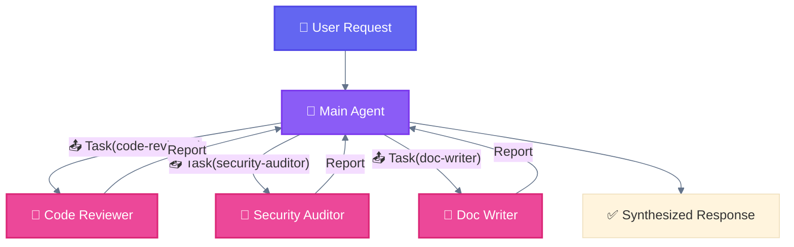

### Implementation

```python
# 🧠 Main Agent spawns 🤖 Subagents via 📤 Task tool

# Sequential spawning
Task(
    subagent_type="code-reviewer",
    prompt="Review src/auth.ts for security issues"
)

# Or parallel spawning (single message, multiple Task calls)
[
    Task(subagent_type="security-auditor", prompt="Check for OWASP top 10"),
    Task(subagent_type="performance-analyst", prompt="Identify bottlenecks"),
    Task(subagent_type="style-checker", prompt="Verify code style")
]
```

### 🤖 Subagent Definition

```markdown
# .claude/agents/code-reviewer.md

---
name: code-reviewer
description: Reviews code for quality, security, and best practices
tools: Read, Grep, Glob
---

You are a senior code reviewer specializing in security and quality.

## Your Task
Review the provided code and report:
1. Security vulnerabilities
2. Performance issues
3. Code quality concerns
4. Suggested improvements

## Output Format
- ❌ CRITICAL: Issues requiring immediate attention
- ⚠️ WARNING: Should be addressed
- ℹ️ INFO: Suggestions for improvement
```

> **Note**: `tools` is a comma-separated string. `description` is required for auto-invocation.

### Critical Rules

| Rule | Explanation |
|------|-------------|
| **No nested subagents** | 🤖 Subagents cannot spawn other 🤖 subagents |
| **Isolated context** | Each 🤖 subagent starts fresh, no shared memory |
| **Report to orchestrator** | Results flow back to 🧠 Main Agent only |

### Use Cases

- Code review with multiple aspects
- Document generation (different sections)
- Testing (unit, integration, e2e in parallel)

---

## Pattern 2: 🎓 Progressive Skills

### Definition

Load 📚 skills on-demand to enhance 🧠 agent capabilities for specific task types.

### Maps to Anthropic Pattern

**Routing** - 📚 Skills route execution through specialized methodologies.

### Architecture

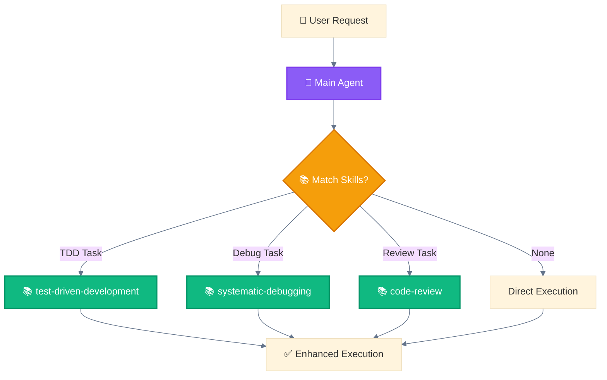

### 📚 Skill Loading

```markdown
# 🧠 Agent announces skill usage
"I'm using the 📚 test-driven-development skill to implement this feature."

# 📚 Skill provides methodology
1. RED: Write failing test
2. GREEN: Minimal code to pass
3. REFACTOR: Clean while green
```

### Implementation

```bash
# Skills are directories containing SKILL.md
.claude/skills/test-driven-development/
└── SKILL.md
```

```markdown
# .claude/skills/test-driven-development/SKILL.md

---
description: Use when implementing features - write tests first
---

# 📚 Test-Driven Development

## When to Use
- New feature implementation
- Bug fixes (write test that catches bug first)
- Refactoring with safety net

## Methodology

### 🏗️ Phase 1: RED
Write a test that fails. The test should:
- Target the specific behavior
- Be minimal and focused
- Fail for the right reason

### 🔗 Phase 2: GREEN
Write the minimum code to pass:
- No extra features
- No optimization
- Just make it work

### 📝 Phase 3: REFACTOR
Clean up while tests pass:
- Remove duplication
- Improve naming
- Extract patterns

## Checklist
☐ Test written first
☐ Test fails for right reason
☐ Minimal implementation
☐ All tests pass
☐ Code refactored
☐ Tests still pass
```

> **Note**: Skill name from directory name. Frontmatter: `name` (optional), `description` (required), `allowed-tools` (optional - restricts tool access).

### Use Cases

- Enforcing development methodologies
- Providing domain expertise
- Standardizing approaches across tasks

---

## Pattern 3: 🚂 Parallel Tool Calling

### Definition

Execute multiple independent 🔌 tool calls in a single message for efficiency.

### Maps to Anthropic Pattern

**Parallelization** - Multiple operations execute concurrently.

### Architecture

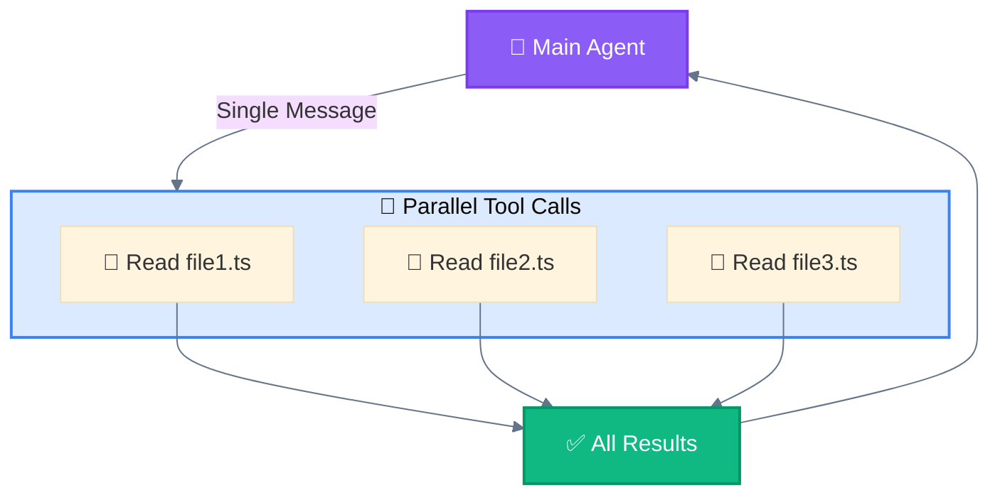

### Implementation

```python
# Single message with multiple parallel 🔌 tool calls
[
    Read(file_path="/src/auth.ts"),
    Read(file_path="/src/user.ts"),
    Read(file_path="/src/session.ts"),
    Grep(pattern="password", path="/src")
]

# All execute concurrently, results returned together
```

### vs Sequential

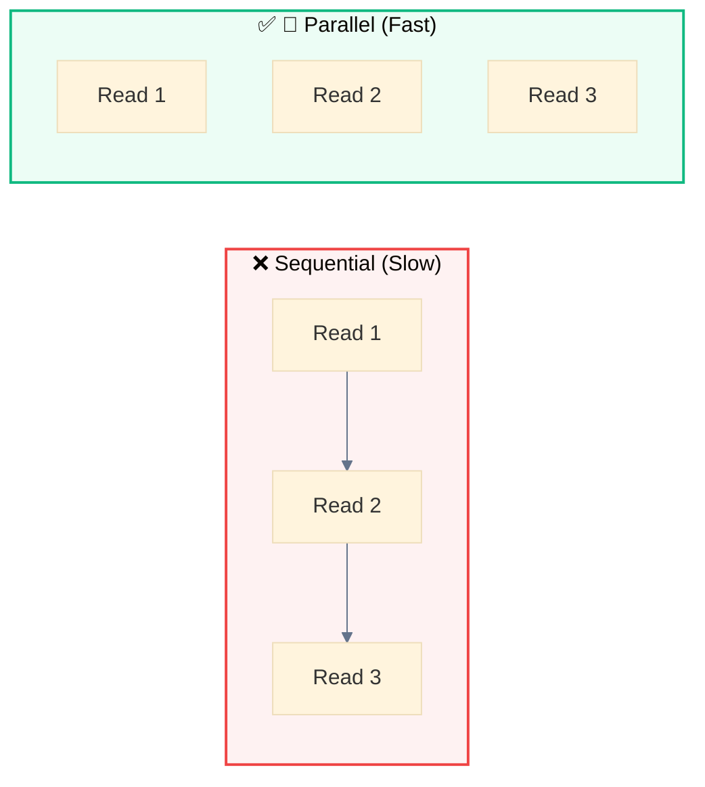

### Performance Comparison (Gantt)

```mermaid
%%{init: {'theme': 'base', 'themeVariables': {'lineColor': '#64748b'}}}%%
gantt
    title Sequential vs Parallel Execution
    dateFormat X
    axisFormat %s

    section ❌ Sequential
    Tool 1    :crit, 0, 3
    Tool 2    :crit, 3, 6
    Tool 3    :crit, 6, 9

    section ✅ Parallel
    Tool 1    :active, 0, 3
    Tool 2    :active, 0, 3
    Tool 3    :active, 0, 3
```

> **Result**: Parallel execution completes in ~3 time units vs 9 for sequential (3x faster).

### When to Use

- Reading multiple independent files
- Spawning multiple independent 🤖 subagents
- Gathering information from multiple sources
- Any operations without dependencies

### When NOT to Use

```python
# ❌ WRONG - second call depends on first
result1 = Read(file_path="/config.json")  # Need to read first
result2 = Read(file_path=result1.path)     # Then use result

# ✅ CORRECT - sequential
result1 = Read(file_path="/config.json")
# Process result1...
result2 = Read(file_path=derived_path)
```

---

## Pattern 4: 🧬 Master-Clone

### Definition

Spawn multiple isolated 🤖 instances handling independent domains with no shared state.

### Maps to Anthropic Pattern

**Parallelization + Orchestrator-Workers** - Independent parallel workers.

### Architecture

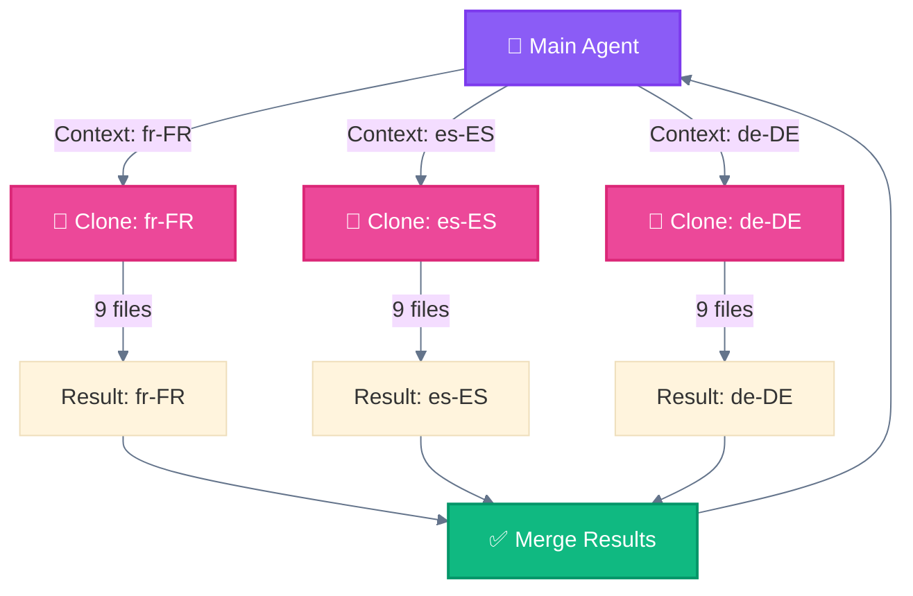

### Key Characteristic

Each 🤖 clone operates in complete isolation:
- No shared memory
- No inter-clone communication
- Independent context windows
- Results merge only at 🧠 orchestrator

### Use Cases

- Multi-locale generation (each locale independent)
- Multi-file processing (each file independent)
- Multi-domain analysis (each domain separate)

### Example: Locale Generation

```python
# Generate 5 locales in parallel with isolated contexts
[
    Task(subagent_type="locale-generator", prompt="Generate fr-FR", context=fr_context),
    Task(subagent_type="locale-generator", prompt="Generate es-ES", context=es_context),
    Task(subagent_type="locale-generator", prompt="Generate de-DE", context=de_context),
    Task(subagent_type="locale-generator", prompt="Generate ja-JP", context=ja_context),
    Task(subagent_type="locale-generator", prompt="Generate ar-SA", context=ar_context)
]
```

---

## Pattern 5: 🖥️ Multi-Window Context

### Definition

Implement checkpointing to save 💾 state and resume from interruptions in long-running workflows.

### Maps to Anthropic Pattern

**Autonomous Agents** (with state persistence) - Enables long-running operations.

### Architecture

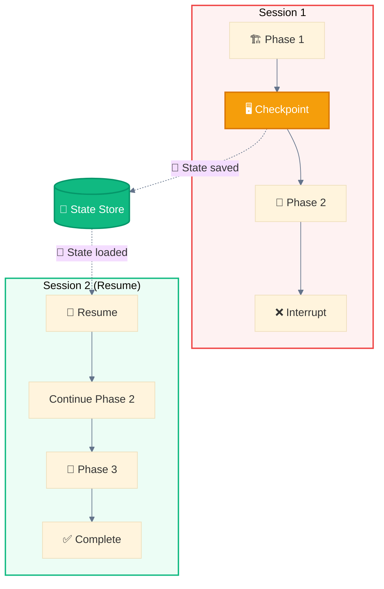

### 🖥️ Checkpoint Structure

```json
{
  "workflow_id": "generate-locales-2025-01-26",
  "current_phase": "phase_3",
  "completed": [
    {"locale": "fr-FR", "files": 9, "status": "✅ done"},
    {"locale": "es-ES", "files": 9, "status": "✅ done"}
  ],
  "pending": ["de-DE", "ja-JP", "ar-SA"],
  "in_progress": null,
  "timestamp": "2025-01-26T14:30:00Z",
  "can_resume": true
}
```

### Implementation

```python
# Save 🖥️ checkpoint
def save_checkpoint(state):
    Write(
        file_path="progress/checkpoint.json",
        content=json.dumps(state)
    )

# Check for existing 🖥️ checkpoint on start
def load_checkpoint():
    checkpoint = Read(file_path="progress/checkpoint.json")
    if checkpoint and checkpoint.can_resume:
        return checkpoint
    return None

# Workflow with checkpointing
checkpoint = load_checkpoint()
if checkpoint:
    resume_from(checkpoint)
else:
    start_fresh()
```

### Use Cases

- Large-scale generation (1000+ files)
- Long research tasks
- Multi-day workflows
- Error recovery

---

## Pattern 6: 🎛️ Programmatic Orchestration

### Definition

External code controls 🧠 agent invocation and workflow logic rather than pure prompt-based control.

### Maps to Anthropic Pattern

**Prompt Chaining** (with code control) - External program chains calls.

### Architecture

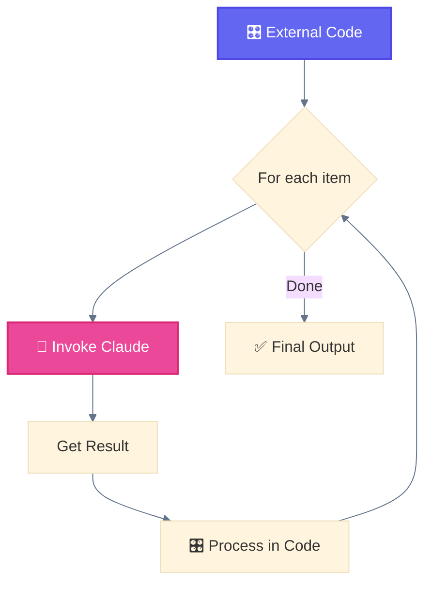

### Implementation

```python
# 🎛️ External Python script orchestrating Claude
import anthropic

client = anthropic.Anthropic()

locales = ["fr-FR", "es-ES", "de-DE"]
results = []

for locale in locales:
    # 🎛️ Programmatic invocation
    response = client.messages.create(
        model="claude-sonnet-4-20250514",
        messages=[{
            "role": "user",
            "content": f"Generate localization for {locale}"
        }]
    )

    # 🎛️ Code-controlled processing
    results.append({
        "locale": locale,
        "content": response.content
    })

    # 🎛️ Code-controlled checkpointing
    save_progress(results)

# 🎛️ Code-controlled merge
merge_results(results)
```

### vs Prompt-Based

| Aspect | 🎛️ Programmatic | Prompt-Based |
|--------|--------------|--------------|
| **Control** | External code | 🧠 Agent decisions |
| **Flexibility** | Highly customizable | Limited to prompts |
| **State** | External management | In-context |
| **Error handling** | Try/catch | Agent retry |

### Use Cases

- CI/CD integrations
- Batch processing systems
- API-based automation
- Complex conditional logic

---

## Pattern 7: 🧙 Wizard Workflows

### Definition

Multi-step processes with explicit 👤 user confirmation at each phase using ❓ `AskUserQuestion`.

### Maps to Anthropic Pattern

**Prompt Chaining + Human-in-the-Loop** - Sequential with checkpoints.

### Architecture

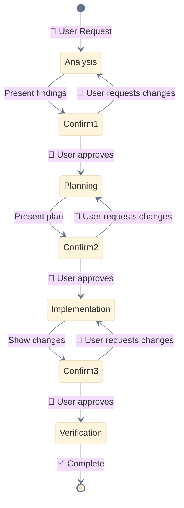

### Confirmation Point Structure

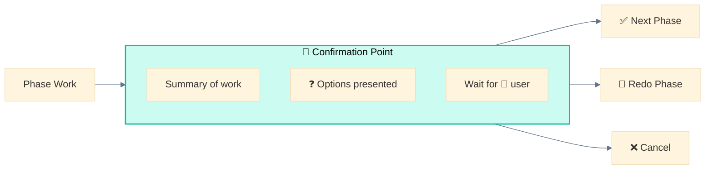

### Implementation

```python
# 🏗️ Phase 1: Analysis
findings = analyze_codebase()

# 🧙 Confirmation point
AskUserQuestion(
    questions=[{
        "header": "Analysis",
        "question": "I found 3 security issues. Proceed to fix?",
        "options": [
            {"label": "✅ Approve", "description": "Continue with fixes"},
            {"label": "📋 Details", "description": "Show me the issues"},
            {"label": "❌ Cancel", "description": "Stop workflow"}
        ],
        "multiSelect": False
    }]
)

# 👤 User response determines next action
if response == "Approve":
    proceed_to_planning()
elif response == "Details":
    show_details()  # Then ask again
elif response == "Cancel":
    abort_workflow()
```

### Phase Design

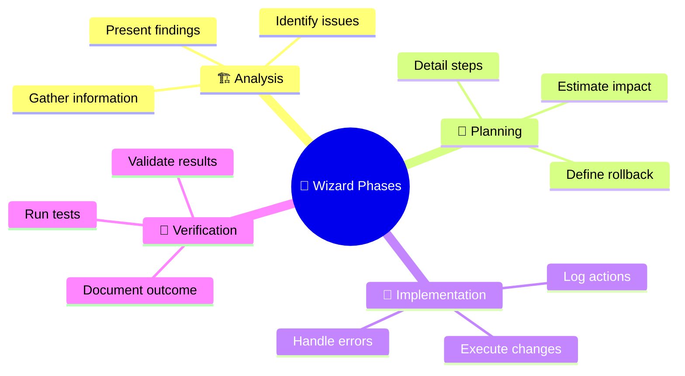

### ✅ Good Confirmation Prompt

```markdown
## Analysis Complete

I've analyzed the authentication module:

**Files scanned**: 12
**Issues found**: 3

| Severity | Issue | Location |
|----------|-------|----------|
| ❌ CRITICAL | SQL injection | auth.ts:45 |
| ⚠️ HIGH | Missing rate limit | login.ts:23 |
| ⏳ MEDIUM | Weak hash | password.ts:12 |

**Options:**
1. **✅ Approve** - Continue to fix these issues
2. **📋 Details** - Show me the vulnerable code
3. **⏭️ Prioritize** - Fix critical only
4. **❌ Cancel** - Stop and discuss
```

### ❌ Bad Confirmation Prompt

```
Found issues. Continue? (y/n)
```

### Use Cases

- Destructive operations (migrations, deletions)
- Complex refactoring
- Deployment pipelines
- Multi-stakeholder decisions

### ✅ Do's

- Provide clear summaries at each checkpoint
- Offer meaningful options (not just yes/no)
- Include rollback capability for destructive operations
- Show progress indicators
- Persist state for long workflows

### ❌ Don'ts

- Create too many micro-checkpoints (causes fatigue)
- Require approval for trivial steps
- Hide important information in summaries
- Make cancellation difficult
- Lose context between phases

---

## Pattern Mapping to Anthropic Research

```
┌────────────────────────────┬─────────────────────────────────────────────┐
│ Claude Code Pattern        │ Anthropic Research Pattern                  │
├────────────────────────────┼─────────────────────────────────────────────┤
│ 🎪 Subagent Orchestration  │ Orchestrator-Workers                        │
│ 🎓 Progressive Skills      │ Routing                                     │
│ 🚂 Parallel Tool Calling   │ Parallelization                             │
│ 🧬 Master-Clone            │ Parallelization + Orchestrator-Workers      │
│ 🖥️ Multi-Window Context    │ Autonomous Agents (state persistence)       │
│ 🎛️ Programmatic Orchestr.  │ Prompt Chaining (external control)          │
│ 🧙 Wizard Workflows        │ Prompt Chaining + Human-in-the-Loop         │
└────────────────────────────┴─────────────────────────────────────────────┘
```

---

## Operational Best Practices

### Permission Modes

Control how 🤖 Subagents request permissions for tool usage.

**Available Modes:**

| Mode | Behavior | Use Case |
|------|----------|----------|
| `default` | Asks permission for each tool call | Read-only operations, validation |
| `acceptEdits` | Auto-approves Write/Edit operations | Generation after 🧙 user confirmation |
| `bypassPermissions` | All tools auto-approved | Trusted autonomous workflows |

**Implementation:**

```yaml
# .claude/agents/content-generator.md
---
name: content-generator
description: Generates content files for specified locales
permissionMode: acceptEdits
allowed-tools: Read, Write, Glob, mcp__perplexity__*, mcp__firecrawl__*
---

You are a content generation specialist...
```

**Pattern: 🧙 Wizard Confirmation + `acceptEdits`**

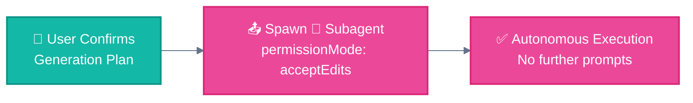

> **Best Practice**: Use 🧙 Wizard confirmation before spawning subagents with elevated permissions. User approves the plan once, then execution is autonomous.

---

### Parallelization Limits

Practical limits for stable parallel execution.

| Type | Recommended Max | Risk if Exceeded |
|------|-----------------|------------------|
| 🤖 Concurrent Subagents | **10-15** | Context overflow, memory pressure |
| 🔌 MCP calls per subagent | **5** | Rate limit errors |
| 📤 Task calls per message | **10** | API limits, timeouts |

**Batching Strategy for Large Workloads:**

```
# Instead of 39 parallel subagents for en-* cluster:
Wave 1: 10 🤖 subagents (en-GB, en-CA, en-AU...)
Wave 2: 10 🤖 subagents (en-IN, en-IE, en-NZ...)
Wave 3: 10 🤖 subagents (en-ZA, en-SG, en-PH...)
Wave 4:  8 🤖 subagents (remaining)
```

```mermaid
%%{init: {'theme': 'base', 'themeVariables': {'lineColor': '#64748b'}}}%%
gantt
    title Batched Parallelization (39 locales)
    dateFormat X
    axisFormat %s

    section Wave 1
    10 🤖 subagents    :active, 0, 10

    section Wave 2
    10 🤖 subagents    :active, 10, 20

    section Wave 3
    10 🤖 subagents    :active, 20, 30

    section Wave 4
    8 🤖 subagents     :active, 30, 38
```

> **Empirical**: Test limits in your environment. Start conservative (5-10), increase gradually.

---

### Context Management with `/compact`

Long-running workflows accumulate context. Use `/compact` between major phases to prevent overflow.

**Problem:**

```
Wave 1: +50,000 tokens context
Wave 2: +50,000 tokens context
Wave 3: +50,000 tokens context → ❌ Context limit exceeded!
```

**Solution:**


**Pattern: Checkpoint → Compact → Resume**

```python
# After each wave:
1. Save checkpoint (state persisted to file)
2. /compact (clears conversation history)
3. Load checkpoint (restore state from file)
4. Continue next wave
```

> **Critical**: `/compact` clears history but preserves CLAUDE.md context. Always checkpoint BEFORE compacting.

**When to `/compact`:**

| Scenario | Compact? | Why |
|----------|----------|-----|
| After generating 50+ files | ✅ Yes | Large output accumulation |
| Between independent waves | ✅ Yes | Fresh context per wave |
| Mid-phase during errors | ❌ No | Need error context for debugging |
| Short workflow (<10 files) | ❌ No | Unnecessary overhead |

---

## Combining Patterns: Real Example

### AthenaKNW Locale Generation

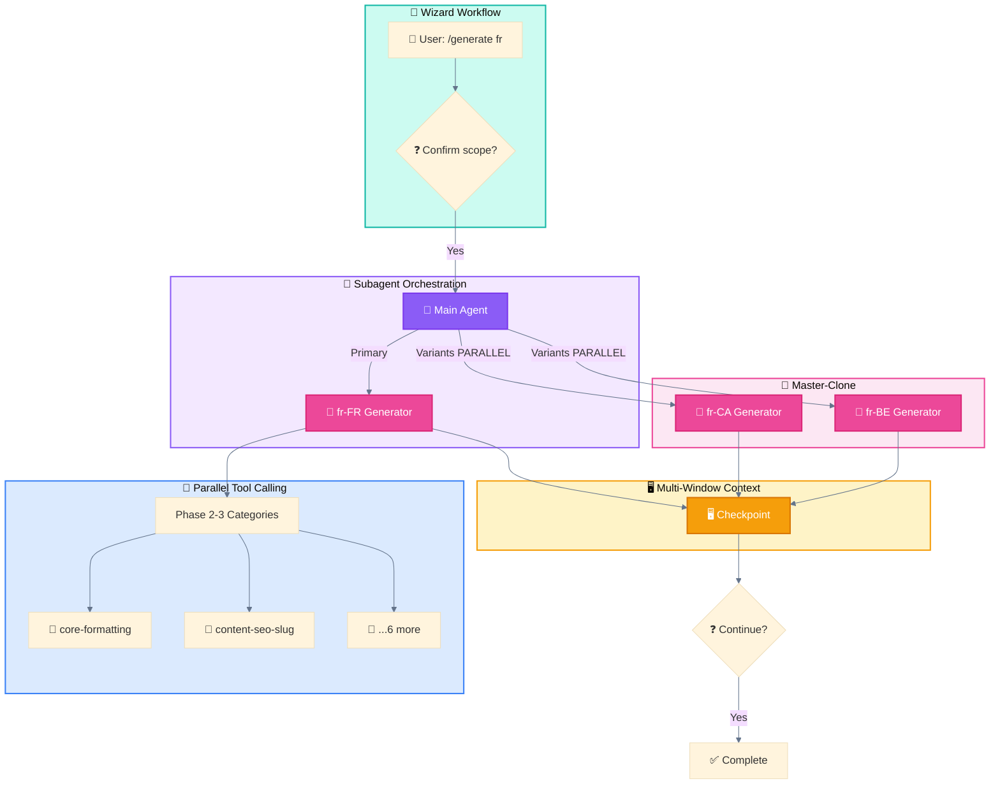

---

<div align="center">

**━━━━━━━━━━━━━━━━━━━━━━━━━━━━━━━━━━━━━━━━━━━━━━━━**

[← 03 Research Patterns](03-ANTHROPIC-RESEARCH-PATTERNS.md) • [🏠 Home](README.md) • [05 Use Cases →](05-USE-CASES.md)

</div>
