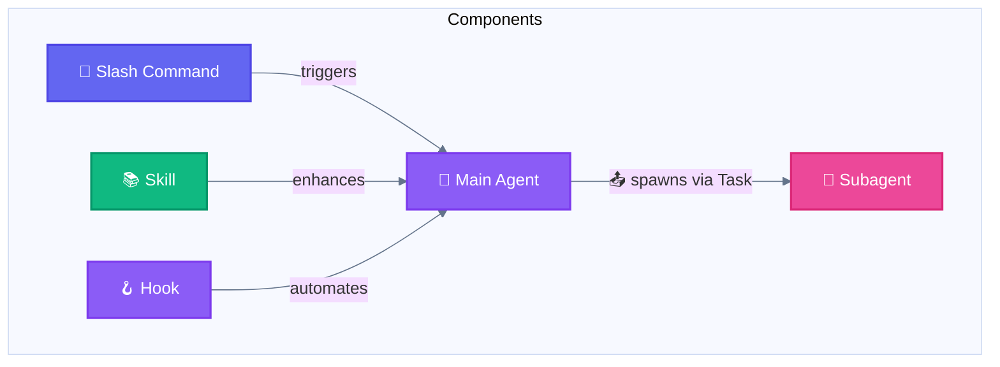
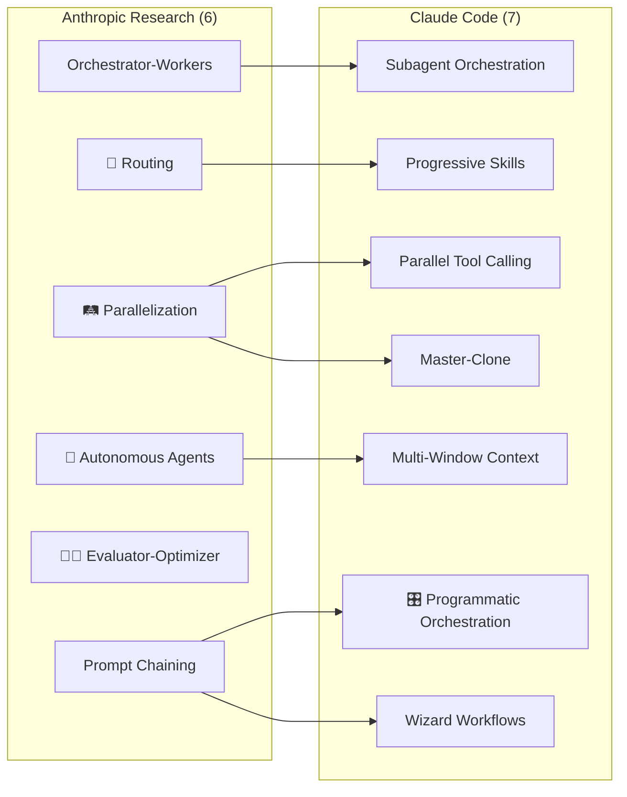
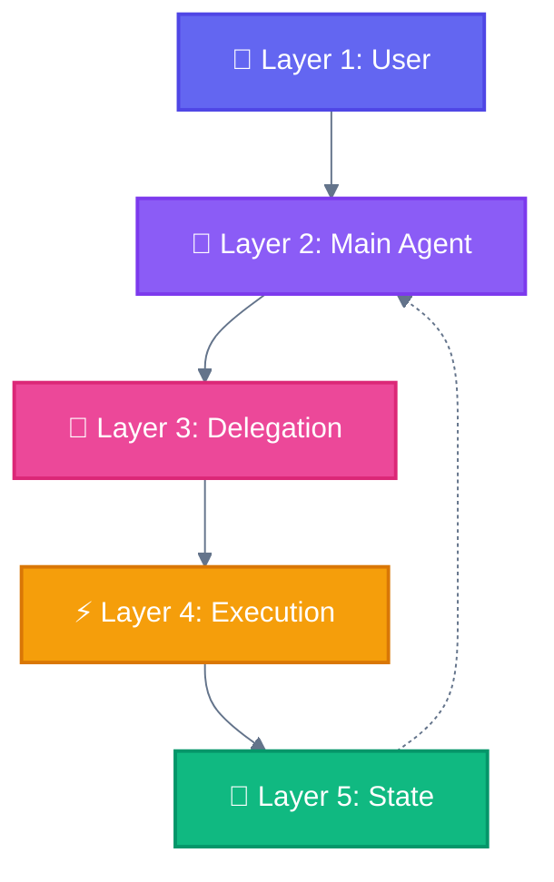

<div align="center">

[🏠 Home](README.md) • [📖 Overview](00-OVERVIEW.md) • **07 Glossary**

━━━━━━━━━━━━━●━━━━━━━━━━━━━━━━━ `7/8`

[← 06 Selection Guide](06-PATTERN-SELECTION-GUIDE.md) • [08 Style Guide →](08-STYLE-GUIDE.md)

</div>

---

# Mapping & Glossary

> Complete cross-reference of all agentic terminology

## 📑 Table of Contents

| # | Section | Description |
|---|---------|-------------|
| 1 | [Master Mapping Table](#master-mapping-table) | Components → Layers → Patterns |
| 2 | [Glossary A-Z](#glossary) | All terms defined |
| 3 | [Common Confusions](#common-confusions-clarified) | Disambiguation |
| 4 | [Quick Reference](#quick-reference-tables) | Color codes |

---

## Master Mapping Table

### Components → Layers → Patterns

```
┌─────────────────┬──────────────────┬─────────────────────────────────────────┐
│ Component       │ Layer            │ Patterns Used In                        │
├─────────────────┼──────────────────┼─────────────────────────────────────────┤
│ Main Agent      │ Main Agent Layer │ All patterns (orchestrator)             │
│ Subagent        │ Execution Layer  │ Subagent Orchestration, Master-Clone    │
│ Slash Command   │ Delegation Layer │ Wizard Workflows, All entry points      │
│ Skill           │ Delegation Layer │ Progressive Skills                      │
│ Hook            │ State Layer      │ Programmatic Orchestration              │
│ Task tool       │ Execution Layer  │ Subagent Orchestration, Master-Clone    │
│ AskUserQuestion │ User Layer       │ Wizard Workflows                        │
│ Tools (Read,..) │ Execution Layer  │ All patterns                            │
└─────────────────┴──────────────────┴─────────────────────────────────────────┘
```

### Anthropic Research → Claude Code Implementation

```
┌───────────────────────┬──────────────────────────┬────────────────────────────┐
│ Anthropic Pattern     │ Claude Code Pattern      │ Key Component              │
├───────────────────────┼──────────────────────────┼────────────────────────────┤
│ ⛓️ Prompt Chaining    │ Prompt Chaining          │ Sequential tool calls      │
│                       │ Programmatic Orchestr.   │ External code control      │
├───────────────────────┼──────────────────────────┼────────────────────────────┤
│ 🚦 Routing            │ Progressive Skills       │ Skill loading              │
├───────────────────────┼──────────────────────────┼────────────────────────────┤
│ 🛤️ Parallelization    │ Parallel Tool Calling    │ Multiple tools/message     │
│                       │ Master-Clone             │ Isolated subagents         │
├───────────────────────┼──────────────────────────┼────────────────────────────┤
│ 🎭 Orchestrator-Workers │ Subagent Orchestration   │ Task tool + agents/*.md    │
├───────────────────────┼──────────────────────────┼────────────────────────────┤
│ 👨‍🔧 Evaluator-Optimizer │ (Loop with validation)   │ Iterative tool calls       │
├───────────────────────┼──────────────────────────┼────────────────────────────┤
│ 🐔 Autonomous Agents  │ Multi-Window Context     │ Checkpointing              │
├───────────────────────┼──────────────────────────┼────────────────────────────┤
│ 🧙 Human-in-the-Loop  │ Wizard Workflows         │ AskUserQuestion tool       │
└───────────────────────┴──────────────────────────┴────────────────────────────┘
```

---

## Glossary: A-Z

### A

**Agent**
: An autonomous AI system that can perceive, decide, and act to achieve goals. In Claude Code, the Main Agent orchestrates all operations.

**AskUserQuestion**
: Tool for human-in-the-loop interactions. Presents structured questions with options to the user. Key component of Wizard Workflows.

```python
AskUserQuestion(questions=[{
    "header": "Confirm",
    "question": "Proceed with migration?",
    "options": [
        {"label": "Yes", "description": "Continue"},
        {"label": "No", "description": "Cancel"}
    ]
}])
```

**🐔 Autonomous Agent**
: An agent that independently plans, executes, and adapts without constant human guidance. Anthropic Research Pattern #6.

### C

**Checkpointing**
: Saving workflow state to enable resume after interruption. Key mechanism of Multi-Window Context pattern.

**CLAUDE.md**
: Project instruction file loaded automatically by Claude Code. Part of the State Layer.

**Component**
: Official Claude Code building blocks: Subagent, Slash Command, Skill, Hook.

### D

**Delegation Layer**
: Layer 3 in the architecture. Contains Slash Commands and Skills that define workflows and capabilities.

### E

**👨‍🔧 Evaluator-Optimizer**
: Anthropic pattern for iterative improvement through generate-evaluate-feedback loops.

**Execution Layer**
: Layer 4 in the architecture. Where Subagents and Tools perform actual work.

### H

**Hook**
: Shell command triggered by Claude Code events (pre/post tool execution, prompts).

```json
{
  "hooks": {
    "post-tool": [{
      "tool": "Write",
      "command": "npm run lint"
    }]
  }
}
```

**Human-in-the-Loop**
: Design pattern where human approval/input is required at key points. Implemented via AskUserQuestion in Wizard Workflows.

### L

**Layer**
: One of 5 architectural levels: User, Main Agent, Delegation, Execution, State.

### M

**Main Agent**
: The central Claude Code agent that orchestrates all operations. Only entity that can spawn Subagents.

**Main Agent Layer**
: Layer 2 in the architecture. The orchestration center.

**Master-Clone**
: Claude Code pattern for spawning multiple isolated subagents handling independent domains.

**Multi-Window Context**
: Claude Code pattern for checkpointing and resuming long workflows.

### O

**Orchestrator**
: The coordinating entity in Orchestrator-Workers pattern. In Claude Code, this is the Main Agent.

**Orchestrator-Workers**
: Anthropic pattern where a central orchestrator delegates to specialized workers.

### P

**Parallel Tool Calling**
: Claude Code pattern for executing multiple independent tool calls in a single message.

```python
# Single message, parallel execution
[
    Read(file_path="file1.ts"),
    Read(file_path="file2.ts"),
    Grep(pattern="TODO")
]
```

**🛤️ Parallelization**
: Anthropic pattern for executing independent tasks simultaneously.

**Pattern**
: A reusable solution to a common agentic system design problem.

**Progressive Skills**
: Claude Code pattern for loading capabilities on-demand based on task context.

**🎛️ Programmatic Orchestration**
: Claude Code pattern where external code controls agent invocation.

**Prompt Chaining**
: Anthropic pattern for sequential execution where each step feeds the next.

### R

**🚦 Routing**
: Anthropic pattern for directing inputs to specialized handlers based on classification.

### S

**Skill**
: Reusable methodology/capability that enhances agent behavior. Located in `.claude/skills/*/SKILL.md`.

```bash
.claude/skills/test-driven-development/
└── SKILL.md   # Contains description + instructions
```

> Skill name from directory name. Frontmatter: `name` (optional, max 64 chars), `description` (required, max 1024 chars), `allowed-tools` (optional, restricts tool access).

**Slash Command**
: User-invokable workflow starting with `/`. Located in `.claude/commands/*.md`.

```markdown
# .claude/commands/generate.md
---
description: Generate localization files
argument-hint: [locale]
---
```

> Command name from filename. Supported: `description`, `argument-hint`, `allowed-tools`, `model`.

**State Layer**
: Layer 5 in the architecture. Handles persistence, memory, and context.

**Subagent**
: Specialized agent spawned via Task tool. Cannot spawn other subagents. Located in `.claude/agents/*.md`.

```markdown
# .claude/agents/reviewer.md
---
name: code-reviewer
description: Expert code review specialist
tools: Read, Grep, Glob
---
```

> `tools` is a comma-separated string. `description` is required.

**Subagent Orchestration**
: Claude Code pattern where Main Agent spawns specialized Subagents.

### T

**Task tool**
: The mechanism for spawning Subagents.

```python
Task(
    subagent_type="code-reviewer",
    prompt="Review auth module"
)
```

**TodoWrite**
: Tool for task tracking and progress visibility.

**Tool**
: Executable capability (Read, Write, Bash, Grep, etc.) available to agents.

### U

**User Layer**
: Layer 1 in the architecture. Entry point for all human interactions.

### W

**Wizard Workflows**
: Claude Code pattern for multi-step processes with explicit user confirmation at each phase.

**Worker**
: Specialized executor in Orchestrator-Workers pattern. In Claude Code, these are Subagents.

---

## Visual Glossary

### Component Hierarchy



### Pattern Relationships



### Layer Interactions



---

## Common Confusions Clarified

### Command vs Slash Command

| Term | Meaning |
|------|---------|
| **Command** | Generic term for any instruction |
| **Slash Command** | Specific Claude Code component starting with `/` |

**Use "Slash Command" when referring to `.claude/commands/*.md` files.**

### Agent vs Subagent

| Term | Meaning |
|------|---------|
| **Agent** | Any autonomous AI system |
| **Main Agent** | The primary Claude Code instance |
| **Subagent** | Agent spawned by Main Agent via Task tool |

**Subagents cannot spawn other Subagents.**

### Pattern vs Workflow

| Term | Meaning |
|------|---------|
| **Pattern** | Reusable design solution (abstract) |
| **Workflow** | Specific implementation of patterns (concrete) |

**Example**: Wizard Workflow is a *pattern*; `/generate fr-FR` with confirmation steps is a *workflow* implementing that pattern.

### Skill vs Tool

| Term | Meaning |
|------|---------|
| **Skill** | Methodology/knowledge loaded for specific tasks |
| **Tool** | Executable action (Read, Write, Bash, etc.) |

**Skills enhance how tools are used; tools are the actual operations.**

---

## File Location Reference

```
.claude/
├── agents/                    # Subagent definitions
│   └── *.md                   # One file per subagent type
├── commands/                  # Slash Command definitions
│   └── *.md                   # One file per command (name from filename)
├── skills/                    # Skill definitions
│   └── skill-name/            # One directory per skill (name from dir)
│       └── SKILL.md           # Skill content
└── settings.json              # Hooks and configuration
```

---

## Symbol Key (for Diagrams)

| Symbol | Meaning |
|--------|---------|
| `[Rectangle]` | Process/Component |
| `{Diamond}` | Decision point |
| `((Circle))` | Start/End |
| `-->` | Sequential flow |
| `-.->` | Optional/async flow |
| `-->│` | Parallel flow |

### Color Coding

| Color | Hex | Meaning | Emoji |
|-------|-----|---------|-------|
| Indigo | `#6366f1` | User, Slash Commands | 👤 🦴 |
| Purple | `#8b5cf6` | Main Agent, Skills | 🧠 📚 |
| Pink | `#ec4899` | Subagent, Task tool | 🤖 📤 |
| Amber | `#f59e0b` | MCP Tools | 🔌 |
| Emerald | `#10b981` | State, Success | 💾 ✅ |
| Blue | `#3b82f6` | Parallel, Multi-Window | 🚂 🖥️ |
| Teal | `#14b8a6` | Wizard | 🧙 |
| Red | `#ef4444` | Error | ❌ |
| Slate | `#64748b` | Neutral, Skip | ⏭️ |

---

<div align="center">

**━━━━━━━━━━━━━━━━━━━━━━━━━━━━━━━━━━━━━━━━━━━━━━━━**

[← 06 Selection Guide](06-PATTERN-SELECTION-GUIDE.md) • [🏠 Home](README.md) • [08 Style Guide →](08-STYLE-GUIDE.md)

</div>
