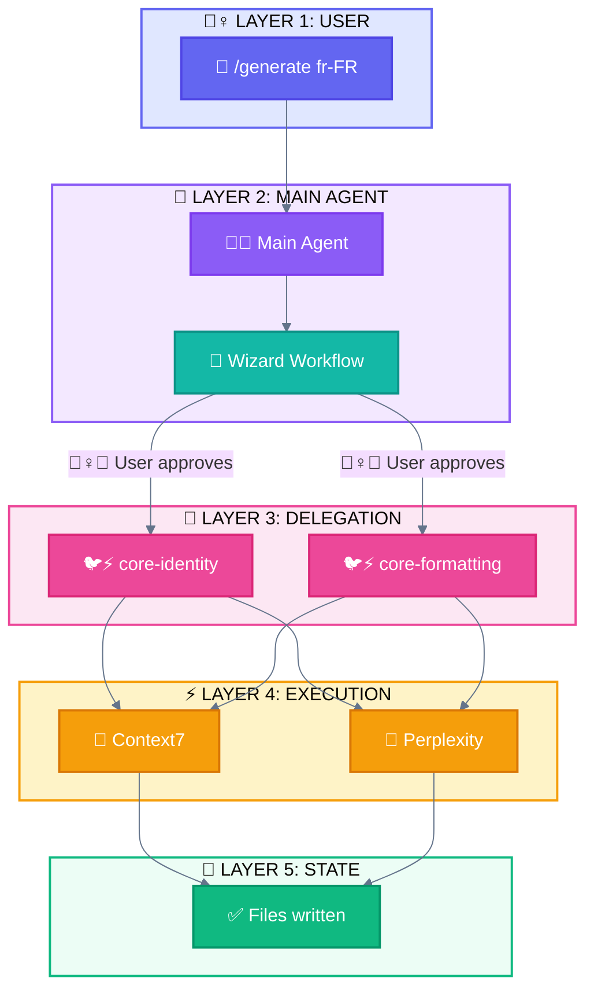

<div align="center">

[🏠 Home](README.md) • [📖 Overview](00-OVERVIEW.md) • **07 Style Guide**

━━━━━━━━━━━━━●━━━━━━━━━━━━━━━━━ `7/8`

[← 06 Glossary](06-MAPPING-GLOSSARY.md) • [🏠 Back to Home](README.md)

</div>

---

# Style Guide: ACTEUR + ACTION System

> Standardized visual language for all Mermaid diagrams using **WHO does WHAT**

## 📑 Table of Contents

| # | Section | Description |
|---|---------|-------------|
| 1 | [Core Concept](#core-concept) | ACTEUR + ACTION explained |
| 2 | [Acteurs](#acteurs) | Who does the action |
| 3 | [Actions](#actions) | What is being done |
| 4 | [Tools](#tools) | What they use |
| 5 | [Combinations](#combinations) | ACTEUR + ACTION examples |
| 6 | [Other Elements](#other-elements) | Status, Triggers, Patterns |
| 7 | [Color Palette](#color-palette) | Hex codes |
| 8 | [Mermaid Classes](#mermaid-class-definitions) | Copy-paste blocks |
| 9 | [Rules](#rules) | Do's and Don'ts |

---

## Core Concept

Every element in a diagram answers: **WHO does WHAT?**

```
┌─────────────────────────────────────────────────────────────────────────────┐
│                         ACTEUR + ACTION SYSTEM                              │
├─────────────────────────────────────────────────────────────────────────────┤
│                                                                             │
│  FORMAT: 🐔💭 = Main Agent (WHO) + Réflexion (WHAT)                         │
│                                                                             │
│  EXAMPLES:                                                                  │
│  ┌─────────┬─────────┬──────────────────────────────────────────────────┐  │
│  │ Combo   │ Meaning │ Description                                      │  │
│  ├─────────┼─────────┼──────────────────────────────────────────────────┤  │
│  │ 🙆‍♀️      │ User    │ User (neutral/idle state)                        │  │
│  │ 🙋‍♀️📥    │ User    │ User sends input                                 │  │
│  │ 📤💁‍♀️    │ User    │ User receives output                             │  │
│  │ 🐔💭    │ Main    │ Main Agent thinks/reasons                        │  │
│  │ 🐔🚦    │ Main    │ Main Agent routes/decides                        │  │
│  │ 🐔🪺    │ Main    │ Main Agent spawns Subagent (via Task)            │  │
│  │ 🐔🔀    │ Main    │ Main Agent splits task                           │  │
│  │ 🐔🌀    │ Main    │ Main Agent merges results                        │  │
│  │ 🐔🔧    │ Main    │ Main Agent uses Built-in tool                    │  │
│  │ 🐔🔌🌐  │ Main    │ Main Agent calls External API (MCP)              │  │
│  │ 🐦⚡    │ Sub     │ Subagent executes task                           │  │
│  │ 🐦📤    │ Sub     │ Subagent returns result                          │  │
│  │ 🐦💤    │ Sub     │ Subagent idle/not chosen (Routing)               │  │
│  │ 🐔💤    │ Main    │ Main Agent idle/not chosen (Routing)             │  │
│  └─────────┴─────────┴──────────────────────────────────────────────────┘  │
│                                                                             │
└─────────────────────────────────────────────────────────────────────────────┘
```

---

## Acteurs

**WHO does the action?**

| Acteur | Emoji | Color | Hex | Description |
|--------|-------|-------|-----|-------------|
| **User (neutral)** | 🙆‍♀️ | Indigo | `#6366f1` | The human (idle state) |
| **User (gives)** | 🙋‍♀️ | Indigo | `#6366f1` | The human sends input |
| **User (receives)** | 💁‍♀️ | Indigo | `#6366f1` | The human receives output |
| **Main Agent** | 🐔 | Purple | `#8b5cf6` | Claude Code orchestrator (the hen) |
| **Subagent** | 🐦 | Pink | `#ec4899` | Delegated worker (the bird) |

```
┌─────────────────────────────────────────────────────────────────────────────┐
│  THE POULTRY FAMILY                                                         │
│                                                                             │
│  USER STATES:                                                               │
│  🙆‍♀️ User (neutral)  → Idle, waiting                                        │
│  🙋‍♀️ User (gives)    → Sends input to system                                │
│  💁‍♀️ User (receives) → Receives output from system                          │
│                                                                             │
│  AGENTS:                                                                    │
│  🐔 Main Agent  → The hen that orchestrates (can spawn 🐦)                  │
│  🐦 Subagent    → The bird that executes (cannot spawn other 🐦)            │
│                                                                             │
│  HIERARCHY: 🙋‍♀️📥 → 🐔 → 🐦 → 📤💁‍♀️                                           │
│                                                                             │
└─────────────────────────────────────────────────────────────────────────────┘
```

---

## Actions

**WHAT is being done?**

| Action | Emoji | Description | Used with |
|--------|-------|-------------|-----------|
| **Input** | 📥 | Data enters system | 🙋‍♀️📥 (user sends) |
| **Output** | 📤 | Data exits system | 🐔📤, 🐦📤 (agent outputs), 📤💁‍♀️ (user receives) |
| **Réflexion** | 💭 | Thinks/Reasons/Prompts | 🐔💭, 🐦💭 |
| **Routing** | 🚦 | Decides direction | 🐔🚦 |
| **Spawn** | 🪺 | Creates/Spawns subagent | 🐔🪺 |
| **Exécution** | ⚡ | Executes task | 🐔⚡, 🐦⚡ |
| **Observation** | 👀 | Reads/Observes | 🐔👀, 🐦👀 |
| **Écriture** | ✏️ | Writes/Modifies | 🐔✏️, 🐦✏️ |
| **Validation** | ✅ | Validates/Approves | 🙆‍♀️✅, 🐔✅ |
| **Question** | ❓ | Asks | 🙆‍♀️❓, 🐔❓ |
| **Split** | 🔀 | Divides/Splits task | 🐔🔀 |
| **Merge** | 🌀 | Combines results | 🐔🌀 |
| **Plan** | 📋 | Creates plan | 🐔📋 |
| **Adjust** | 🔄 | Adjusts/Loops | 🐔🔄 |
| **Continue** | ▶️ | Continues execution | 🐔▶️ |
| **Idle/Sleep** | 💤 | Not chosen/Inactive | 🐦💤, 🐔💤 |

> **📥/📤 Order Rule:** The position of 📥/📤 indicates data flow direction:
> - `ACTEUR📥` = Acteur sends INTO system (e.g., 🙋‍♀️📥)
> - `ACTEUR📤` = Acteur produces output (e.g., 🐔📤, 🐦📤)
> - `📤ACTEUR` = Acteur receives FROM system (e.g., 📤💁‍♀️)

---

## Tools

**WHAT do they use?** (by source)

> Tools are distinguished by their **source**, not their type. Both are tools the agent uses.

| Source | Emoji | Color | Hex | Examples |
|--------|-------|-------|-----|----------|
| **Built-in** | 🔧 | Slate | `#64748b` | Read, Write, Edit, Bash, Glob, Grep, AskUserQuestion, TodoWrite |
| **External (MCP)** | 🔌 | Amber | `#f59e0b` | Context7, Perplexity, Firecrawl (via Model Context Protocol) |

### Built-in Tool Sub-categories (optional precision)

| Sub-category | Combo | Tools |
|--------------|-------|-------|
| Read File | 🔧👀 | Read |
| Search Content | 🔧🔍 | Grep |
| Search Files | 🔧🗂️ | Glob |
| Write Operations | 🔧✏️ | Write, Edit, NotebookEdit |
| Shell Operations | 🔧📟 | Bash, BashOutput, KillShell |
| Web Operations | 🔧🌐 | WebFetch, WebSearch |
| Ask User | 🔧❓ | AskUserQuestion |
| Plan/Track | 🔧📋 | TodoWrite |

### External Tool (MCP) Usage

| Usage | Combo | Description |
|-------|-------|-------------|
| MCP call | 🐔🔌🌐 | Main Agent calls external API via MCP |
| MCP call | 🐦🔌🌐 | Subagent calls external API via MCP |

---

## Combinations

### ACTEUR + ACTION

```
┌─────────────────────────────────────────────────────────────────────────────┐
│  USER (3 states: 🙆‍♀️ 🙋‍♀️ 💁‍♀️)                                                 │
│  ────────────────────────────────────────────────────────────────────────── │
│  🙆‍♀️      User (neutral/idle state)                                         │
│  🙋‍♀️📥    User sends input                                                   │
│  🙆‍♀️✅    User validates (approves)                                          │
│  🙆‍♀️❓    User questions                                                     │
│  📤💁‍♀️    User receives output                                               │
├─────────────────────────────────────────────────────────────────────────────┤
│  MAIN AGENT 🐔                                                              │
│  ────────────────────────────────────────────────────────────────────────── │
│  🐔💭   Main Agent thinks/reasons                                           │
│  🐔🚦   Main Agent routes/decides                                           │
│  🐔🪺   Main Agent spawns Subagent (via Task)                               │
│  🐔🔀   Main Agent splits task                                              │
│  🐔🌀   Main Agent merges results                                           │
│  🐔📋   Main Agent plans (Pattern 7: 🐉 Autonomous)                         │
│  🐔📤   Main Agent outputs result                                           │
│  🐔⚡   Main Agent executes                                                 │
│  🐔👀   Main Agent observes/reads                                           │
│  🐔✏️   Main Agent writes                                                   │
│  🐔✅   Main Agent validates                                                │
│  🐔🔄   Main Agent adjusts/loops                                            │
├─────────────────────────────────────────────────────────────────────────────┤
│  SUBAGENT 🐦                                                                │
│  ────────────────────────────────────────────────────────────────────────── │
│  🐦💭   Subagent thinks/reasons                                             │
│  🐦⚡   Subagent executes                                                   │
│  🐦👀   Subagent observes/reads                                             │
│  🐦✏️   Subagent writes                                                     │
│  🐦📤   Subagent returns result                                             │
│  🐦✅   Subagent validates                                                  │
│  🐦💤   Subagent idle/not chosen                                            │
├─────────────────────────────────────────────────────────────────────────────┤
│  IDLE (for Routing pattern)                                                 │
│  ────────────────────────────────────────────────────────────────────────── │
│  🐔💤   Main Agent idle/not chosen                                          │
│  🐦💤   Subagent idle/not chosen                                            │
└─────────────────────────────────────────────────────────────────────────────┘
```

### ACTEUR + TOOL

```
┌─────────────────────────────────────────────────────────────────────────────┐
│  MAIN AGENT 🐔 + BUILT-IN TOOLS 🔧                                          │
│  ────────────────────────────────────────────────────────────────────────── │
│  🐔🔧      Main Agent uses built-in tool                                    │
│  🐔🔧👀    Main Agent reads file (Read)                                     │
│  🐔🔧🔍    Main Agent searches content (Grep)                               │
│  🐔🔧🗂️    Main Agent searches files (Glob)                                 │
│  🐔🔧✏️    Main Agent writes (Write, Edit)                                  │
│  🐔🔧📟    Main Agent shell (Bash)                                          │
│  🐔🔧🌐    Main Agent web (WebFetch, WebSearch)                             │
│  🐔🔧❓    Main Agent asks user (AskUserQuestion)                           │
│  🐔🔧📋    Main Agent plans/tracks (TodoWrite)                              │
├─────────────────────────────────────────────────────────────────────────────┤
│  MAIN AGENT 🐔 + EXTERNAL TOOLS 🔌 (MCP)                                    │
│  ────────────────────────────────────────────────────────────────────────── │
│  🐔🔌🌐    Main Agent calls external API via MCP                            │
├─────────────────────────────────────────────────────────────────────────────┤
│  SUBAGENT 🐦 + BUILT-IN TOOLS 🔧                                            │
│  ────────────────────────────────────────────────────────────────────────── │
│  🐦🔧      Subagent uses built-in tool                                      │
│  🐦🔧👀    Subagent reads file (Read)                                       │
│  🐦🔧🔍    Subagent searches content (Grep)                                 │
│  🐦🔧🗂️    Subagent searches files (Glob)                                   │
│  🐦🔧✏️    Subagent writes (Write, Edit)                                    │
│  🐦🔧📟    Subagent shell (Bash)                                            │
├─────────────────────────────────────────────────────────────────────────────┤
│  SUBAGENT 🐦 + EXTERNAL TOOLS 🔌 (MCP)                                      │
│  ────────────────────────────────────────────────────────────────────────── │
│  🐦🔌🌐    Subagent calls external API via MCP                              │
└─────────────────────────────────────────────────────────────────────────────┘
```

---

## Other Elements

### Triggers & Components

| Element | Emoji | Color | Hex | Description |
|---------|-------|-------|-----|-------------|
| **Hook** | 🪝 | Emerald | `#10b981` | Automatic trigger |
| **Slash Command** | 🦴 | Indigo | `#6366f1` | User entry point |
| **Skill** | 📚 | Purple | `#8b5cf6` | Loaded knowledge |
| **State/Data** | 💾 | Emerald | `#10b981` | Persisted data |

### Status

| Status | Emoji | Color | Hex |
|--------|-------|-------|-----|
| **Success** | ✅ | Emerald | `#10b981` |
| **Error** | ❌ | Red | `#ef4444` |
| **Warning** | ⚠️ | Amber | `#f59e0b` |
| **In Progress** | 🔄 | Blue | `#3b82f6` |
| **Pending** | ⏳ | Slate | `#64748b` |
| **Skip** | ⏭️ | Slate | `#64748b` |

### Agentic Patterns (7 patterns)

| # | Pattern | Emoji | Color | Hex |
|---|---------|-------|-------|-----|
| 1 | Direct Execution | 🏎️ | Slate | `#64748b` |
| 2 | Prompt Chaining | ⛓️ | Purple | `#8b5cf6` |
| 3 | Routing | 🚦 | Amber | `#f59e0b` |
| 4 | Parallelization | 🛤️ | Blue | `#3b82f6` |
| 5 | Subagent Orchestration | 🦑 | Pink | `#ec4899` |
| 6 | Evaluator-Optimizer | 🩻 | Teal | `#14b8a6` |
| 7 | Autonomous Agents | 🐉 | Purple | `#8b5cf6` |

### Mechanisms (implementation, not patterns)

| Mechanism | Emoji | Color | Hex |
|-----------|-------|-------|-----|
| Progressive Skills | 📚 | Purple | `#8b5cf6` |
| Programmatic Orchestration | 🎛️ | Indigo | `#6366f1` |

### Pattern Variants

| Variant | Parent Pattern | Emoji |
|---------|----------------|-------|
| Wizard Workflow | ⛓️ Prompt Chaining | 🧙 |
| Parallel Tool Calling | 🛤️ Parallelization | 🚂 |
| Master-Clone | 🛤️ Parallelization | 🧬 |
| Multi-Window Context | 🐉 Autonomous Agents | 🖥️ |

### Phases (generation order)

| Phase | Emoji | Description |
|-------|-------|-------------|
| **Phase 1** | 🏗️ | Foundation |
| **Phase 2** | 🔗 | Formatting |
| **Phase 3** | 📝 | Content |
| **Phase 4** | 🔮 | Synthesis |

---

## Quick Reference Card

```
┌─────────────────────────────────────────────────────────────────────────────┐
│                      EMOJI QUICK REFERENCE v2                               │
├─────────────────────────────────────────────────────────────────────────────┤
│                                                                             │
│  ACTEURS              ACTIONS              TOOLS (by source)                │
│  ────────             ───────              ─────────────────                │
│  🙆‍♀️ User (neutral)   📥 Input             🔧 Built-in                      │
│  🙋‍♀️ User (gives)     📤 Output            🔌 External (MCP)                │
│  💁‍♀️ User (receives)  💭 Réflexion                                          │
│  🐔 Main Agent        🚦 Routing           BUILT-IN DETAIL                  │
│  🐦 Subagent          🪺 Spawn             ───────────────                  │
│                       ⚡ Exécution         🔧👀 Read file                    │
│                       👀 Observation       🔧🔍 Grep (content)               │
│                       ✏️ Écriture          🔧🗂️ Glob (files)                 │
│                       📋 Plan              🔧✏️ Write ops                    │
│                       🔄 Adjust            🔧📟 Shell ops                    │
│                       ✅ Validation        🔧🌐 Web ops                      │
│                       ❓ Question          🔧❓ Ask user                     │
│                       🔀 Split             🔧📋 Plan/Track                   │
│                       🌀 Merge             🔌🌐 External API (MCP)           │
│                       💤 Idle/Sleep                                         │
├─────────────────────────────────────────────────────────────────────────────┤
│  TRIGGERS             STATUS               COMPOSANTS                       │
│  ────────             ──────               ──────────                       │
│  🪝 Hook              ✅ Success           🦴 Slash Command                 │
│                       ❌ Error             📚 Skill                         │
│                       ⚠️ Warning           💾 State                         │
│                       🔄 Progress                                           │
│                       ⏳ Pending                                            │
│                       ⏭️ Skip                                               │
├─────────────────────────────────────────────────────────────────────────────┤
│  AGENTIC PATTERNS (7)              VARIANTS                 MECHANISMS     │
│  ────────────────────              ────────                 ──────────     │
│  🏎️ Direct Execution               🧙 Wizard Workflow       📚 Progressive │
│  ⛓️ Prompt Chaining                🚂 Parallel Tool Call      Skills       │
│  🚦 Routing                        🧬 Master-Clone          🎛️ Programmatic│
│  🛤️ Parallelization                🖥️ Multi-Window             Orch.       │
│  🦑 Subagent Orchestration                                                 │
│  🩻 Evaluator-Optimizer                                                   │
│  🐉 Autonomous Agents                                                      │
└─────────────────────────────────────────────────────────────────────────────┘
```

---

## Color Palette

```
┌─────────────────────────────────────────────────────────────────────────────┐
│                         STANDARD COLOR PALETTE                              │
├─────────────────────────────────────────────────────────────────────────────┤
│                                                                             │
│  🟣 #6366f1 (Indigo)    → User 🙆‍♀️🙋‍♀️💁‍♀️, Slash Commands 🦴, Prog. Orch. 🎛️   │
│  🟣 #8b5cf6 (Purple)    → Main Agent 🐔, Skills 📚                          │
│  🩷 #ec4899 (Pink)      → Subagent 🐦                                       │
│  🟠 #f59e0b (Amber)     → MCP Tools 🔌, Master-Clone 🧬                     │
│  🟢 #10b981 (Emerald)   → State 💾, Success ✅, Hook 🪝                     │
│  🔵 #3b82f6 (Blue)      → Parallel 🚂, Multi-Window 🖥️, Progress 🔄        │
│  🔴 #ef4444 (Red)       → Errors ❌                                        │
│  🩶 #64748b (Slate)     → Built-in Tools 🔧, Neutral, Skip ⏭️               │
│  🩶 #94a3b8 (Slate-400) → Idle/Not chosen 💤                                │
│  🩵 #14b8a6 (Teal)      → Wizard 🧙                                         │
│  🩵 #06b6d4 (Cyan)      → Data flow                                        │
│                                                                             │
└─────────────────────────────────────────────────────────────────────────────┘
```

---

## Mermaid Class Definitions

### Standard classDef Block

Copy this block at the start of every Mermaid diagram:

```mermaid
%%{init: {'theme': 'base', 'themeVariables': {'lineColor': '#64748b'}}}%%
flowchart TB
    %% Acteurs
    classDef user fill:#6366f1,stroke:#4f46e5,stroke-width:2px,color:#ffffff
    classDef main fill:#8b5cf6,stroke:#7c3aed,stroke-width:2px,color:#ffffff
    classDef subagent fill:#ec4899,stroke:#db2777,stroke-width:2px,color:#ffffff
    classDef skill fill:#8b5cf6,stroke:#7c3aed,stroke-width:2px,color:#ffffff

    %% Tools (by source)
    classDef builtinTool fill:#64748b,stroke:#475569,stroke-width:2px,color:#ffffff
    classDef mcpTool fill:#f59e0b,stroke:#d97706,stroke-width:2px,color:#ffffff

    %% Other
    classDef state fill:#10b981,stroke:#059669,stroke-width:2px,color:#ffffff
    classDef wizard fill:#14b8a6,stroke:#0d9488,stroke-width:2px,color:#ffffff
    classDef parallel fill:#3b82f6,stroke:#2563eb,stroke-width:2px,color:#ffffff
    classDef error fill:#ef4444,stroke:#dc2626,stroke-width:2px,color:#ffffff
    classDef neutral fill:#64748b,stroke:#475569,stroke-width:2px,color:#ffffff
    classDef data fill:#06b6d4,stroke:#0891b2,stroke-width:2px,color:#ffffff
    classDef idle fill:#94a3b8,stroke:#64748b,stroke-width:2px,color:#ffffff
    classDef pattern fill:#8b5cf6,stroke:#7c3aed,stroke-width:2px,color:#ffffff
```

### Subgraph Styles

```mermaid
    %% Layer Subgraph Styles
    style L1 fill:#e0e7ff,stroke:#6366f1,stroke-width:2px
    style L2 fill:#f3e8ff,stroke:#8b5cf6,stroke-width:2px
    style L3 fill:#fce7f3,stroke:#ec4899,stroke-width:2px
    style L4 fill:#fef3c7,stroke:#f59e0b,stroke-width:2px
    style L5 fill:#ecfdf5,stroke:#10b981,stroke-width:2px
```

---

## Example: Complete Diagram



---

## Example: Prompt Chaining Flow (Pattern 2: ⛓️)

```
🙋‍♀️📥 ──► 🐔💭 ──► 🐔📤 ──► 🐔💭 ──► 🐔📤 ──► 🐔💭 ──► 🐔📤 ──► 📤💁‍♀️
Input     Step 1    (internal)  Step 2    (internal)  Step 3     Output    User
```

## Example: Subagent Orchestration Flow (Pattern 5: 🦑)

```
🙋‍♀️📥 ──► 🐔🔀 ──┬──► 🐦⚡ ──► 🐦📤 ──┐
                ├──► 🐦⚡ ──► 🐦📤 ──┼──► 🐔🌀 ──► 🐔📤 ──► 📤💁‍♀️
                └──► 🐦⚡ ──► 🐦📤 ──┘
```

## Example: Autonomous Agent Flow (Pattern 7: 🐉)

```
🙋‍♀️📥 ──► 🐔📋 ──► 🐔⚡ ──► 🐔👀 ──► 🐔💭 ──┬──► 🐔🔄 ──► 🐔📋 (loop)
Goal       Plan      Act      Observe   Reflect │
                                                └──► 🐔📤 ──► 📤💁‍♀️ (done)
```

## Example: Human-in-the-Loop with Continue

```
🙋‍♀️📥 ──► 🐔📋 ──► 🐔📤 ──► 📤💁‍♀️ ──► 🙆‍♀️✅ ──► 🐔▶️ ──► 🐔⚡ ──► 🐔📤 ──► 📤💁‍♀️
Request    Plan      Show      User      User      Agent     Execute   Output    Done
                     plan      reviews   approves  continues
```

> **🐔▶️ (Continue)** is used when the agent resumes execution after a pause, checkpoint, or user approval.

---

## Rules

### Do's

1. **Always use ACTEUR + ACTION** - Every node should show WHO does WHAT
2. **Use classDef** - Never inline styles
3. **Consistent colors** - Same color = same acteur/tool everywhere
4. **White text on dark fills** - `color:#ffffff` for readability
5. **2px stroke-width** - Standard border thickness
6. **Subgraph backgrounds** - Use lighter versions of layer colors

### Don'ts

1. **Don't mix emoji meanings** - 🐔 is always Main Agent, never Subagent
2. **Don't use random colors** - Stick to the palette
3. **Don't skip emojis** - They aid quick scanning
4. **Don't use dark backgrounds with dark text**
5. **Don't create new emojis without documenting**
6. **Don't use 🧠 for Main Agent** - Use 🐔 (deprecated)
7. **Don't use 🤖 for Subagent** - Use 🐦 (deprecated)
8. **Don't use 👤 for User** - Use 🙋‍♀️ (deprecated)

---

## CSS Variables (for web implementations)

```css
:root {
  /* Acteur Colors */
  --color-user: #6366f1;
  --color-main-agent: #8b5cf6;
  --color-subagent: #ec4899;

  /* Tool Colors (by source) */
  --color-builtin-tool: #64748b;
  --color-mcp-tool: #f59e0b;

  /* Other */
  --color-state: #10b981;
  --color-wizard: #14b8a6;
  --color-parallel: #3b82f6;
  --color-data: #06b6d4;
  --color-pattern: #8b5cf6;

  /* Status Colors */
  --color-success: #10b981;
  --color-error: #ef4444;
  --color-warning: #f59e0b;
  --color-neutral: #64748b;
  --color-idle: #94a3b8;

  /* Border Colors (darker variants) */
  --border-user: #4f46e5;
  --border-main-agent: #7c3aed;
  --border-subagent: #db2777;
  --border-state: #059669;
  --border-builtin-tool: #475569;
  --border-mcp-tool: #d97706;
  --border-pattern: #7c3aed;

  /* Background Colors (lighter variants for subgraphs) */
  --bg-user: #e0e7ff;
  --bg-main-agent: #f3e8ff;
  --bg-subagent: #fce7f3;
  --bg-tool: #fef3c7;
  --bg-state: #ecfdf5;
}
```

---

<div align="center">

**━━━━━━━━━━━━━━━━━━━━━━━━━━━━━━━━━━━━━━━━━━━━━━━━**

[← 06 Glossary](06-MAPPING-GLOSSARY.md) • [🏠 Home](README.md) • [📖 Overview](00-OVERVIEW.md)

</div>
