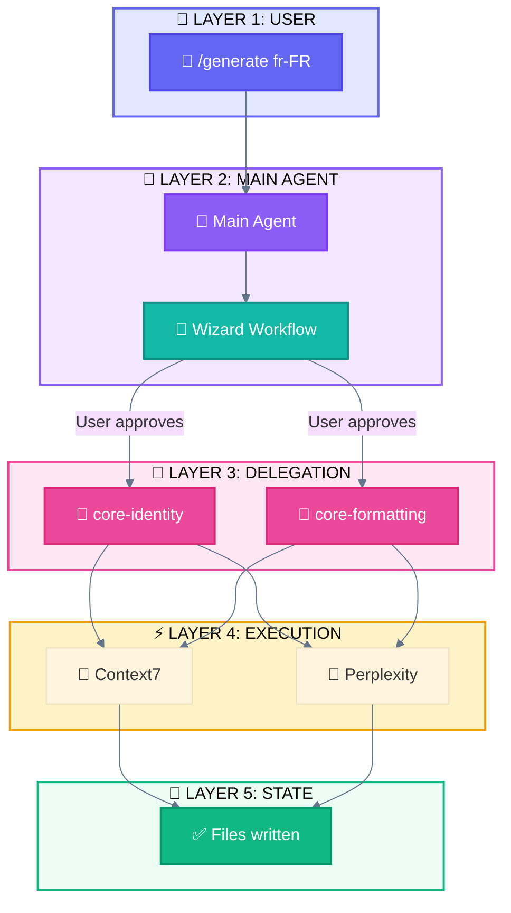

<div align="center">

[🏠 Home](README.md) • [📖 Overview](00-OVERVIEW.md) • **08 Style Guide**

━━━━━━━━━━━━━━●━━━━━━━━━━━━━━━━ `8/8`

[← 07 Glossary](07-MAPPING-GLOSSARY.md) • [🏠 Back to Home](README.md)

</div>

---

# Style Guide: Colors & Emojis

> Standardized visual language for all Mermaid diagrams in agentic documentation

## 📑 Table of Contents

| # | Section | Description |
|---|---------|-------------|
| 1 | [Understanding the Model](#understanding-the-model) | Layers vs Components |
| 2 | [Emoji System](#emoji-system) | Complete reference |
| 3 | [Color Palette](#color-palette) | Hex codes |
| 4 | [Mermaid Classes](#mermaid-class-definitions) | Copy-paste blocks |
| 5 | [Rules](#rules) | Do's and Don'ts |

---

## Understanding the Model

Before using this style guide, understand the relationship between **Layers** and **Components**:

```
┌─────────────────────────────────────────────────────────────────────────────┐
│                    LAYERS vs COMPONENTS                                     │
├─────────────────────────────────────────────────────────────────────────────┤
│                                                                             │
│  LAYERS = Containers (where things live)                                    │
│  COMPONENTS = Entities (what lives there)                                   │
│                                                                             │
│  ┌─────────────────────────────────────────────────────────────────────┐   │
│  │ Layer 1: User        │  👤 User interacts here                      │   │
│  │                      │  🦴 Slash Commands live here (entry points)  │   │
│  ├──────────────────────┼──────────────────────────────────────────────┤   │
│  │ Layer 2: Main Agent  │  🧠 Main Agent lives here (orchestrator)     │   │
│  │                      │  📚 Skills loaded here                       │   │
│  ├──────────────────────┼──────────────────────────────────────────────┤   │
│  │ Layer 3: Delegation  │  🔀 Workflow definitions                     │   │
│  ├──────────────────────┼──────────────────────────────────────────────┤   │
│  │ Layer 4: Execution ⚡│  🤖 Subagents work here                      │   │
│  │                      │  🛠️ Native, 🔌 MCP, 🖐️ Interaction tools     │   │
│  ├──────────────────────┼──────────────────────────────────────────────┤   │
│  │ Layer 5: State       │  💾 Data persists here                       │   │
│  │                      │  🪝 Hooks trigger here                       │   │
│  └─────────────────────────────────────────────────────────────────────┘   │
│                                                                             │
│  KEY INSIGHT: Main Agent IS Layer 2. Use 🧠 for both.                       │
│               Subagent IS the worker in Layer 4. Use 🤖 for both.           │
│                                                                             │
└─────────────────────────────────────────────────────────────────────────────┘
```

---

## Emoji System

### Components (entities that live in layers)

| Component | Emoji | Color | Hex | Border |
|-----------|-------|-------|-----|--------|
| **User** | 👤 | Indigo | `#6366f1` | `#4f46e5` |
| **Slash Command** | 🦴 | Indigo | `#6366f1` | `#4f46e5` |
| **Main Agent** | 🧠 | Purple | `#8b5cf6` | `#7c3aed` |
| **Skill** | 📚 | Purple | `#8b5cf6` | `#7c3aed` |
| **Subagent** | 🤖 | Pink | `#ec4899` | `#db2777` |
| **Task tool** | 📤 | Pink | `#ec4899` | `#db2777` |
| **State** | 💾 | Emerald | `#10b981` | `#059669` |
| **Hook** | 🪝 | Emerald | `#10b981` | `#059669` |

### Tools (3 categories)

| Category | Emoji | Color | Hex | Border | Examples |
|----------|-------|-------|-----|--------|----------|
| **Native Tools** | 🛠️ | Slate | `#64748b` | `#475569` | Read, Write, Edit, Bash, Glob, Grep |
| **MCP Tools** | 🔌 | Amber | `#f59e0b` | `#d97706` | Context7, Perplexity, Firecrawl |
| **User Interaction** | 🖐️ | Teal | `#14b8a6` | `#0d9488` | ❓ AskUserQuestion, 📋 TodoWrite |

**Native Tools sub-categories** (optional, for precision):

| Sub-category | Emoji | Tools |
|--------------|-------|-------|
| Read Operations | 🛠️👀 | Read, Glob, Grep |
| Write Operations | 🛠️✏️ | Write, Edit, NotebookEdit |
| System Operations | 🛠️💻 | Bash, BashOutput, KillShell |
| Web Operations | 🛠️🌐 | WebFetch, WebSearch |

### Patterns (reusable design solutions)

#### Claude Code Implementation Patterns (7 + baseline)

| Pattern | Emoji | Color | Hex | Border |
|---------|-------|-------|-----|--------|
| **Direct Execution** | 🏎️ | Slate | `#64748b` | `#475569` |
| **Subagent Orchestration** | 🎪 | Pink | `#ec4899` | `#db2777` |
| **Parallel Tool Calling** | 🚂 | Blue | `#3b82f6` | `#2563eb` |
| **Master-Clone** | 🧬 | Amber | `#f59e0b` | `#d97706` |
| **Wizard Workflow** | 🧙 | Teal | `#14b8a6` | `#0d9488` |
| **Multi-Window Context** | 🖥️ | Blue | `#3b82f6` | `#2563eb` |
| **Progressive Skills** | 🎓 | Emerald | `#10b981` | `#059669` |
| **Programmatic Orchestration** | 🎛️ | Indigo | `#6366f1` | `#4f46e5` |

#### Anthropic Research Patterns (6)

| Pattern | Emoji | Maps to Claude Code |
|---------|-------|---------------------|
| **Prompt Chaining** | ⛓️ | 🎛️ Programmatic Orchestration, 🧙 Wizard |
| **Routing** | 🚦 | 🎓 Progressive Skills |
| **Parallelization** | 🛤️ | 🚂 Parallel Tool Calling, 🧬 Master-Clone |
| **Orchestrator-Workers** | 🎭 | 🎪 Subagent Orchestration |
| **Evaluator-Optimizer** | 👨‍🔧 | (Loop with validation) |
| **Autonomous Agents** | 🐔 | 🖥️ Multi-Window Context |

### Phases (generation order)

| Phase | Emoji | Description |
|-------|-------|-------------|
| **Phase 1** | 🏗️ | Foundation |
| **Phase 2** | 🔗 | Formatting |
| **Phase 3** | 📝 | Content |
| **Phase 4** | 🔮 | Synthesis |

### Status (workflow states)

| Status | Emoji | Color | Hex |
|--------|-------|-------|-----|
| **Success** | ✅ | Emerald | `#10b981` |
| **Error** | ❌ | Red | `#ef4444` |
| **Warning** | ⚠️ | Amber | `#f59e0b` |
| **In Progress** | 🔄 | Blue | `#3b82f6` |
| **Pending** | ⏳ | Slate | `#64748b` |
| **Skip** | ⏭️ | Slate | `#64748b` |

### Categories (AthenaKNW specific)

| Category | Emoji |
|----------|-------|
| core-identity | 🆔 |
| core-formatting | 📐 |
| content-seo-slug | 🔍 |
| content-vocabulary | 💬 |
| content-style | ✍️ |
| content-cultural-values | 🎭 |
| content-cultural-refs | 🎯 |
| market-intelligence | 📊 |
| content-ai-rules | ⚙️ |

---

## Quick Reference Card

```
┌─────────────────────────────────────────────────────────────────────────────┐
│                           EMOJI QUICK REFERENCE                             │
├─────────────────────────────────────────────────────────────────────────────┤
│                                                                             │
│  COMPONENTS                          CLAUDE CODE PATTERNS                   │
│  ──────────                          ────────────────────                   │
│  👤 User                             🏎️ Direct Execution                    │
│  🦴 Slash Command                    🎪 Subagent Orchestration              │
│  🧠 Main Agent                       🚂 Parallel Tool Calling               │
│  📚 Skill                            🧬 Master-Clone                        │
│  🤖 Subagent                         🧙 Wizard Workflow                     │
│  📤 Task tool                        🖥️ Multi-Window Context                │
│  💾 State                            🎓 Progressive Skills                  │
│  🪝 Hook                             🎛️ Programmatic Orchestration          │
│                                                                             │
│  TOOLS (3 categories)                                                       │
│  ────────────────────                                                       │
│  🛠️ Native Tools (Read, Write, Bash...)                                     │
│  🔌 MCP Tools (Context7, Perplexity...)                                     │
│  🖐️ User Interaction (❓ AskUser, 📋 Todo)                                  │
│                                                                             │
│  STATUS                                                                     │
│  ──────                                                                     │
│  ✅ Success    ❌ Error                                                     │
│  ⚠️ Warning    🔄 Progress                                                  │
│  ⏳ Pending    ⏭️ Skip                                                      │
│                                                                             │
│  PHASES                                                                     │
│  ──────                                                                     │
│  🏗️ Phase 1 (Foundation)                                                   │
│  🔗 Phase 2 (Formatting)                                                    │
│  📝 Phase 3 (Content)                                                       │
│  🔮 Phase 4 (Synthesis)                                                     │
│                                                                             │
└─────────────────────────────────────────────────────────────────────────────┘
```

---

## Color Palette

```
┌─────────────────────────────────────────────────────────────────────────────┐
│                         STANDARD COLOR PALETTE                              │
├─────────────────────────────────────────────────────────────────────────────┤
│                                                                             │
│  🟣 #6366f1 (Indigo)    → User, Slash Commands                              │
│  🟣 #8b5cf6 (Purple)    → Main Agent, Skills                                │
│  🩷 #ec4899 (Pink)      → Subagents, Task tool                              │
│  🟠 #f59e0b (Amber)     → MCP Tools, Master-Clone                           │
│  🟢 #10b981 (Emerald)   → State, Success, Progressive Skills                │
│  🔵 #3b82f6 (Blue)      → Parallel, Multi-Window, Progress                  │
│  🔴 #ef4444 (Red)       → Errors                                            │
│  🩶 #64748b (Slate)     → Neutral, Skip, Pending                            │
│  🩵 #14b8a6 (Teal)      → Wizard, Human-in-the-Loop                         │
│  🩵 #06b6d4 (Cyan)      → Data flow                                         │
│                                                                             │
└─────────────────────────────────────────────────────────────────────────────┘
```

---

## Mermaid Class Definitions

### Standard classDef Block

Copy this block at the start of every Mermaid diagram:

```mermaid
%%{init: {'theme': 'base', 'themeVariables': {'lineColor': '#64748b'}}}%%
flowchart TB
    %% Standard Color Classes - Components
    classDef user fill:#6366f1,stroke:#4f46e5,stroke-width:2px,color:#ffffff
    classDef main fill:#8b5cf6,stroke:#7c3aed,stroke-width:2px,color:#ffffff
    classDef subagent fill:#ec4899,stroke:#db2777,stroke-width:2px,color:#ffffff
    classDef state fill:#10b981,stroke:#059669,stroke-width:2px,color:#ffffff

    %% Tool Categories (3 types)
    classDef nativeTool fill:#64748b,stroke:#475569,stroke-width:2px,color:#ffffff
    classDef mcpTool fill:#f59e0b,stroke:#d97706,stroke-width:2px,color:#ffffff
    classDef userInteraction fill:#14b8a6,stroke:#0d9488,stroke-width:2px,color:#ffffff
    classDef tool fill:#f59e0b,stroke:#d97706,stroke-width:2px,color:#ffffff  %% Alias for mcpTool (backward compat)

    %% Patterns & Status
    classDef wizard fill:#14b8a6,stroke:#0d9488,stroke-width:2px,color:#ffffff
    classDef parallel fill:#3b82f6,stroke:#2563eb,stroke-width:2px,color:#ffffff
    classDef error fill:#ef4444,stroke:#dc2626,stroke-width:2px,color:#ffffff
    classDef neutral fill:#64748b,stroke:#475569,stroke-width:2px,color:#ffffff
    classDef data fill:#06b6d4,stroke:#0891b2,stroke-width:2px,color:#ffffff
```

### Subgraph Styles

```mermaid
    %% Layer Subgraph Styles
    style L1 fill:#e0e7ff,stroke:#6366f1,stroke-width:2px
    style L2 fill:#f3e8ff,stroke:#8b5cf6,stroke-width:2px
    style L3 fill:#fce7f3,stroke:#ec4899,stroke-width:2px
    style L4 fill:#fef3c7,stroke:#f59e0b,stroke-width:2px
    style L5 fill:#ecfdf5,stroke:#10b981,stroke-width:2px
```

---

## Example: Complete Diagram



---

## Rules

### Do's

1. **Always use classDef** - Never inline styles
2. **Consistent colors** - Same color = same component type everywhere
3. **Emoji + Text** - Use both for accessibility
4. **White text on dark fills** - `color:#ffffff` for readability
5. **2px stroke-width** - Standard border thickness
6. **Subgraph backgrounds** - Use lighter versions of layer colors

### Don'ts

1. **Don't mix emoji meanings** - 🧠 is always Main Agent, never Subagent
2. **Don't use random colors** - Stick to the palette
3. **Don't skip emojis** - They aid quick scanning
4. **Don't use dark backgrounds with dark text**
5. **Don't create new emojis without documenting**

---

## CSS Variables (for web implementations)

```css
:root {
  /* Component Colors */
  --color-user: #6366f1;
  --color-main-agent: #8b5cf6;
  --color-subagent: #ec4899;
  --color-state: #10b981;

  /* Tool Colors (3 categories) */
  --color-native-tool: #64748b;
  --color-mcp-tool: #f59e0b;
  --color-user-interaction: #14b8a6;

  /* Pattern Colors */
  --color-wizard: #14b8a6;
  --color-parallel: #3b82f6;
  --color-data: #06b6d4;

  /* Status Colors */
  --color-success: #10b981;
  --color-error: #ef4444;
  --color-warning: #f59e0b;
  --color-neutral: #64748b;

  /* Border Colors (darker variants) */
  --border-user: #4f46e5;
  --border-main-agent: #7c3aed;
  --border-subagent: #db2777;
  --border-state: #059669;
  --border-native-tool: #475569;
  --border-mcp-tool: #d97706;
  --border-user-interaction: #0d9488;

  /* Background Colors (lighter variants for subgraphs) */
  --bg-user: #e0e7ff;
  --bg-main-agent: #f3e8ff;
  --bg-subagent: #fce7f3;
  --bg-tool: #fef3c7;
  --bg-state: #ecfdf5;
}
```

---

<div align="center">

**━━━━━━━━━━━━━━━━━━━━━━━━━━━━━━━━━━━━━━━━━━━━━━━━**

[← 07 Glossary](07-MAPPING-GLOSSARY.md) • [🏠 Home](README.md) • [📖 Overview](00-OVERVIEW.md)

</div>
