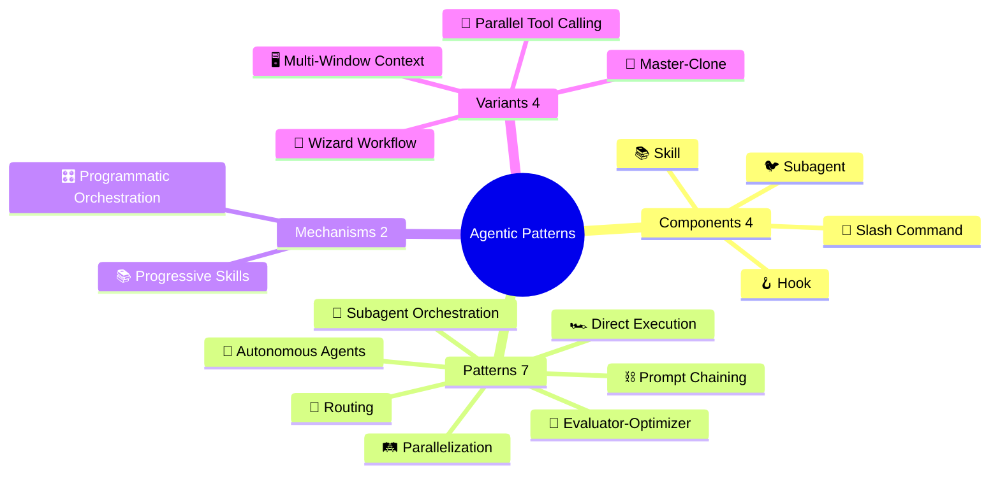
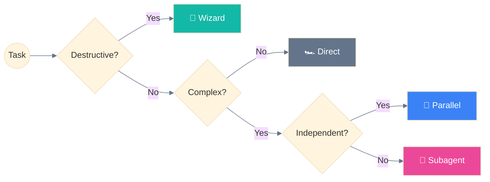

<h1 align="center">Agentic : Patterns / Workflows / Use Cases</h1>

<p align="center">
  <strong>Design patterns for building agentic AI systems with Claude Code CLI</strong>
</p>

<p align="center">
  <em>Curated collection of validated orchestration patterns from official Anthropic documentation</em>
</p>

<p align="center">
  <a href="https://github.com/hesreallyhim/awesome-claude-code">
    
  </a>
</p>

<p align="center">
  
  
  
</p>

---

## Overview



---

## Quick Start

| I want to... | Read this |
|--------------|-----------|
| **Learn the basics** | [01-OFFICIAL-TERMINOLOGY.md](01-OFFICIAL-TERMINOLOGY.md) |
| **Understand architecture** | [02-LAYER-ARCHITECTURE.md](02-LAYER-ARCHITECTURE.md) |
| **See real examples** | [04-USE-CASES.md](04-USE-CASES.md) |
| **Choose a pattern** | [05-PATTERN-SELECTION-GUIDE.md](05-PATTERN-SELECTION-GUIDE.md) |
| **Implement a pattern** | [03-AGENTIC-PATTERNS.md](03-AGENTIC-PATTERNS.md) |

---

## Agentic Patterns (7)

| # | Pattern | Description | Complexity |
|---|---------|-------------|:----------:|
| 1 | **🏎️ Direct Execution** | Baseline - no orchestration needed | None |
| 2 | **⛓️ Prompt Chaining** | Sequential steps, each feeding the next | Low |
| 3 | **🚦 Routing** | Direct inputs to specialized handlers | Low |
| 4 | **🛤️ Parallelization** | Execute independent tasks simultaneously | Medium |
| 5 | **🦑 Subagent Orchestration** | Delegate to specialized agents with isolated context | High |
| 6 | **🩻 Evaluator-Optimizer** | Iterative improvement via feedback loops | Medium |
| 7 | **🐉 Autonomous Agents** | Self-directed with minimal human guidance | Very High |

### Mechanisms (implementation, not patterns)

| Mechanism | Description |
|-----------|-------------|
| **📚 Progressive Skills** | On-demand loading of modular capabilities |
| **🎛️ Programmatic Orchestration** | External code controls agent invocation |

### Pattern Variants

| Variant | Parent Pattern | Description |
|---------|----------------|-------------|
| **🧙 Wizard Workflow** | ⛓️ Prompt Chaining | Multi-step with user confirmation |
| **🚂 Parallel Tool Calling** | 🛤️ Parallelization | Multiple tools in single message |
| **🧬 Master-Clone** | 🛤️ Parallelization | Isolated clones for independent domains |
| **🖥️ Multi-Window Context** | 🐉 Autonomous Agents | State persistence across sessions |

---

## Components

| Component | Emoji | Location |
|-----------|:-----:|----------|
| **Subagent** | 🐦 | `.claude/agents/*.md` |
| **Slash Command** | 🦴 | `.claude/commands/*.md` |
| **Skill** | 📚 | `.claude/skills/*/SKILL.md` |
| **Hook** | 🪝 | `.claude/settings.json` |

```
.claude/
├── agents/           # 🐦 Subagent definitions
│   └── *.md
├── commands/         # 🦴 Slash Command definitions
│   └── *.md
├── skills/           # 📚 Skill definitions
│   └── skill-name/
│       └── SKILL.md
└── settings.json     # 🪝 Hooks configuration
```

---

## Documentation Structure

| File | Content |
|------|---------|
| [00-OVERVIEW.md](00-OVERVIEW.md) | Entry point, quick reference, emoji guide |
| [01-OFFICIAL-TERMINOLOGY.md](01-OFFICIAL-TERMINOLOGY.md) | Components: 🐦 Subagent, 🦴 Command, 📚 Skill, 🪝 Hook |
| [02-LAYER-ARCHITECTURE.md](02-LAYER-ARCHITECTURE.md) | 5-Layer system architecture |
| [03-AGENTIC-PATTERNS.md](03-AGENTIC-PATTERNS.md) | 7 unified patterns + 2 mechanisms |
| [04-USE-CASES.md](04-USE-CASES.md) | Real-world validated examples |
| [05-PATTERN-SELECTION-GUIDE.md](05-PATTERN-SELECTION-GUIDE.md) | Decision trees for choosing patterns |
| [06-MAPPING-GLOSSARY.md](06-MAPPING-GLOSSARY.md) | Cross-reference & definitions |
| [07-STYLE-GUIDE.md](07-STYLE-GUIDE.md) | Colors, emojis, Mermaid standards |

---

## Key Concepts

### Critical Rule

> **🐦 Subagents cannot spawn other 🐦 subagents.**
> All delegation must go through the 🐔 Main Agent.

### Pattern Selection



```
Simple Task (1 step)          → 🏎️ Direct execution
Medium Task (2-4 steps)       → 📚 Progressive Skills
Complex Task (5+ steps)       → 🦑 Subagent Orchestration
Destructive Operation         → 🧙 Wizard Workflows (mandatory)
Long-Running (>10 min)        → 🖥️ Multi-Window Context
```

---

## Cross-Platform Compatibility

| Pattern | Claude | GPT Agents | Gemini ADK | LangGraph |
|:--------|:------:|:----------:|:----------:|:---------:|
| 🦑 Subagent Orchestration | ✅ | ✅ Handoffs | ✅ Multi-agent | ✅ Subgraphs |
| 📚 Progressive Skills | ✅ | ❌ | ❌ | ❌ |
| 🚂 Parallel Tool Calling | ✅ | ✅ | ✅ ParallelAgent | ✅ Fan-out |
| 🧬 Master-Clone | ✅ | ✅ Dynamic | ✅ Custom | ✅ Send API |
| 🖥️ Multi-Window Context | ✅ | ⚠️ Sessions | ⚠️ ctx.state | ✅ Checkpointing |
| 🎛️ Programmatic Orchestration | ✅ | ✅ | ✅ Workflows | ✅ StateGraph |
| 🧙 Wizard Workflows | ✅ | ⚠️ | ✅ Tool Confirm | ✅ interrupt() |

**Legend:** ✅ Native | ⚠️ Partial | ❌ Not supported

> **Note**: 📚 Progressive Skills uses Claude Code's unique `.md`-based skill system.

---

## References

| Resource | URL |
|----------|-----|
| Claude Code Docs | https://docs.anthropic.com/en/docs/claude-code |
| Agent SDK | https://docs.anthropic.com/docs/en/agent-sdk |
| Building Effective Agents | Anthropic Research Paper (Dec 2024) |
| Anthropic Cookbook | https://github.com/anthropics/anthropic-cookbook |

---

## Repository Structure

```
.
├── README.md                           # This file
├── 00-OVERVIEW.md                      # Entry point, quick reference
├── 01-OFFICIAL-TERMINOLOGY.md          # Components definitions
├── 02-LAYER-ARCHITECTURE.md            # 5-Layer system architecture
├── 03-AGENTIC-PATTERNS.md              # 7 unified patterns + 2 mechanisms
├── 04-USE-CASES.md                     # Real-world examples
├── 05-PATTERN-SELECTION-GUIDE.md       # Decision trees
├── 06-MAPPING-GLOSSARY.md              # Cross-reference & definitions
└── 07-STYLE-GUIDE.md                   # Colors, emojis, Mermaid standards
```

---

## Contributing

We welcome contributions! This repository aims to be the definitive collection of Claude agentic patterns.

### Ways to Contribute

- **Add new patterns** - Document patterns from Anthropic sources
- **Improve existing patterns** - Add examples, clarify explanations
- **Fix issues** - Correct errors, update outdated information
- **Add translations** - Help make patterns accessible globally

### Contribution Requirements

All contributions must:

1. **Reference official sources** - Link to Anthropic docs, blog posts, or official examples
2. **Include code examples** - Provide working, tested code snippets
3. **Follow the pattern format** - Use the established template structure
4. **Add Mermaid diagrams** - Visual explanations where helpful

See [CONTRIBUTING.md](CONTRIBUTING.md) for detailed guidelines.

---

## License

MIT License - See [LICENSE](LICENSE) for details.

---

<p align="center">
  <sub>Built with Claude Code | Based on official documentation | November 2025</sub><br/>
  <sub>Independent community resource - not affiliated with Anthropic</sub>
</p>

<p align="center">
  <a href="https://github.com/ThibautMelen">
    
  </a>
  &nbsp;&nbsp;❤️&nbsp;&nbsp;
  <a href="https://github.com/SuperNovae-studio">
    
  </a>
  &nbsp;&nbsp;🏴‍☠️
</p>
