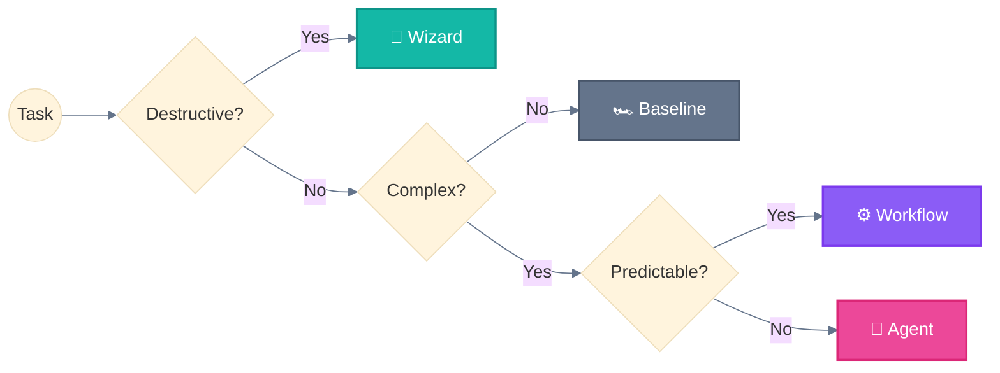

<div align="center">

# Agentic AI Systems 🐔

**Workflows and agents for building agentic AI systems | Explained simply**

<sub>Mermaid diagrams 📊 • Clear examples 💡 • Chicken metaphors 🐔🐦<br/>
Because complex systems deserve simple explanations.</sub>

<br/>

<!-- Credibility -->
<a href="https://docs.anthropic.com/en/docs/claude-code">
  
</a>
<a href="https://www.anthropic.com/research/building-effective-agents">
  
</a>
<a href="https://github.com/hesreallyhim/awesome-claude-code">
  
</a>

<br/>

<!-- Stats -->


</div>

---

## Why This Repo? 🪺

Building effective AI agents requires proven patterns, not guesswork.

This repository distills **official Anthropic documentation** into actionable designs:

| What you get | Why it matters |
|--------------|----------------|
| 📊 **Mermaid diagrams** | See the architecture, don't just read about it |
| 💡 **Clear examples** | Copy-paste ready, not abstract theory |
| 🗺️ **Decision guides** | Know which workflow fits your use case |
| 🐔 **Chicken metaphors** | Remember systems, not jargon |

*Why chickens? Because 🐔 Main Agent spawning 🐦 Subagents is way easier to remember than "hierarchical agent orchestration".*

---

## 🗺️ Navigation Hub

<table>
<tr>
<td width="33%" valign="top">

### 🧱 [Foundations](foundations/)

The building block for everything.

| Doc | Description |
|-----|-------------|
| [🧱 Augmented LLM](foundations/augmented-llm.md) | LLM + Retrieval + Tools + Memory |

</td>
<td width="33%" valign="top">

### ⚙️ [Workflows](workflows/)

Predefined orchestration paths.

| # | Workflow |
|:-:|----------|
| 0 | [🏎️ Baseline](workflows/00-baseline.md) |
| 1 | [⛓️ Prompt Chaining](workflows/01-prompt-chaining.md) |
| 2 | [🚦 Routing](workflows/02-routing.md) |
| 3 | [🛤️ Parallelization](workflows/03-parallelization.md) |
| 4 | [🦑 Orchestrator-Workers](workflows/04-orchestrator-workers.md) |
| 5 | [🩻 Evaluator-Optimizer](workflows/05-evaluator-optimizer.md) |

</td>
<td width="33%" valign="top">

### 🐉 [Agents](agents/)

Dynamic, autonomous systems.

| Agent | Description |
|-------|-------------|
| [🐉 Autonomous](agents/autonomous.md) | Self-directed execution |
| [🖥️ Multi-Window](agents/multi-window.md) | Cross-session state |

</td>
</tr>
</table>

---

## Anthropic Taxonomy

```
┌─────────────────────────────────────────────────────────────────────────────┐
│                         AGENTIC SYSTEMS (umbrella)                          │
├─────────────────────────────────────────────────────────────────────────────┤
│                                                                             │
│  WORKFLOWS (6)                                   AGENTS (2)                 │
│  ─────────────                                   ──────────                 │
│  🏎️ Baseline (Direct Execution)                  🐉 Autonomous Agents       │
│  ⛓️ Prompt Chaining                              🖥️ Multi-Window Context    │
│  🚦 Routing                                                                 │
│  🛤️ Parallelization                                                         │
│  🦑 Orchestrator-Workers                                                    │
│  🩻 Evaluator-Optimizer                                                     │
│                                                                             │
│  CODE controls the flow ─────────────────────► LLM controls the flow        │
│                                                                             │
└─────────────────────────────────────────────────────────────────────────────┘
```

> Based on [Building Effective Agents](https://www.anthropic.com/engineering/building-effective-agents) (Anthropic, Dec 2024)

---

## Quick Decision Tree



```
Simple Task (1 step)          → 🏎️ Baseline
Medium Task (2-4 steps)       → ⛓️ Prompt Chaining
Complex + Predictable         → 🦑 Orchestrator-Workers
Complex + Open-ended          → 🐉 Autonomous Agent
Destructive Operation         → 🧙 Wizard (human checkpoints)
Long-Running (>10 min)        → 🖥️ Multi-Window Context
```

---

## Key Concepts

### Critical Rule

> **🐦 Subagents cannot spawn other 🐦 subagents.**
> All delegation must go through the 🐔 Main Agent.

### Workflows vs Agents

| Aspect | Workflows | Agents |
|--------|-----------|--------|
| **Flow control** | Code | LLM |
| **Path** | Predefined | Dynamic |
| **Predictability** | High | Low |
| **Use case** | Known steps | Open-ended |

---

## Repository Structure

```
.
├── README.md                    # 🏠 This file (navigation hub)
│
├── foundations/                 # 🧱 Core concepts
│   └── augmented-llm.md         # The building block
│
├── workflows/                   # ⚙️ Predefined orchestration (6)
│   ├── 00-baseline.md           # Direct execution
│   ├── 01-prompt-chaining.md    # Sequential + Wizard
│   ├── 02-routing.md            # Classification routing
│   ├── 03-parallelization.md    # Parallel + Master-Clone
│   ├── 04-orchestrator-workers.md
│   └── 05-evaluator-optimizer.md
│
├── agents/                      # 🐉 Dynamic autonomous (2)
│   ├── autonomous.md            # Self-directed agents
│   └── multi-window.md          # Cross-session state
│
├── guides/                      # 🗺️ Workflow selection
└── reference/                   # 📖 Quick lookups
```

---

## References

| Resource | URL |
|----------|-----|
| Claude Code Docs | https://docs.anthropic.com/en/docs/claude-code |
| Agent SDK | https://docs.anthropic.com/docs/en/agent-sdk |
| Building Effective Agents | Anthropic Research Paper (Dec 2024) |
| Anthropic Cookbook | https://github.com/anthropics/anthropic-cookbook |

---

## Contributing

We welcome contributions! This repository aims to be the definitive collection of Claude agentic systems.

### Ways to Contribute

- **Add new workflows** — Document systems from Anthropic sources
- **Improve existing content** — Add examples, clarify explanations
- **Fix issues** — Correct errors, update outdated information
- **Add translations** — Help make content accessible globally

### Requirements

All contributions must:
1. **Reference official sources** — Link to Anthropic docs or blog posts
2. **Include code examples** — Provide working, tested snippets
3. **Follow the format** — Use the established template
4. **Add Mermaid diagrams** — Visual explanations where helpful

See [CONTRIBUTING.md](CONTRIBUTING.md) for detailed guidelines.

---

## License

MIT License — See [LICENSE](LICENSE) for details.

---

<p align="center">
  <sub>Built with Claude Code | Based on official documentation | November 2025</sub><br/>
  <sub>Independent community resource — not affiliated with Anthropic</sub>
</p>

<p align="center">
  <a href="https://github.com/ThibautMelen">
    
  </a>
  &nbsp;&nbsp;❤️&nbsp;&nbsp;
  <a href="https://github.com/SuperNovae-studio">
    
  </a>
  &nbsp;&nbsp;🏴‍☠️
</p>
