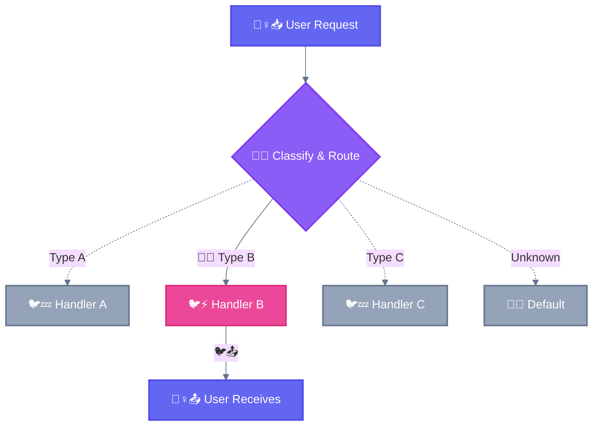

<div align="center">

[🏠 Home](../README.md) › [Agentic Systems](./) › **🚦 Routing**

`━━━━━━━━━━●━━━━━━━━━━━━━━━━━━━━━━━━` **3/8** Routing

</div>

---

# 🚦 Routing

> **TL;DR:** Classify an input and direct it to a specialized handler. Like a train switch — one input takes ONE track.

---

## Diagram



---

## Key Insight

```
┌─────────────────────────────────────────────────────────────────────────────┐
│  🚦 ROUTING: Choose ONE branch                                              │
├─────────────────────────────────────────────────────────────────────────────┤
│                                                                             │
│  Logic: if/else, switch/case                                                │
│  Question: "Where should I send this?"                                      │
│  Result: Single output from chosen handler                                  │
│                                                                             │
│  Analogy: Train switch → One train takes ONE track                          │
│                                                                             │
└─────────────────────────────────────────────────────────────────────────────┘
```

---

## Characteristics

| Property | Value |
|----------|-------|
| **Complexity** | Low |
| **Parallelism** | None |
| **Human-Loop** | None |
| **Iteration** | None |

---

## When to Use

Routing works well for complex tasks where there are **distinct categories** that are better handled separately, and where **classification can be handled accurately**.

| Use Case | Routes |
|----------|--------|
| Customer support | Bug → Tech Team, Billing → Finance, General → FAQ |
| Code tasks | Bug fix → Debugger, New feature → Builder |
| Model routing | Easy → Claude Haiku 4.5, Hard → Claude Sonnet 4.5 |
| Content | Question → Q&A handler, Task → Executor |

---

## When NOT to Use

- All inputs require same processing
- Classification is unreliable
- Categories overlap significantly

---

<div align="center">

```
━━━━━━━━━━●━━━━━━━━━━━━━━━━━━━━━━━━ 3/8
```

[← 02 Prompt Chaining](02-prompt-chaining.md) • [04 Parallelization →](04-parallelization.md)

</div>
