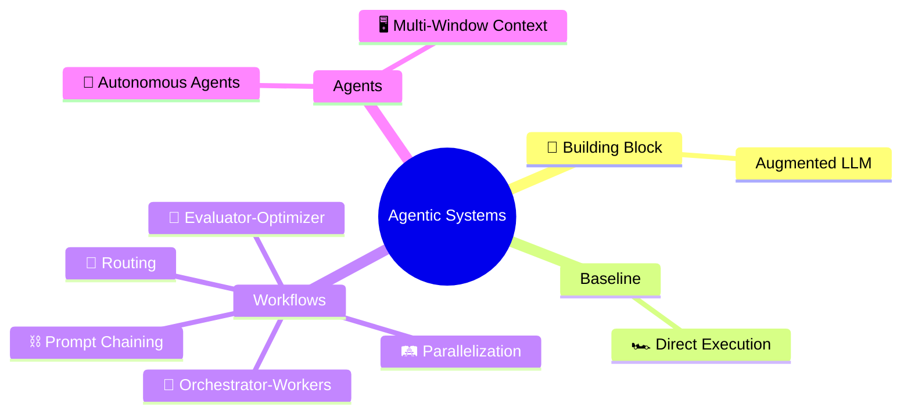
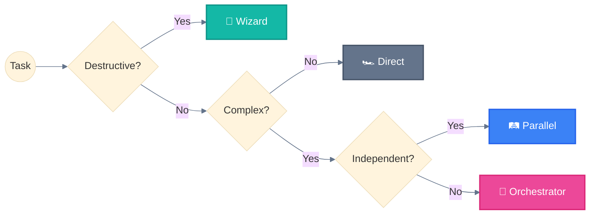

<div align="center">

[🏠 Home](../README.md) • **Agentic Systems**

</div>

---

# Agentic Systems

> **TL;DR:** Complete reference for AI orchestration patterns. From single LLM calls to fully autonomous agents.

---

## What are Agentic Systems?

**Agentic Systems** = Umbrella term for any system using LLMs with tools and control flow.

```
┌─────────────────────────────────────────────────────────────────────────────┐
│                         AGENTIC SYSTEMS (umbrella)                          │
├─────────────────────────────────────────────────────────────────────────────┤
│                                                                             │
│  BASELINE (1)                    WORKFLOWS (5)          AGENTS (1)          │
│  ────────────                    ─────────────          ──────────          │
│  0. 🏎️ Direct Execution          1. ⛓️ Prompt Chaining   6. 🐉 Autonomous    │
│     (single augmented LLM)       2. 🚦 Routing                              │
│                                  3. 🛤️ Parallelization                      │
│                                  4. 🦑 Orchestrator-Workers                 │
│                                  5. 🩻 Evaluator-Optimizer                  │
│                                                                             │
│  CODE controls the flow ─────────────────────► LLM controls the flow        │
│                                                                             │
└─────────────────────────────────────────────────────────────────────────────┘
```

> Source: [Building Effective Agents](https://www.anthropic.com/engineering/building-effective-agents) (Anthropic, Dec 2024)

---

## Overview



---

## Pattern Index

| # | Pattern | Emoji | Description | Complexity |
|:-:|---------|:-----:|-------------|:----------:|
| 0 | [Building Block](00-building-block.md) | 🧱 | Augmented LLM foundation | — |
| 1 | [Baseline](01-baseline.md) | 🏎️ | Single LLM call, no orchestration | None |
| 2 | [Prompt Chaining](02-prompt-chaining.md) | ⛓️ | Sequential steps, output→input | Low |
| 3 | [Routing](03-routing.md) | 🚦 | Classify then dispatch | Low |
| 4 | [Parallelization](04-parallelization.md) | 🛤️ | Concurrent independent tasks | Medium |
| 5 | [Orchestrator-Workers](05-orchestrator-workers.md) | 🦑 | Delegate to specialized subagents | High |
| 6 | [Evaluator-Optimizer](06-evaluator-optimizer.md) | 🩻 | Iterative improvement via feedback | Medium |
| 7 | [Autonomous Agents](07-autonomous-agents.md) | 🐉 | Self-directed with environment feedback | Very High |
| 8 | [Multi-Window Context](08-multi-window-context.md) | 🖥️ | State persistence across sessions | High |

---

## Quick Decision Tree



```
Simple Task (1 step)          → 🏎️ Direct execution
Medium Task (2-4 steps)       → ⛓️ Prompt Chaining
Complex Task (5+ steps)       → 🦑 Orchestrator-Workers
Destructive Operation         → 🧙 Wizard Workflows (mandatory)
Long-Running (>10 min)        → 🖥️ Multi-Window Context
```

---

## Variants & Mechanisms

### Workflow Variants (Claude Code specific)

| Variant | Parent | Emoji | Description |
|---------|--------|:-----:|-------------|
| **Wizard Workflow** | ⛓️ Prompt Chaining | 🧙 | Human checkpoints via AskUserQuestion |
| **Parallel Tool Calling** | 🛤️ Parallelization | 🚂 | Multiple tools in single response |
| **Master-Clone** | 🛤️ Parallelization | 🧬 | Same agent, parallel instances |

### Implementation Mechanisms

| Mechanism | Emoji | Description |
|-----------|:-----:|-------------|
| **Progressive Skills** | 📚 | Load skills on-demand based on context |
| **Programmatic Orchestration** | 🎛️ | Code-controlled agent workflows (Agent SDK) |

---

## Cross-Platform Compatibility

| Pattern | Claude | GPT Agents | Gemini ADK | LangGraph |
|:--------|:------:|:----------:|:----------:|:---------:|
| 🦑 Orchestrator-Workers | ✅ | ✅ Handoffs | ✅ Multi-agent | ✅ Subgraphs |
| 📚 Progressive Skills | ✅ | ❌ | ❌ | ❌ |
| 🚂 Parallel Tool Calling | ✅ | ✅ | ✅ ParallelAgent | ✅ Fan-out |
| 🧬 Master-Clone | ✅ | ✅ Dynamic | ✅ Custom | ✅ Send API |
| 🖥️ Multi-Window Context | ✅ | ⚠️ Sessions | ⚠️ ctx.state | ✅ Checkpointing |
| 🎛️ Programmatic Orchestration | ✅ | ✅ | ✅ Workflows | ✅ StateGraph |
| 🧙 Wizard Workflows | ✅ | ⚠️ | ✅ Tool Confirm | ✅ interrupt() |

**Legend:** ✅ Native | ⚠️ Partial | ❌ Not supported

---

## Related Sections

| Section | Description |
|---------|-------------|
| [🧩 Components](../components/) | Subagent, Slash Command, Skill, Hook |
| [🏗️ Architecture](../architecture/) | 5-Layer system design |
| [🗺️ Guides](../guides/) | Pattern selection & use cases |
| [📖 Reference](../reference/) | Glossary, visual standards |

---

<div align="center">

```
━━━━━━━━━━━━━━━━━━━━━━━━━━━━━━━━━━━━━━━━━━━━━━━━━━━━━━━━━━━━
```

[🏠 Home](../README.md) • [00 Building Block →](00-building-block.md)

</div>
