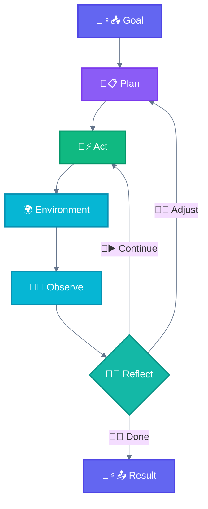
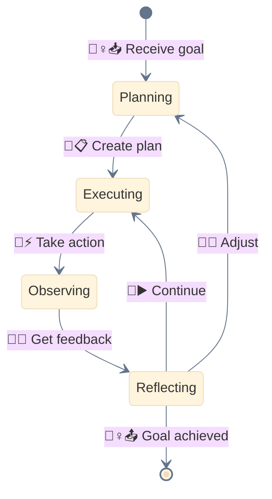

<div align="center">

[🏠 Home](../README.md) › [Autonomous](./) › **🐔 Autonomous Agent**

[← Autonomous](./) ━━━━━━━━━━━━━━━━━━━━━━●━━━━━━━━━━━━━ [Multi-Window Context →](multi-window.md)

</div>

---

# 🐔 Autonomous Agent

> **TL;DR:** Long-running agents that independently plan, execute, and adapt based on environment feedback. Maximum autonomy, but requires guardrails.

---

## Diagram



---

## The Agent Loop



---

## Key Insight

```
┌─────────────────────────────────────────────────────────────────────────────┐
│  🐔 AUTONOMOUS AGENT: What Makes It Different                               │
├─────────────────────────────────────────────────────────────────────────────┤
│                                                                             │
│  Agents are emerging in production as LLMs mature in key capabilities:      │
│                                                                             │
│  ✅ Understanding complex inputs                                            │
│  ✅ Engaging in reasoning and planning                                      │
│  ✅ Using tools reliably                                                    │
│  ✅ Recovering from errors                                                  │
│                                                                             │
│  During execution, it's CRUCIAL for agents to gain "ground truth"           │
│  from the environment at each step (tool results, code execution)           │
│  to assess their progress.                                                  │
│                                                                             │
└─────────────────────────────────────────────────────────────────────────────┘
```

---

## Characteristics

| Characteristic | Description |
|----------------|-------------|
| **Goal-directed** | Works toward specified objective |
| **Adaptive** | Adjusts based on environment feedback |
| **Self-directed** | Decides next actions independently |
| **Persistent** | Continues until goal achieved or stopping condition |

---

## When to Use Agents

Agents can be used for **open-ended problems** where:
- It's difficult or impossible to predict the required number of steps
- You can't hardcode a fixed path
- The LLM will potentially operate for many turns
- You have some level of trust in its decision-making

| Domain | Example | Why Agent? |
|--------|---------|------------|
| **Coding** | SWE-bench tasks, multi-file edits | Can't predict which files need changes |
| **Computer Use** | Claude uses a computer to accomplish tasks | Open-ended interaction |
| **Research** | Complex investigations with unknown scope | Adaptive information gathering |
| **Bug Investigation** | Tracing issues through codebase | Unknown path to root cause |

---

## Example: Bug Investigation

```
Goal: "Fix the login timeout bug"

Agent:
1. PLAN: Need to find where timeout is set
2. ACT: Search codebase for "timeout" in auth
3. OBSERVE: Found 3 locations
4. REFLECT: Most likely in session config
5. ACT: Read session config file
6. OBSERVE: Default timeout is 30 minutes
7. REFLECT: User reported issue after 5 minutes
8. ACT: Check if there's an override
9. ...continues until resolved...
```

---

## When NOT to Use Agents

- Predictable tasks with known steps (use Workflows)
- No rollback capability
- Tight time constraints
- Untrusted environments

---

## Risk Management

> **Warning:** The autonomous nature of agents means higher costs, and the potential for compounding errors. We recommend extensive testing in sandboxed environments, along with appropriate guardrails.

---

## Essential Guardrails

| Guardrail | Purpose | Implementation |
|-----------|---------|----------------|
| **⏱️ Iteration Limit** | Prevent infinite loops | Max turns, timeout |
| **🙆‍♀️ Human Checkpoints** | Maintain oversight | AskUserQuestion at key decisions |
| **🔒 Action Scope** | Limit blast radius | Tool restrictions, sandboxing |
| **↩️ Rollback** | Enable recovery | Git commits, state snapshots |
| **📊 Logging** | Audit trail | Record all agent actions |

---

## Stopping Conditions

```
┌─────────────────────────────────────────────────────────────────────────────┐
│  WHEN TO STOP                                                               │
├─────────────────────────────────────────────────────────────────────────────┤
│                                                                             │
│  ✅ Goal achieved                                                           │
│  ⏱️ Maximum iterations reached                                              │
│  🚫 Unrecoverable error                                                     │
│  🙆‍♀️ Human intervention requested                                           │
│  💰 Cost threshold exceeded                                                 │
│                                                                             │
└─────────────────────────────────────────────────────────────────────────────┘
```

---

## Best Practices

### Agent-Computer Interface (ACI)

> Think about how much effort goes into human-computer interfaces (HCI), and plan to invest just as much effort in creating good **agent-computer interfaces (ACI)**.

```
┌─────────────────────────────────────────────────────────────────────────────┐
│  ACI DESIGN PRINCIPLES                                                      │
├─────────────────────────────────────────────────────────────────────────────┤
│                                                                             │
│  1. Put yourself in the model's shoes                                       │
│     Is it obvious how to use this tool based on description?                │
│                                                                             │
│  2. Include in tool definitions:                                            │
│     - Example usage                                                         │
│     - Edge cases                                                            │
│     - Input format requirements                                             │
│     - Clear boundaries from other tools                                     │
│                                                                             │
│  3. Test how the model uses your tools                                      │
│     Run many example inputs, see mistakes, iterate                          │
│                                                                             │
│  4. Poka-yoke your tools                                                    │
│     Change arguments so it's harder to make mistakes                        │
│                                                                             │
└─────────────────────────────────────────────────────────────────────────────┘
```

### Three Core Principles

| Principle | Description |
|-----------|-------------|
| **1. Simplicity** | Maintain simplicity in your agent's design |
| **2. Transparency** | Explicitly show the agent's planning steps |
| **3. ACI Design** | Carefully craft agent-computer interface through thorough tool documentation and testing |

---

<div align="center">

[← Autonomous](./) ━━━━━━━━━━━━━━━━━━━━━━●━━━━━━━━━━━━━ [Multi-Window Context →](multi-window.md)

</div>
