<div align="center">

[🏠 Home](../README.md) › [Autonomous](./) › **🖥️ Multi-Window Context**

[← Autonomous Agent](autonomous.md) ━━━━━━━━━━━━━━━━━━━━━━━━━━━━━━━━━●━━ [Autonomous →](./)

</div>

---

# 🖥️ Multi-Window Context

> **TL;DR:** State persistence across Claude Code sessions. Checkpoint your progress, resume from interruptions. Essential for long-running workflows.

---

## Diagram

```mermaid
%%{init: {'theme': 'base', 'themeVariables': {'lineColor': '#64748b'}}}%%
flowchart TB
    classDef checkpoint fill:#f59e0b,stroke:#d97706,stroke-width:2px,color:#ffffff
    classDef state fill:#10b981,stroke:#059669,stroke-width:2px,color:#ffffff

    subgraph Session1["Session 1"]
        S1P1["🏗️ Phase 1"] --> S1CP["🖥️ Checkpoint"]:::checkpoint
        S1CP --> S1P2["🔗 Phase 2"]
        S1P2 --> INTERRUPT["❌ Interrupt"]
    end

    subgraph Session2["Session 2 (Resume)"]
        RESUME["🔄 Resume"] --> S2P2["Continue Phase 2"]
        S2P2 --> S2P3["📝 Phase 3"]
        S2P3 --> DONE["✅ Complete"]
    end

    S1CP -.->|💾 State saved| STATE[("💾 State Store")]:::state
    STATE -.->|💾 State loaded| RESUME

    classDef session1Box fill:#fef2f2,stroke:#ef4444,stroke-width:2px,color:#991b1b
    classDef session2Box fill:#ecfdf5,stroke:#10b981,stroke-width:2px,color:#065f46

    Session1:::session1Box
    Session2:::session2Box
```



---

## When to Use

- Large-scale generation (1000+ files)
- Long research tasks
- Multi-day workflows
- Error recovery needs
- Context window limitations

---

## Implementation

```
Session 1:
  1. Work on Phase 1
  2. Save checkpoint (progress, decisions, context)
  3. Continue until context limit or interruption

Session 2:
  1. Load checkpoint
  2. Resume from saved state
  3. Continue execution
```

---

## Flow Example

```
🖥️ MULTI-WINDOW CONTEXT
Session 1: 🙋‍♀️📥 ──► 🐔📋 ──► 🐔⚡ ──► 🖥️💾 ──► [Context Limit]
                                      ↓
Session 2: 🖥️💾 ──► 🐔⚡ ──► 🐔👀 ──► 🐔💭 ──► 💁‍♀️📤
```

---

## Checkpointing for Long Workflows

```mermaid
%%{init: {'theme': 'base', 'themeVariables': {'lineColor': '#64748b'}}}%%
flowchart LR
    classDef checkpoint fill:#f59e0b,stroke:#d97706,stroke-width:2px,color:#ffffff

    subgraph Workflow
        P1["🏗️ Phase 1"] --> CP1["🖥️ Checkpoint"]:::checkpoint
        CP1 --> P2["🔗 Phase 2"]
        P2 --> CP2["🖥️ Checkpoint"]:::checkpoint
        CP2 --> P3["📝 Phase 3"]
    end

    FAIL["❌ Failure/Interrupt"] -.->|Resume from| CP2
```



---

## Checkpoint Data Structure

### Basic Structure

```json
{
  "workflow_id": "wf_2025_001",
  "current_phase": 2,
  "completed_tasks": ["task_1", "task_2"],
  "pending_tasks": ["task_3", "task_4"],
  "state": {
    "variables": {},
    "context_summary": "..."
  },
  "resume_point": "checkpoint_2",
  "timestamp": "2025-11-28T10:00:00Z"
}
```

### Full Implementation Example

```json
{
  "workflow_id": "locale-gen-2025-001",
  "workflow_type": "multi-locale-generation",
  "version": "1.0",

  "progress": {
    "current_phase": 2,
    "total_phases": 4,
    "phase_name": "locale_generation",
    "percent_complete": 45
  },

  "completed_tasks": [
    {
      "id": "task_001",
      "name": "generate_en_US",
      "status": "completed",
      "output_files": ["locales/en-US.json"],
      "completed_at": "2025-11-28T09:30:00Z"
    }
  ],

  "pending_tasks": [
    {
      "id": "task_003",
      "name": "generate_de_DE",
      "status": "pending",
      "dependencies": ["task_001"]
    }
  ],

  "state": {
    "primary_locale": "en-US",
    "target_locales": ["fr-FR", "de-DE", "es-ES", "ja-JP"],
    "context_summary": "Generating locale files for e-commerce app..."
  },

  "resume_instructions": "Load checkpoint, spawn locale-generator for de-DE and es-ES in parallel, then proceed to validation phase.",

  "metadata": {
    "created_at": "2025-11-28T09:00:00Z",
    "updated_at": "2025-11-28T09:50:00Z",
    "checkpoint_number": 3
  }
}
```

---

## Loading a Checkpoint

```python
# At session start, check for existing checkpoint
checkpoint_file = ".claude/checkpoints/locale-gen-2025-001.json"

if os.path.exists(checkpoint_file):
    checkpoint = load_json(checkpoint_file)

    # Resume from saved state
    print(f"Resuming workflow: {checkpoint['workflow_id']}")
    print(f"Progress: {checkpoint['progress']['percent_complete']}%")
    print(f"Next: {checkpoint['resume_instructions']}")

    # Continue pending tasks
    for task in checkpoint['pending_tasks']:
        if task['status'] == 'pending':
            execute_task(task)
```

---

## State Persistence Mechanisms

| Mechanism | Best For | Example |
|-----------|----------|---------|
| **Structured (JSON/YAML)** | Queryable data | `tests.json` with status |
| **Freeform (Markdown)** | Progress notes | `progress.txt` |
| **Git checkpoints** | Code state | `git commit -m "WIP"` |

---

## Use Cases

| Use Case | Why Multi-Window? |
|----------|-------------------|
| **Large-scale generation** | 1000+ files exceed context limits |
| **Long research tasks** | Days of research need persistence |
| **Multi-day workflows** | Cannot complete in single session |
| **Error recovery** | Resume after failures |
| **Team handoffs** | Different operators continue work |

---

<div align="center">

[← Autonomous Agent](autonomous.md) ━━━━━━━━━━━━━━━━━━━━━━━━━━━━━━━━━●━━ [Autonomous →](./)

</div>
