<div align="center">

[🏠 Home](../README.md) › [Foundations](./) › **🦄 Augmented LLM**

[← Foundations](./) ━━━━━━━━━━━━━━━━━━●━━━━━━━━━━━━━━━━━━ [Workflows →](../workflows/)

</div>

---

# 🦄 The Augmented LLM

> **TL;DR:** The foundation of ALL agentic systems — an LLM enhanced with retrieval, tools, and memory. Every workflow builds on this.

---

## Diagram

```mermaid
%%{init: {'theme': 'base', 'themeVariables': {'lineColor': '#64748b'}}}%%
flowchart TB
    classDef retrieval fill:#3b82f6,stroke:#2563eb,stroke-width:2px,color:#ffffff
    classDef tools fill:#8b5cf6,stroke:#7c3aed,stroke-width:2px,color:#ffffff
    classDef memory fill:#06b6d4,stroke:#0891b2,stroke-width:2px,color:#ffffff
    classDef llm fill:#f59e0b,stroke:#d97706,stroke-width:2px,color:#ffffff

    R[("Retrieval<br/>RAG, search")]:::retrieval
    T{{"Tools<br/>MCP, Bash"}}:::tools
    M[/"Memory<br/>Context"/]:::memory

    LLM(["LLM<br/>Generates • Selects • Decides"]):::llm

    R --> LLM
    T --> LLM
    M --> LLM
```



---

## Key Components

| Component | Description | Examples |
|-----------|-------------|----------|
| **Retrieval** | Access to external knowledge | RAG, docs, search |
| **Tools** | Ability to take actions | MCP, Bash, API calls |
| **Memory** | Context persistence | Conversation history, state |
| **LLM** | Core reasoning engine | Claude, GPT, etc. |

---

## Key Insight

> **Focus on tailoring capabilities to your specific use case and ensuring they provide an easy, well-documented interface for the LLM.**

All workflows assume each LLM call has access to these augmented capabilities.

---

## Key Distinction

```
┌─────────────────────────────────────────────────────────────────────────────┐
│                    🦄 BUILDING BLOCK = AUGMENTED LLM                        │
│                       (foundation for ALL workflows)                        │
├───────────────┬───────────────┬───────────────┬─────────────────────────────┤
│   Retrieval   │    Tools      │    Memory     │            LLM              │
│   (RAG/docs)  │   (actions)   │   (context)   │           (core)            │
└───────────────┴───────────────┴───────────────┴─────────────────────────────┘
```

> - **🦄 Building Block** = Augmented LLM (Anthropic's foundation concept)
> - **Components** = Claude Code abstractions (🐦 Subagent, 🦴 Slash Command, 📚 Skill, 🪝 Hook)
> - **Layers** = Architectural organization (User → Main Agent → Delegation → Execution → State)

---

## Terminology

| Symbol | Term | Description |
|:------:|------|-------------|
| 🐔 | **Main Agent** | Claude Code orchestrator (the hen that coordinates) |
| 🐦 | **Subagent** | Delegated worker spawned via Task (the bird) |
| 🪺 | **Spawn (Task)** | Action to create 🐦 subagents (via Task built-in tool) |
| 📚 | **Skill** | Loaded knowledge that enhances 🐔 capabilities |
| 🚧 | **Gate** | Checkpoint that validates output before proceeding |

---

## Hierarchy

```mermaid
%%{init: {'theme': 'base', 'themeVariables': {'lineColor': '#64748b'}}}%%
flowchart LR
    classDef user fill:#6366f1,stroke:#4f46e5,stroke-width:2px,color:#ffffff
    classDef main fill:#f59e0b,stroke:#d97706,stroke-width:2px,color:#ffffff
    classDef sub fill:#ec4899,stroke:#db2777,stroke-width:2px,color:#ffffff
    classDef blocked fill:#ef4444,stroke:#dc2626,stroke-width:2px,color:#ffffff

    U1["🙋‍♀️📥 User"]:::user
    MA["🐔 Main Agent"]:::main
    SA["🐦 Subagent"]:::sub
    U2["💁‍♀️📤 User"]:::user

    U1 -->|request| MA
    MA -->|"🪺 spawn"| SA
    SA -->|result| MA
    MA -->|response| U2

    SA x-.-x|"❌ cannot spawn"| SA2["🐦 Subagent"]:::blocked
```



> **Critical Rule:** 🐦 Subagents CANNOT spawn other 🐦 subagents (flat hierarchy)

---

<div align="center">

[← Foundations](./) ━━━━━━━━━━━━━━━━━━●━━━━━━━━━━━━━━━━━━ [Workflows →](../workflows/)

</div>
