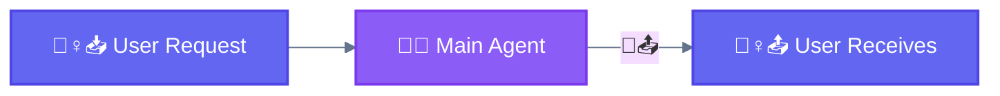

<div align="center">

[🏠 Home](../README.md) › [Workflows](./) › **🏎️ Baseline**

`━━●━━━━━━━━━━━━━━━━━━━━━━━━━━━━━━━━━` **0/5** Baseline

</div>

---

# 🏎️ Baseline (Direct Execution)

> **TL;DR:** Single augmented LLM call without orchestration. The simplest baseline — use when tasks need no complexity.

---

## Diagram



---

## Characteristics

| Property | Value |
|----------|-------|
| **Complexity** | None |
| **Parallelism** | None |
| **Human-Loop** | None |
| **Iteration** | None |

---

## When to Use

- Simple, single-step tasks
- No need for specialization
- Quick operations (file read, simple edit, search)

**Examples:**
- "What's in the config.json file?"
- "Add a console.log statement to this function"
- "Search for usages of `useState`"

---

## When NOT to Use

- Complex multi-step workflows
- Tasks requiring multiple specializations
- Large-scale operations

---

<div align="center">

```
━━●━━━━━━━━━━━━━━━━━━━━━━━━━━━━━━━━━ 0/5
```

[← Workflows](./) • [01 Prompt Chaining →](01-prompt-chaining.md)

</div>
