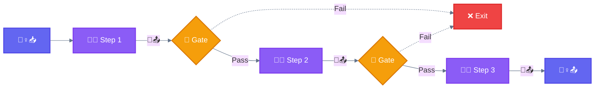
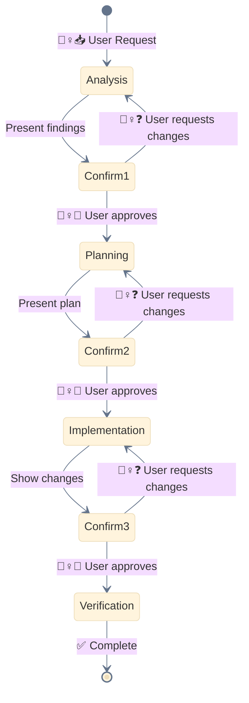

<div align="center">

[🏠 Home](../README.md) › [Workflows](./) › **⛓️ Prompt Chaining**

`━━━━━━●━━━━━━━━━━━━━━━━━━━━━━━━━━━━━` **1/5** Prompt Chaining

</div>

---

# ⛓️ Prompt Chaining

> **TL;DR:** Decompose a task into sequential steps where each LLM call processes the output of the previous one. Trade latency for accuracy.

---

## Diagram



---

## 🚧 Gate

> A checkpoint between steps that validates the output before proceeding. If validation fails, the chain exits early.

**Gates can check for:**
- Output format/structure validity
- Quality thresholds (confidence scores, completeness)
- Safety checks (content moderation, guardrails)
- Business rules (required fields, constraints)

---

## Characteristics

| Property | Value |
|----------|-------|
| **Complexity** | Low |
| **Parallelism** | None |
| **Human-Loop** | Optional |
| **Iteration** | Linear |

---

## When to Use

Ideal when the task can be easily decomposed into fixed subtasks. The main goal is to **trade latency for higher accuracy** by making each LLM call an easier task.

| Use Case | Chain |
|----------|-------|
| Marketing | Generate copy → Translate to target language |
| Documents | Write outline → Validate criteria → Write document |
| Code generation | Plan → Implement → Review |
| Data transformation | Parse → Transform → Validate |

---

## Example Flow

```
Step 1: "Extract all function names from this code"
        → [list of functions]

Step 2: "For each function, identify parameters and return types"
        → [function signatures]

Step 3: "Generate documentation for each function"
        → [documented code]
```

---

## When NOT to Use

- Steps can be done independently (use 🛤️ Parallelization)
- Simple single-step tasks (use 🏎️ Baseline)

---

## Variant: 🧙 Wizard Workflow

Multi-step process with explicit 🙆‍♀️ user confirmation at each phase using ❓ `AskUserQuestion`.



**Use 🧙 Wizard for:**
- Destructive operations (migrations, deletions)
- Complex refactoring
- Multi-stakeholder decisions

---

<div align="center">

```
━━━━━━●━━━━━━━━━━━━━━━━━━━━━━━━━━━━━ 1/5
```

[← 00 Baseline](00-baseline.md) • [02 Routing →](02-routing.md)

</div>
