<div align="center">

[🏠 Home](../README.md) › [Workflows](./) › **🛤️ Parallelization**

`━━━━━━━━━━━━━━━━●━━━━━━━━━━━━━━━━━━━` **3/5** Parallelization

</div>

---

# 🛤️ Parallelization

> **TL;DR:** Execute independent tasks simultaneously and aggregate outputs. Two flavors: **Sectioning** (split data, combine all) and **Voting** (same task, pick best).

---

## Core Concept

```mermaid
%%{init: {'theme': 'base', 'themeVariables': {'lineColor': '#64748b'}}}%%
flowchart LR
    classDef user fill:#6366f1,stroke:#4f46e5,stroke-width:2px,color:#ffffff
    classDef main fill:#8b5cf6,stroke:#7c3aed,stroke-width:2px,color:#ffffff
    classDef parallel fill:#3b82f6,stroke:#2563eb,stroke-width:2px,color:#ffffff

    IN["🙋‍♀️📥"]:::user --> SPLIT["🐔🔀 Split"]:::main
    SPLIT -->|"🐔🪺"| A["🐦⚡"]:::parallel
    SPLIT -->|"🐔🪺"| B["🐦⚡"]:::parallel
    SPLIT -->|"🐔🪺"| C["🐦⚡"]:::parallel
    A -->|"🐦📤"| MERGE["🐔🌀 Merge"]:::main
    B -->|"🐦📤"| MERGE
    C -->|"🐦📤"| MERGE
    MERGE -->|"🐔📤"| OUT["💁‍♀️📤"]:::user
```



---

## Key Insight

```
┌─────────────────────────────────────────────────────────────────────────────┐
│  ⚠️  IMPORTANT: Parallelization vs Orchestrator-Workers                     │
├─────────────────────────────────────────────────────────────────────────────┤
│                                                                             │
│  In Parallelization, all spawned subagents are IDENTICAL.                   │
│  Same prompt, same capabilities. They are INTERCHANGEABLE.                  │
│                                                                             │
│  🛤️ Parallelization:        🐦⚡ = 🐦⚡ = 🐦⚡   (clones)                     │
│  🦑 Orchestrator-Workers:   🐦🔒 ≠ 🐦⚡ ≠ 🐦🎨   (specialists)               │
│                                                                             │
└─────────────────────────────────────────────────────────────────────────────┘
```

---

## Characteristics

| Property | Value |
|----------|-------|
| **Complexity** | Medium |
| **Parallelism** | High |
| **Human-Loop** | Optional |
| **Iteration** | None |

---

## 2 Types of Parallelization

### Type 1: 🛤️ Sectioning (Split DATA)

Break a task into independent subtasks run in parallel, then **combine ALL** results.

```mermaid
%%{init: {'theme': 'base', 'themeVariables': {'lineColor': '#64748b'}}}%%
flowchart LR
    classDef user fill:#6366f1,stroke:#4f46e5,stroke-width:2px,color:#ffffff
    classDef main fill:#8b5cf6,stroke:#7c3aed,stroke-width:2px,color:#ffffff
    classDef parallel fill:#3b82f6,stroke:#2563eb,stroke-width:2px,color:#ffffff

    S_IN["🙋‍♀️📥 100 files"]:::user --> S_SPLIT["🐔🛤️"]:::main
    S_SPLIT -->|"🐔🪺"| S1["🐦⚡ Files 1-50"]:::parallel
    S_SPLIT -->|"🐔🪺"| S2["🐦⚡ Files 51-100"]:::parallel
    S1 -->|"🐦📤"| S_MERGE["🐔🌀 Combine ALL"]:::main
    S2 -->|"🐦📤"| S_MERGE
    S_MERGE -->|"🐔📤"| S_OUT["💁‍♀️📤"]:::user
```



**Examples:**
- Guardrails: One instance processes queries, another screens for inappropriate content
- Evals: Each LLM call evaluates a different aspect of model performance

### Type 2: 🗳️ Voting (Same TASK, pick BEST)

Run the same task multiple times to get diverse outputs, then **select the best**.

```mermaid
%%{init: {'theme': 'base', 'themeVariables': {'lineColor': '#64748b'}}}%%
flowchart LR
    classDef user fill:#6366f1,stroke:#4f46e5,stroke-width:2px,color:#ffffff
    classDef main fill:#8b5cf6,stroke:#7c3aed,stroke-width:2px,color:#ffffff
    classDef parallel fill:#3b82f6,stroke:#2563eb,stroke-width:2px,color:#ffffff
    classDef success fill:#10b981,stroke:#059669,stroke-width:2px,color:#ffffff

    V_IN["🙋‍♀️📥 Write headline"]:::user --> V_COPY["🐔🔀 3 attempts"]:::main
    V_COPY -->|"🐔🪺"| V1["🐦⚡ Version A"]:::parallel
    V_COPY -->|"🐔🪺"| V2["🐦⚡ Version B"]:::parallel
    V_COPY -->|"🐔🪺"| V3["🐦⚡ Version C"]:::parallel
    V1 -->|"🐦📤"| VOTE{"🐔🗳️ Compare"}:::main
    V2 -->|"🐦📤"| VOTE
    V3 -->|"🐦📤"| VOTE
    VOTE -->|"🐔✅ B wins"| BEST["🏆 Best"]:::success
```



---

## Voting Selection Strategies

| Strategy | How It Works | Best For |
|----------|--------------|----------|
| **LLM Judge** | Main Agent compares outputs and selects best | Creative content, subjective quality |
| **Scoring Rubric** | Each output scored against criteria, highest wins | Code review, compliance checks |
| **Consensus** | Majority agreement required | Critical decisions, validation |
| **Weighted Vote** | Outputs weighted by model capability | Mixed model ensemble |

---

## Summary

| Type | Workers | Input | Output |
|------|---------|-------|--------|
| **🛤️ Sectioning** | IDENTICAL | Different DATA chunks | Combine ALL |
| **🗳️ Voting** | IDENTICAL | Same DATA | Pick ONE best |

---

## When to Use

Parallelization is effective when the divided subtasks can be parallelized for speed, or when multiple perspectives are needed for higher confidence results.

---

## When NOT to Use

- Tasks depend on each other's output
- Sequential order matters
- Limited resources

---

## Variant: 🚂 Parallel Tool Calling

Execute multiple independent 🔧 tool calls in a single message for efficiency.

```mermaid
%%{init: {'theme': 'base', 'themeVariables': {'lineColor': '#64748b'}}}%%
flowchart TB
    classDef main fill:#8b5cf6,stroke:#7c3aed,stroke-width:2px,color:#ffffff
    classDef state fill:#10b981,stroke:#059669,stroke-width:2px,color:#ffffff

    MA["🐔 Main Agent"]:::main -->|Single Message| TOOLS

    subgraph TOOLS["🚂 Parallel Tool Calls"]
        T1["🔧 Read file1.ts"]
        T2["🔧 Read file2.ts"]
        T3["🔧 Read file3.ts"]
    end

    T1 --> RESULTS["✅ All Results"]:::state
    T2 --> RESULTS
    T3 --> RESULTS

    RESULTS --> MA

    classDef toolbox fill:#dbeafe,stroke:#3b82f6,stroke-width:2px,color:#1e40af
    TOOLS:::toolbox
```



---

## Variant: 🧬 Master-Clone

Spawn multiple isolated 🐦 instances handling independent domains with no shared state.

### Key Characteristics

| Property | Value |
|----------|-------|
| **Isolation** | Complete - each clone has own context |
| **State Sharing** | None - clones cannot communicate |
| **Best For** | Independent domains, parallel generation |
| **Merge Strategy** | Combine all outputs (no conflict resolution needed) |

### Diagram

```mermaid
%%{init: {'theme': 'base', 'themeVariables': {'lineColor': '#64748b'}}}%%
flowchart TB
    classDef main fill:#8b5cf6,stroke:#7c3aed,stroke-width:2px,color:#ffffff
    classDef subagent fill:#ec4899,stroke:#db2777,stroke-width:2px,color:#ffffff
    classDef state fill:#10b981,stroke:#059669,stroke-width:2px,color:#ffffff

    MA["🐔 Main Agent"]:::main

    MA -->|"Context: fr-FR"| C1["🐦 Clone: fr-FR"]:::subagent
    MA -->|"Context: es-ES"| C2["🐦 Clone: es-ES"]:::subagent
    MA -->|"Context: de-DE"| C3["🐦 Clone: de-DE"]:::subagent

    C1 -->|9 files| R1[Result: fr-FR]
    C2 -->|9 files| R2[Result: es-ES]
    C3 -->|9 files| R3[Result: de-DE]

    R1 --> MERGE["✅ Merge Results"]:::state
    R2 --> MERGE
    R3 --> MERGE

    MERGE --> MA
```



### When to Use Master-Clone

| Use Case | Why Master-Clone? |
|----------|-------------------|
| **Multi-locale generation** | Each locale is independent domain |
| **Multi-platform builds** | iOS, Android, Web don't share state |
| **Parallel documentation** | Each doc section is self-contained |
| **A/B test generation** | Variants shouldn't influence each other |
| **Multi-tenant operations** | Tenant data must be isolated |

---

<div align="center">

```
━━━━━━━━━━━━━━━━●━━━━━━━━━━━━━━━━━━━ 3/5
```

[← 02 Routing](02-routing.md) • [04 Orchestrator-Workers →](04-orchestrator-workers.md)

</div>
