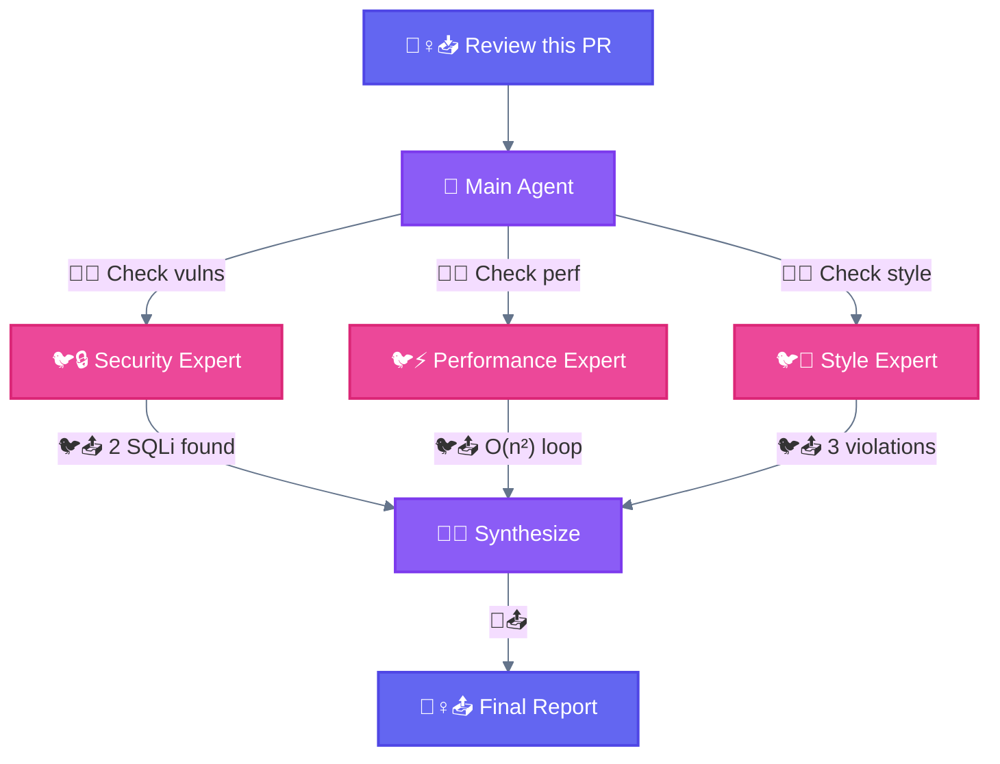

<div align="center">

[🏠 Home](../README.md) › [Workflows](./) › **🦑 Orchestrator-Workers**

`━━━━━━━━━━━━━━━━━━━━━●━━━━━━━━━━━━━━` **4/5** Orchestrator-Workers

</div>

---

# 🦑 Orchestrator-Workers

> **TL;DR:** A central LLM dynamically breaks down tasks, delegates to specialized worker LLMs, and synthesizes results. Different experts collaborate on the same problem.

---

## Diagram



---

## Key Insight

```
┌─────────────────────────────────────────────────────────────────────────────┐
│  🦑 ORCHESTRATOR-WORKERS: Different specialists                             │
├─────────────────────────────────────────────────────────────────────────────┤
│                                                                             │
│  Each 🐦 subagent has a DIFFERENT expertise and does a DIFFERENT task.      │
│                                                                             │
│  Key difference from 🛤️ Parallelization: subtasks aren't pre-defined,       │
│  but determined by the orchestrator based on the specific input.            │
│                                                                             │
│  Analogy: Hospital team → Different experts collaborate                     │
│           (Chef + Pastry + Sommelier, not 3 cooks making same recipe)       │
│                                                                             │
│  Compare:                                                                   │
│  - 🛤️ Parallelization: Same worker + Different data (assembly line)        │
│  - 🦑 Orchestration: Different workers + Same data (expert team)            │
│                                                                             │
└─────────────────────────────────────────────────────────────────────────────┘
```

---

## Characteristics

| Property | Value |
|----------|-------|
| **Complexity** | High |
| **Parallelism** | High |
| **Human-Loop** | Optional |
| **Iteration** | As needed |

---

## When to Use

Well-suited for complex tasks where you **can't predict the subtasks needed**. The key difference from parallelization is its flexibility — subtasks aren't pre-defined, but determined by the orchestrator based on the specific input.

| Use Case | Orchestration |
|----------|---------------|
| Coding products | Make complex changes to multiple files dynamically |
| Search tasks | Gather and analyze from multiple sources |
| PR Review | Security + Performance + Style experts |

---

## 🐔 Main Agent Responsibilities

| Responsibility | Description |
|----------------|-------------|
| **Decomposition** | Break complex task into subtasks |
| **Assignment** | Route subtasks to appropriate 🐦 subagents |
| **Monitoring** | Track 🐦 subagent progress |
| **Synthesis** | Combine results into coherent output |

---

## 🐦 Subagent Definition Example

```markdown
# .claude/agents/code-reviewer.md

---
name: code-reviewer
description: Reviews code for quality, security, and best practices.
tools: Read, Grep, Glob
model: sonnet
permissionMode: plan
---

You are a senior code reviewer with expertise in security, performance, and maintainability.

## Review Checklist

1. **Security** - SQL injection, XSS, secrets exposure, auth bypasses
2. **Performance** - O(n²) loops, memory leaks, unnecessary computations
3. **Code Quality** - DRY violations, dead code, unclear naming
4. **Best Practices** - Error handling, logging, testing coverage

## Output Format

### ❌ CRITICAL (must fix before merge)
- [file:line] Issue description

### ⚠️ WARNING (should address)
- [file:line] Issue description

### ℹ️ SUGGESTIONS (nice to have)
- [file:line] Issue description
```

---

## Full Orchestration Example

```python
# 🐔 Main Agent orchestrates PR review with specialists

# Step 1: Decompose - identify what experts are needed
changed_files = get_pr_diff()  # ["auth.py", "api.py", "styles.css"]

# Step 2: Assign - spawn appropriate specialists
Task(
    subagent_type="security-reviewer",
    prompt=f"Review these files for security: {changed_files}"
)

Task(
    subagent_type="performance-reviewer",
    prompt=f"Review these files for performance: {changed_files}"
)

Task(
    subagent_type="style-reviewer",
    prompt=f"Review these files for style/quality: {changed_files}"
)

# Step 3: Monitor - wait for all subagents to complete
# (handled automatically by Task tool)

# Step 4: Synthesize - combine into final report
"""
## PR Review: #123 - Add user authentication

### Security Review (🐦 security-reviewer)
❌ CRITICAL: SQL injection in auth.py:45

### Performance Review (🐦 performance-reviewer)
⚠️ WARNING: O(n²) loop in api.py:78

### Final Verdict: ❌ CHANGES REQUESTED
"""
```

---

## Critical Rules

| Rule | Explanation |
|------|-------------|
| **No nested subagents** | 🐦 Subagents cannot spawn other 🐦 subagents |
| **Isolated context** | Each 🐦 subagent starts fresh, no shared memory |
| **Report to orchestrator** | Results flow back to 🐔 Main Agent only |

---

## When NOT to Use

- Simple tasks not worth decomposition overhead
- Workers need heavy inter-communication

---

<div align="center">

```
━━━━━━━━━━━━━━━━━━━━━●━━━━━━━━━━━━━━ 4/5
```

[← 03 Parallelization](03-parallelization.md) • [05 Evaluator-Optimizer →](05-evaluator-optimizer.md)

</div>
