<div align="center">

[🏠 Home](../README.md) › [Workflows](./) › **🩻 Evaluator-Optimizer**

`━━━━━━━━━━━━━━━━━━━━━━━━━━●━━━━━━━━━` **5/5** Evaluator-Optimizer

</div>

---

# 🩻 Evaluator-Optimizer

> **TL;DR:** One LLM generates, another evaluates. Loop until quality threshold is met. Self-improvement through feedback.

---

## Diagram

```mermaid
%%{init: {'theme': 'base', 'themeVariables': {'lineColor': '#64748b'}}}%%
flowchart TB
    classDef user fill:#6366f1,stroke:#4f46e5,stroke-width:2px,color:#ffffff
    classDef data fill:#06b6d4,stroke:#0891b2,stroke-width:2px,color:#ffffff
    classDef main fill:#8b5cf6,stroke:#7c3aed,stroke-width:2px,color:#ffffff
    classDef wizard fill:#14b8a6,stroke:#0d9488,stroke-width:2px,color:#ffffff
    classDef success fill:#10b981,stroke:#059669,stroke-width:2px,color:#ffffff
    classDef error fill:#ef4444,stroke:#dc2626,stroke-width:2px,color:#ffffff

    INPUT["🙋‍♀️📥 Task"]:::user --> GEN["🐔💭 Generate"]:::main
    GEN --> CAND["🐔📤 Candidate"]:::data
    CAND --> EVAL{"🐔🩻 Evaluate"}:::wizard

    EVAL -->|"🐔✅ Pass"| OUTPUT["💁‍♀️📤 Output"]:::success
    EVAL -->|"🐔❌ Fail"| FEEDBACK["🐔🔄 Feedback"]:::error
    FEEDBACK --> GEN
```



---

## Detailed Flow

```mermaid
%%{init: {'theme': 'base', 'themeVariables': {'lineColor': '#64748b'}}}%%
sequenceDiagram
    participant U as 🙋‍♀️ User
    participant G as 🐔💭 Generator
    participant E as 🐔🩻 Evaluator

    U->>G: 🙋‍♀️📥 Request
    loop 🔄 Until quality threshold
        G->>G: 🐔💭 Generate candidate
        G->>E: 🐔📤 Submit for evaluation
        E->>E: 🐔👀 Score candidate
        alt ✅ Score >= threshold
            E->>U: 💁‍♀️📤 Accept
        else ❌ Score < threshold
            E->>G: 🐔🔄 Feedback for improvement
        end
    end
```



---

## Characteristics

| Property | Value |
|----------|-------|
| **Complexity** | Medium |
| **Parallelism** | Optional |
| **Human-Loop** | Optional |
| **Iteration** | Loop |

---

## When to Use

Effective when we have **clear evaluation criteria**, and when **iterative refinement provides measurable value**. Two signs of good fit:

1. LLM responses can be demonstrably improved when feedback is articulated
2. The LLM can provide such feedback

| Domain | Criteria | Use Case |
|--------|----------|----------|
| **Code** | Tests pass, lint clean, no security issues | Code generation |
| **Text** | Clarity score, factual accuracy, tone match | Literary translation |
| **Search** | Comprehensiveness, relevance | Complex research tasks |

---

## Example: Code Generation

```
Generator: Write function to parse CSV

Attempt 1: Basic implementation
Evaluator: "Missing error handling for malformed input"

Attempt 2: Added try/catch
Evaluator: "Not handling empty files"

Attempt 3: Complete implementation
Evaluator: "Pass - all criteria met"
```

---

## Advanced: Self-Correction Chains

You can chain prompts to have Claude **review its own work**. This catches errors and refines outputs, especially for high-stakes tasks.

```mermaid
%%{init: {'theme': 'base', 'themeVariables': {'lineColor': '#64748b'}}}%%
sequenceDiagram
    participant U as 🙋‍♀️ User
    participant G as 🐔💭 Generator
    participant R as 🐔🔍 Reviewer

    U->>G: 🙋‍♀️📥 "Summarize this research paper"
    G->>G: 🐔💭 Generate summary
    G->>R: 🐔📤 Submit for self-review
    R->>R: 🐔🔍 Check accuracy, clarity, completeness
    alt ✅ Quality OK
        R->>U: 💁‍♀️📤 Final summary
    else ❌ Issues found
        R->>G: 🐔🔄 "Missing methodology details"
        G->>G: 🐔💭 Regenerate with feedback
        G->>R: 🐔📤 Submit improved version
    end
```



**Use Self-Correction for:**
- Research summaries requiring accuracy
- Code that must meet strict criteria
- Content requiring specific style/tone

---

## When NOT to Use

- First attempt is usually good enough
- No clear quality metrics
- Time constraints prevent iteration

---

<div align="center">

```
━━━━━━━━━━━━━━━━━━━━━━━━━━●━━━━━━━━━ 5/5
```

[← 04 Orchestrator-Workers](04-orchestrator-workers.md) • [Agents →](../agents/)

</div>
